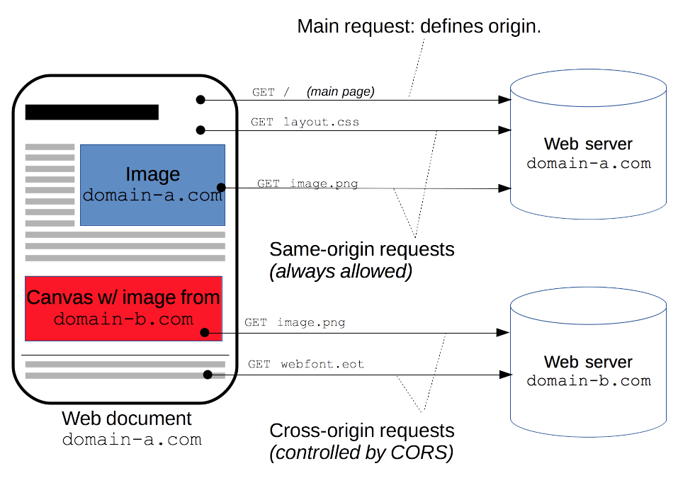

## Общие вопросы

## REST
 
### Что такое REST?
**REST** (REpresentational State Transfer) - принцип взаимодействия клиента и сервера, основанные на понятиях "ресурса" и "глагола". В случае HTTP, ресура - это _uri_, глагол - это метод. 

### REST API [Best practices](https://habr.com/ru/articles/351890/)
1. Конечные точки в URL - имя существительное (_frames_ вместо _getFrames_, _updateFrames_, ...)
2. Множественное число (_frames_, _frames/{id}_ вместо _frame_, _frame/{id}_)
3. Документация :)
4. Версионирование (_host/v1/frames/_)
5. Пагинация
6. Использование SSL
7. Разные HTTP-методы
8. Разные коды

### Что такое SSL и TLS, есть ли между ними отличия?  

### Что такое CORS?  

_**CORS** (Cross-origin request sharing)_ - механизм, который разрешает серверу указывать другие источники отличные от его собственных, с которых браузеру разрешено будет выполнить загрузку.

Категории доступа тэгов:
1. Запись из из разных источников (ссылки, переадресации, отправка форм). С активным CORS эти операции будут разрешены.
2. Вставка из разных источников (script, link, img, video, ...)
3. Считывание из разных источников (тэги загружаемые через выховы AJAX/fetch). По умолчанию заблокированы браузером

Источник идентифицируется тройкой параметров: схема, имя хоста, порт. Если хотя бы из трех элементов у двух источников отличается, то ресурсы считаются разными и такие запросы будут блокироваться. Другими словами, если пользователь находится на сайте, на котором в тэге <script> будет выполняться код, который будет запрашивать ресурсы другого сайта, то такой код будет блокироваться ошибкой _Cross-Origin Request Blocked_.

Заметки:
- На сайт, не ограниченный платным доступом, не требующий аутентификацию и авторизацию можно установить: `Access-Control-Allow-Origin: *`
- На сторонний (например) аналитический API хорошо устанавливать набор заголовков `Access-Control-Allow-Origin`, чтобы API не пропустила лишние вредоносные запросы
- Полезно пропускать куки в запросах между разными источниками (`Access-Control-Allow-Credentials: true`) когда вы точно знаете какие клиенты будут иметь доступ к вашему серверу.