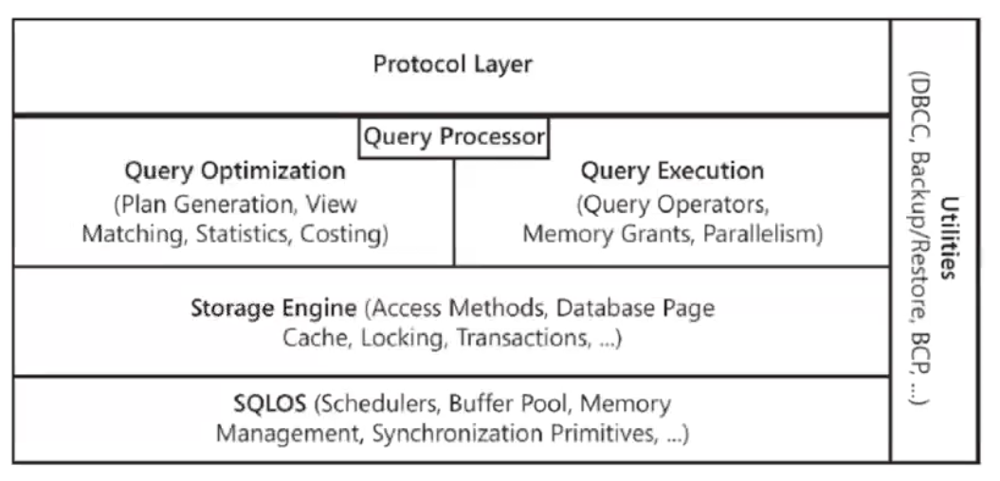
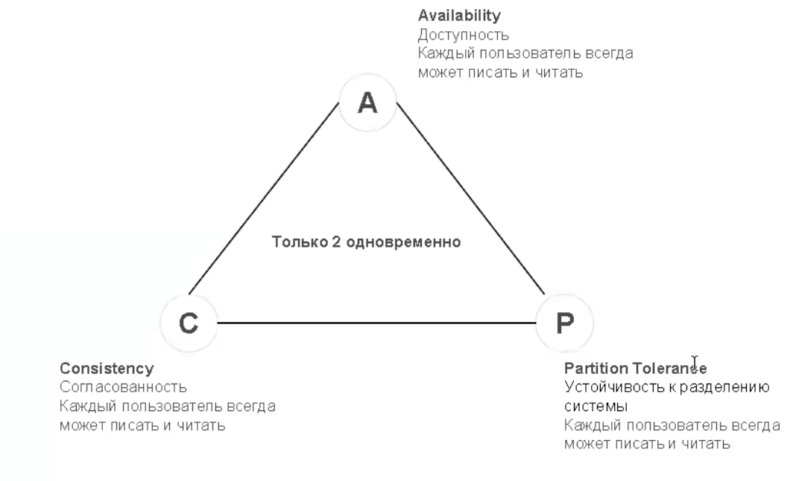
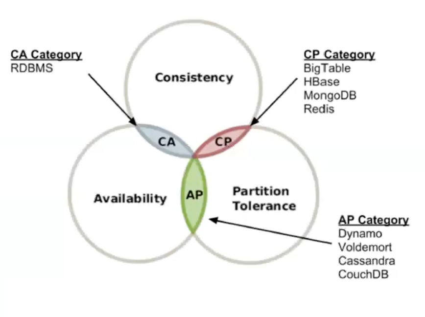

## СУБД

_**СУБД** (система управления базами данных)_ - совокупность программных и лингвистических средств общего или
специального назначения, обеспечивающих управление созданием и использованием баз данных.

_**База данных**_ - это взаимосвязанная информация об объектах, которая организована специальным образом и храниться на
каком-то носителе.

Необходимы для решения следующих проблем (помимо хранения данных):
- производительность
- многопользовательский доступ
- резервное копирование
- восстановление после сбоев

Классификация баз данных: [Хорошая статья](https://habr.com/ru/companies/amvera/articles/754702/)  
1. Реляционные - хранение данных в связанных таблицах.  
    A: колоночные  
    Б: по столбцам (ClickHouse, Vertica, Snowflake..)  
    
    open source - _PostgreSQL, MySQL, SQLite_   
    проприетарные - _Oracle, MSSQL, IBM Db2Relational_  

2. Key-Value базы данных - быстрое, почти мгновенное выполнение запросов. Задачи - кэш, отображение баланса  
   _Redis, Amazon DynamoDB, Memcached, Ignite, Hazelcast, Oracle NoSQL, Tarantool_  

3. Документо-ориентированные базы данных - хранение иерархических структур данных  
   _MongoDB, Couchbase, Databricks_  

4. Базы данных временных рядов - хранение упорядоченных по времени данных с временными метками  
   _InfluxDB, Kdb, Prometheus, TimescaleDB, Apache IoTDB_  

5. Графовые базы данных - удобны для анализа отношения данных и их связей. Данные представляются, как вершины и ребра 
графов. Чаще используются в финансовой сфере. Например, для отображения переводов денежных средств.  
   _Neo4j, Azure Cosmos DB, Memgraph, Giraph_  

6. Поисковые данные - поиск по большим объемам данных, особенно не структурированным, например логи  
   _ElasticSearch, Splunk, Solr, Solr_  

7. Объектно-ориентированные базы данных - информация представлена в виде объектов, как в ООП языках  
   _InterSystems Cache, Db4o, ObjectBox_  

8. Resource Description Framework - функционирует на основе концепции формулировок утверждений, касающихся ресурсов, как 
выраженний субъект-предикат-объект. Субъект - ресурс, предикат - черты ресурса и определяет отношения между субъектом и 
объектом  
   _MarkLogic, Apache Jena TDB, Virtuoso, GraphDB_  

9. Wide Column Stores - хранение данных в виде гибких столбцов, которые можно распределить по нескольким серверам. 
Похожи на реляционные БД, но поиск происходит быстрее, столбец записывается только в том случаем, если для него есть 
элемент данных  
   _Casandra, HBase, CosmosDB, ScyllaDB, Google Bigtable_   

10. Мультимодальные СУБД - позволяет эмулировать другие типы, но в основе лежит один принцип  

11. Native XML - управление большим количеством XML за счет внутреннего представления XML  
    _MarkLogic, BaseX, Sedna_  

12. GEO/GIS пространственные и специализированные - обладают специализированными механиками по работе с пространственными 
данными - содержится в, касатеся, находится на заданном расстоянии  
    _PostGIS, Aerospike, SpatiaLite, GeoMesa_  

13. Event - EventStoreDB, NEventStore  

14. Контентные - Apache Jackrabbit, ModeShape  

15. Навигационные (иерархические) - записи или объекты находятся по ссылкам других объектов. Близко по концепции с 
графовыми бд  
    _IBM IMS, IDMS_  

16. Векторные базы данных - позволяют работать непосредственно с векторами, представленными в виде числовых массивов  
    _Kdb, Pinecone, Chroma, Milvus_

### Основные компоненты сервера БД

- пользователи и роли
- пользовательские таблицы, индексы, статистики
- представления (view)
- хранимые процедуры и функции
- синонимы
- JOB'ы
- Linked Server
- Очереди
- Репликация/Always On

### Что внутри БД?

  

### Основные термины:
**OLTP** - On-Line Transaction Processing - характер нагрузки на систему, с большим количеством коротких транзакций, 
обычно на внесение данных в систему, например, платежи от клиентов  
**OLAP** - On-Line Analytical Processing - характер нагрузки, с длинными ресурсоемкими транзакциями, много долгих 
запросов на чтение, редкие на запись/изменение данных, например, хранилища данных, отчеты систему  
**MVCC** - MultiVersion Concurrency Control - принцип устранения конфликтов между различными транзакциями через создание 
различных версий одних и тех же данных (оптимистичный сценарий разрешения блокировок)  
**Tempdb** - система БД в SQL Server, которая используется для хранения временных таблиц, табличных переменных, курсоров, 
иногда работы с hash join, промежуточные результаты сортировки  

### Теорема распределенных систем

_**CAP** - Consistency Availability Partition tolerance -_ САР система говорит о том, что нельзя совместить все 3 
свойства в одной системе.

  
  

