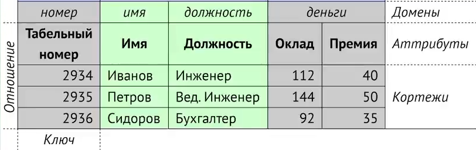

## Реляционная модель СУБД

**Реляционная база** - *неупорядоченное* множество котрежей или отношений входящих пар {имя; значение}, принадлежащего
одной схеме.

Реляционные базы данных состоят из:
- типы данных (boolean, varchar...)
- домены - тип данных, т.е. множество значений
- аттрибуты (имена столбцов)
- кортежи (строки данных)

Реляционная модель данных включает следующие аспекты:
- _структурный аспект_ - данные в базе представляют собой набор отношений
- _аспект целостности_ - отношения отвечают определенным условиям целостности
- _аспект манипулирования_ - изменение данных, структуры отношений, получения данных

Минусы реляционных БД:
- скорость
- невозможность автоматического разделения
- сложность
- скорость

### Ключи

**Потенциальный ключ** - подмножество атрибутов, удовлетворяющее требованиям уникальности и минимальности.

**Первичный ключ** - в реляционной модели специальный столбец таблицы, предназначеный для идентификации каждой записи в 
 таблице. Обычно используется, как уникальный идентификатор для быстрого анализа данных в таблице.

Характеристики:
- должен содержать **уникальное** значение для каждой строки данных.
- не может быть пустым
- каждая строка должна иметь значение первичного ключа

**Суррогатный (искусственный) ключ** - генерируемое системой значение, не имеющее смысла в терминах предметной области 
и которое используется для однозначной идентификации записи в таблице. Сам ключ может быть составлен из одного или более 
числа столбцов.

Т.к. первичный ключ может быть очень большим, то суррогатный ключ помогает сэкономить память при обработке. Обычно 
первичный ключ выбирается исходя из соображений удобства и сохранения уникальности. Если такого ключа нет, то имеет 
смысл добавить специальное поле. Суррогатный ключ часто делают автоинкрементным.  

**Внешний ключ** - поле таблицы, в котором есть ссылка на другую таблицу. Поле на которое ссылается - это первичный ключ

### Типы данных

* Числовые
 - SMALLINT, int2, small serial - 2 байта
 - INTEGER, int, serial - 4 байта
 - BIGINT, int8, big serial - 8 байт
 - DECIMAL / numeric - 2 байта на 4 цифры
 - REAL - 4 байта
 - DOUBLE PRICISSION - 8 байт
 - MONEY - 8 байт
* Бинарные
 - BIT(N) - (N + 7) / 8 байт
 - VARBIT(N)
 - BOOLEAN - 1 байт
* Строковые
 - CHAR(N) - строка фиксированной длины
 - VARCHAR(N) - строка переменной длины
 - TEXT - строковые данные без ограничения длины
 - BYTEA - двоичные данные без ограничения длины
* Календарные
 - TIMESTAMP [WITHOUT TIME ZONE] - 8 байт
 - TIMESTAMP [WITH TIME ZONE] - 8 байт (временная зона не храниться на диске. Время храниться в UTC)
 - DATE - 4 байта
 - TIME [WITHOUT TIME ZONE] - 8 байт
 - TIME [WITH TIME ZONE] - 12 байт
 - INTERVAL - 16 байт (два timestamp)
* Null

### Миграции

- Генерация на базе исходного кода
 - [+] удобно наблюдать изменение в структуре между версиями при помощи Системы контроля версий
 - [+] удобно комментировать
 - [+] для того, чтобы создать чистую БД нужно выполнить всего 1 файл
 - [+] скрипты миграции более надежны
 - [+] при слиянии двух веток мердж осуществляется проще
 - [-] изменения данных храняться отдельно
 - [-] необходимы средства миграции
- Метод инкрементных изменений
 - [+] быстрое и удобное выполнение миграции с любой промежуточной версии
 - [+] механизм нумерации версий
 - [-] нужны средства автоматизации выполнения микграций
 - [-] неудобно добавлять комментарии к структуре БД
- Метод идемпотентных изменений  (наприм, flyway, liquibase)
 - [+] удобно устанавливать обновления без дополнительного инструментария
 - [-] возможны ситуации, когда теряются данные
 - [-] для того, чтобы изменения были идемпотентными, нужно потратить больше времени на их написание