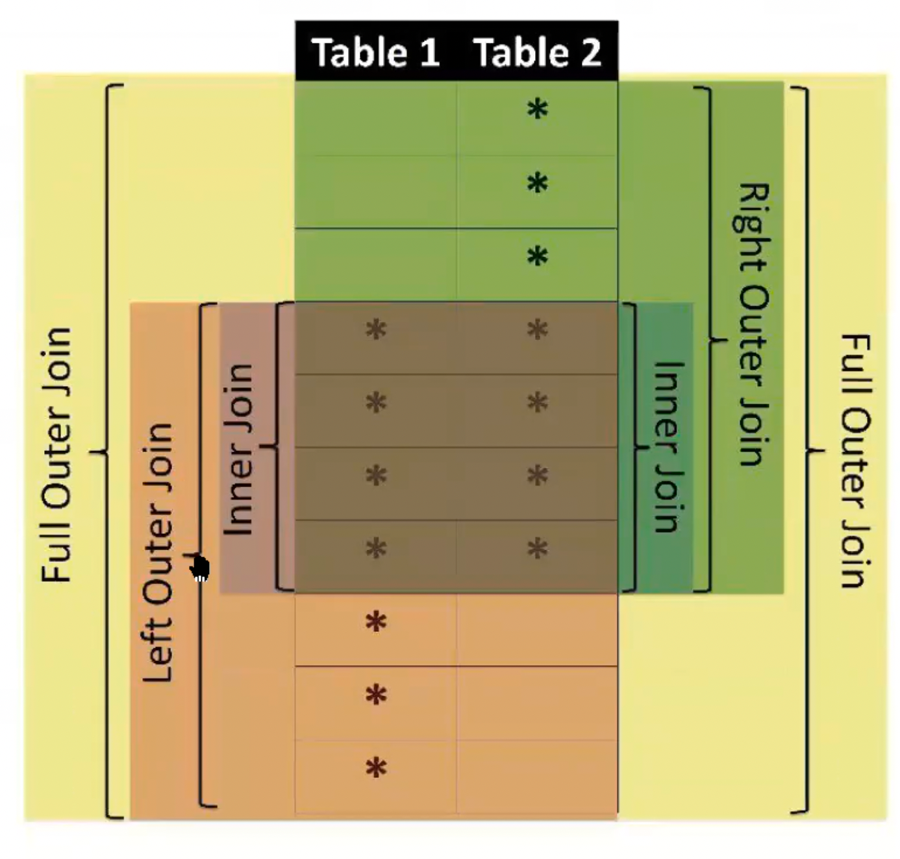
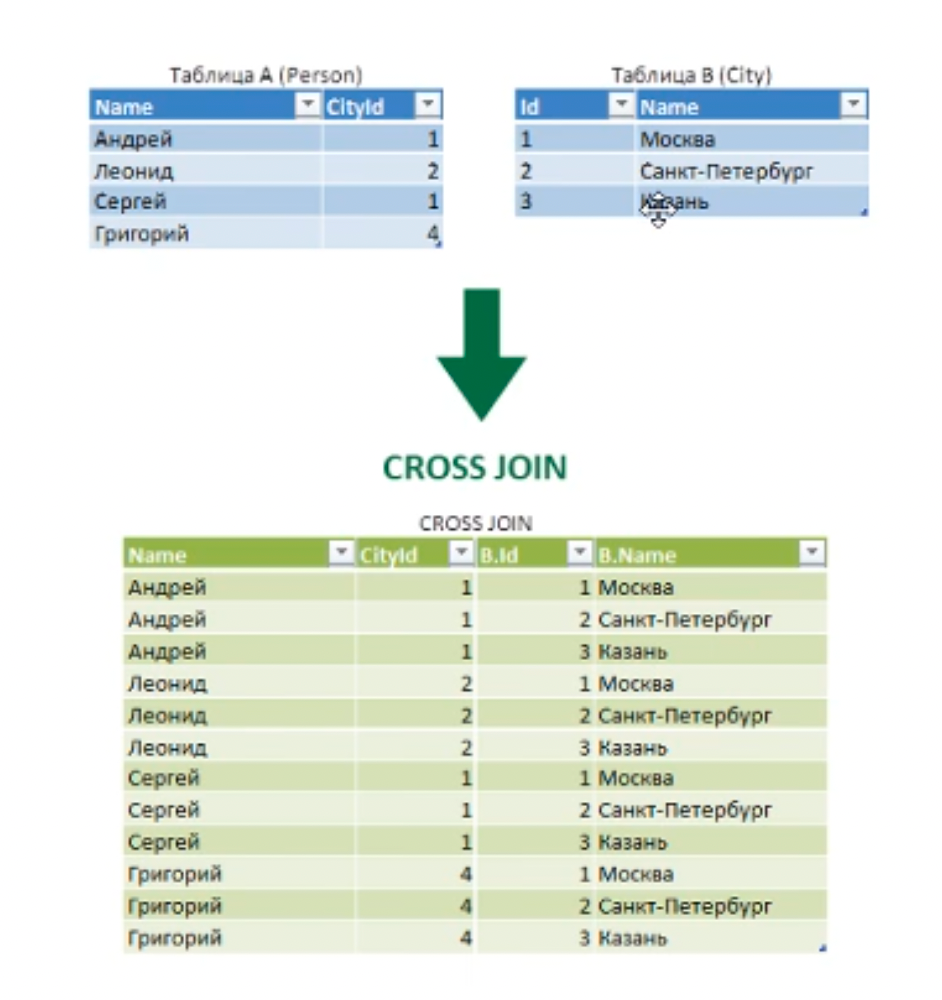
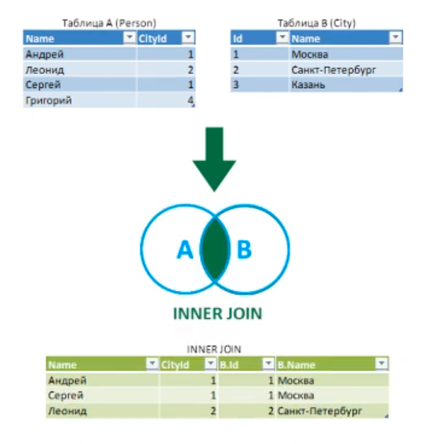
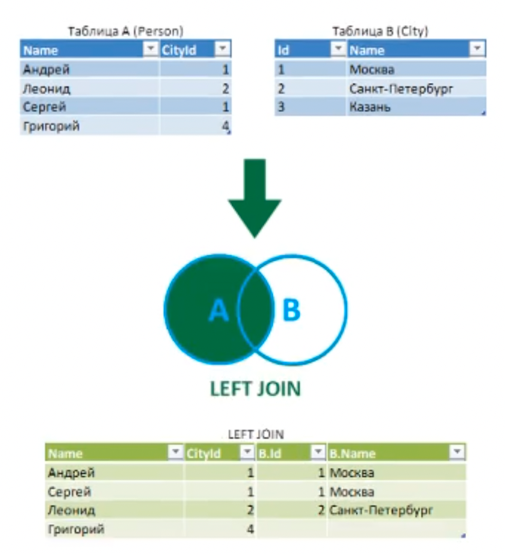
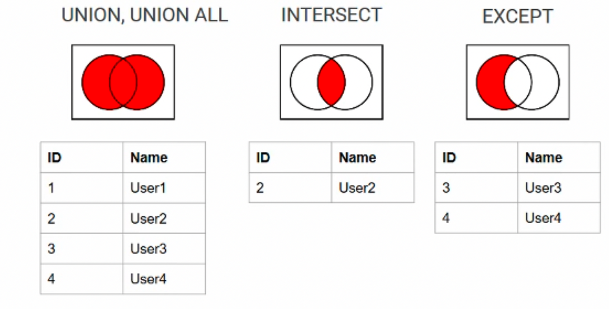

### JOIN
Аналог горизонтального соединения

  

`CROSS JOIN` - декартово произведение(каждой строчке одной таблицы сопоставляем каждую строчку другой)  
Пример:
`FROM t1 CROSS JOIN t2`  
Старый синтаксис (SQL-89): `FROM t1, t2`

  

`INNER JOIN` - декартово произведение + фильтрация
Пример:
`FROM t1 [INNER] JOIN t2 on t1.id = t2.id`

  

`LEFT/RIGHT JOIN` - INNER JOIN + внешние строки
Пример:
`FROM t1 LEFT [OUTER] JOIN t2 on t1.id = t2.id`

  

`FULL JOIN` - LEFT + RIGHT JOIN
Пример:
`FROM t1 FULL [OUTER] JOIN t2 on t1.id = t2.id`

Рекомендуется делать индекс по тем колонкам, по которым делаем JOIN.

### UNION
Аналог вертикального соединения.  
`UNION ALL` дублирует одинаковые строки.

`UNION` - это `UNION ALL` + `DISTINCT`

  

