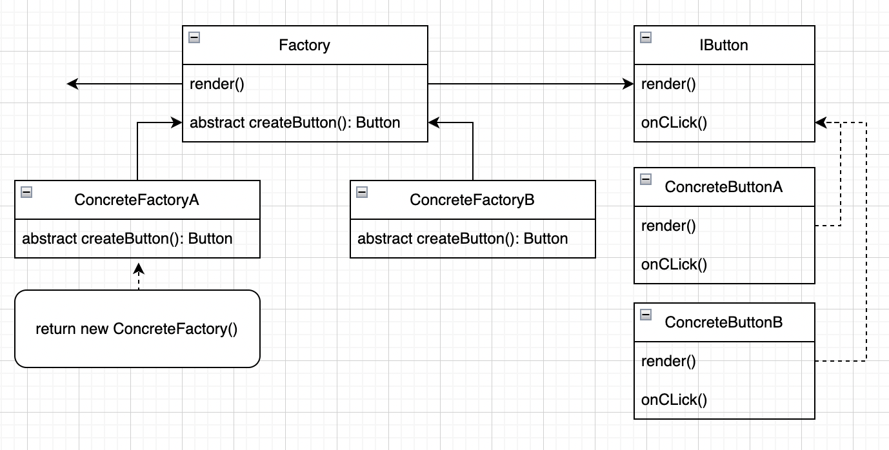
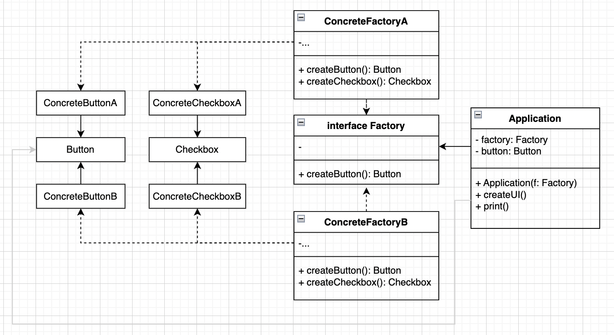
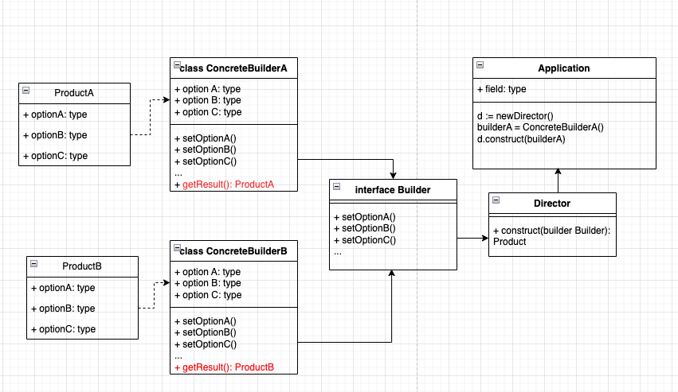
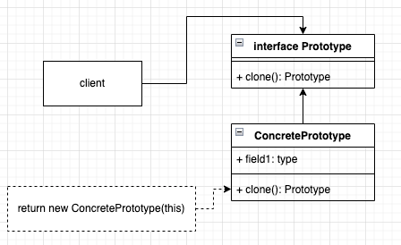
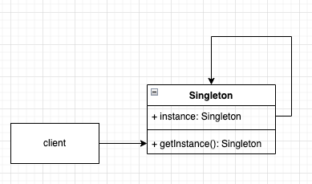

# Creational. Порождающие

## Фабричный метод (Factory method)

Фабричный метод — это порождающий паттерн проектирования, который определяет общий интерфейс для создания объектов в
суперклассе, позволяя подклассам изменять тип создаваемых объектов.

**Пример:** логистической компании помимо грузовиков требуется добавить морские суда.  
[java](1-creational/factory-method/main.java) || [go](1-creational/factory-method/main.go) (неидиоматичный пример)

Когда использовать:

1. Когда заранее известны типы и зависимости объектов, с которыми должен работать ваш код
2. Когда вы хотите дать возможность пользователям расширять части вашего фреймфорка или библиотеки
3. Когда вы хотите экономить системные ресурсы, повторно используя уже созданные объекты, вместо порождения новых

Плюсы:

+ Избавляет класс от привязки к конкретным классам продуктов.
+ Выделяет код производства продуктов в одно место, упрощая поддержку кода.
+ Упрощает добавление новых продуктов в программу.
+ Реализует принцип открытости/закрытости.

Минусы:

- Может привести к созданию больших параллельных иерархий классов, так как для каждого класса продукта надо создать
  свой подкласс создателя.

## Абстрактная фабрика (Abstract factory)

Абстрактная фабрика - это порождающий паттерн проектирования, который позволяет создавать семейства связанных объектов,
не привязываясь к конкретным классам создаваемых объектов.

**Пример:** мебельный магазин с различными дизайнами мебельных коллекций.  
[java](1-creational/abstract-factory/main.java) || [go](1-creational/abstract-factory/main.go)

Когда использовать:

1. Когда бизнес-логика программы должна работать с разными видами связанных друг с другом продуктов, не завися от
   конкретных продуктов
2. Когда в программе используется factory method, но очередные изменения предполагают введение новых типов продуктов

Плюсы:

+ Гарантирует сочетаемость создаваемых продуктов
+ Избавляет клиентский код от привязки к конкретным классам продуктов
+ Выделяет код производства продуктов в одно место, упрощая поддержку кода
+ Упрощает добавление новых продуктов в программу
+ Реализует принцип открытости/закрытости

Минусы:

- Усложняет код программы из-за введения множества дополнительных классов
- Требует наличия всех типов продуктов в каждой вариации

## Строитель (Builder)

Строитель - порождающий паттерн, который позволяет создавать сложные объекты пошагово.

**Пример:**
[java](1-creational/builder/main.java) || [go](1-creational/builder/main.go)

Когда использовать:

1. Когда вы хотите избавиться от «телескопического конструктора» - конструктор с большим количеством опциональных
   аргументов.
2. Когда код должен создавать разные представления одного объекта.
3. Когда вам нужно собирать сложные составные объекты

Плюсы:

1. Позволяет создавать продукты пошагово
2. Позволяет использовать один и тот же код для создания различных продуктов
3. Изолирует сложный код сборки продукта от бизнес-логики

Минусы:

1. Усложняет код программы из-за введения дополнительных классов
2. Клиент привязан к конкретным классам строителей, т.к. в интерфейсе декоратора может не быть метода получения
   результата

## Прототип (Prototype)

Прототип - это порождающий паттерн, который позволяет копировать объекты, не вдаваясь в подробности их реализации  

**Пример:**
[java](1-creational/prototype/main.java) || [go](1-creational/prototype/main.go)

Когда использовать:
1. Когда ваш код не должен зависеть от классов копируемых объектов
2. Когда есть много подклассов, которые отличаются начальным значением полей.  

Плюсы: 
1. Позволяет клонировать объекты, не привязываясь к их конкретным классам
2. Меньше повторяющегося кода инициализации объектов
3. Ускоряет создание объектов
4. Альтернатива созданию подклассов для конструирования сложных объектов

Минусы:
1. Сложно клонировать составные объекты, имеющие ссылки на другие объекты

## Одиночка (Singleton)

Одиночка - это порождающий паттерн проектирование, который гарантирует, что у класса есть только один экземпляр, и 
предоставляет к нему глобальную точку доступа.  

**Пример**: доступ к базе данных  
[java](1-creational/singleton/main.java) || [go](1-creational/singleton/main.go)

Когда использовать:
1. Когда в программе должен быть единственный экземпляр какого-то класса, доступный всем клиентам
2. Когда вам хочется иметь больше контроля над глобальными переменными

Плюсы:
1. Гарантирует наличие единственного экземпляра
2. Предоставляет единственную точку доступа
3. Реализует отложенную инициализацию объекта-одиночки

Минусы:
1. Нарушает принцип единственной ответственности класса
2. Маскирует плохой дизайн
3. Проблемы мультипоточности
4. Требует постоянного создания объектов при юнит-тестировании
