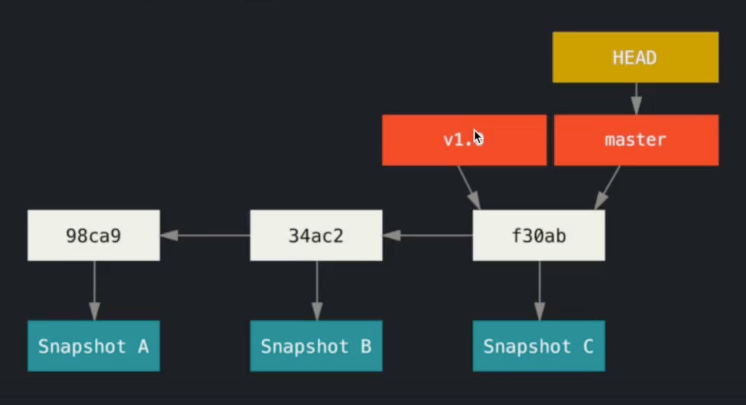
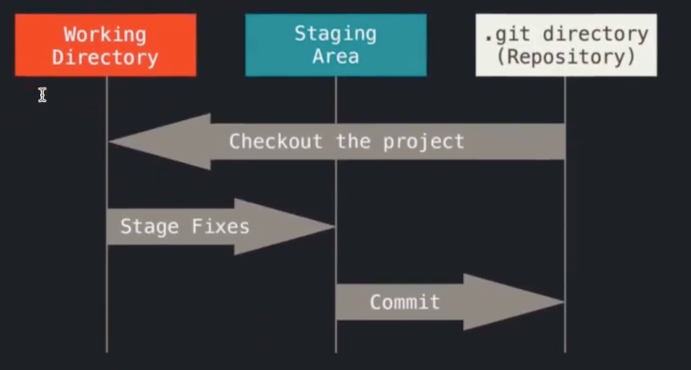
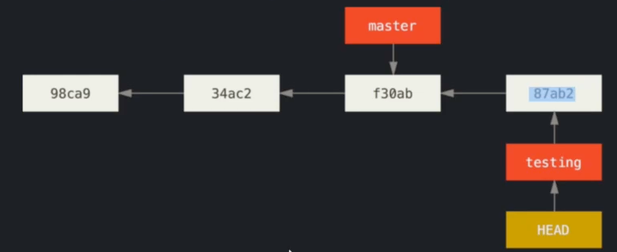
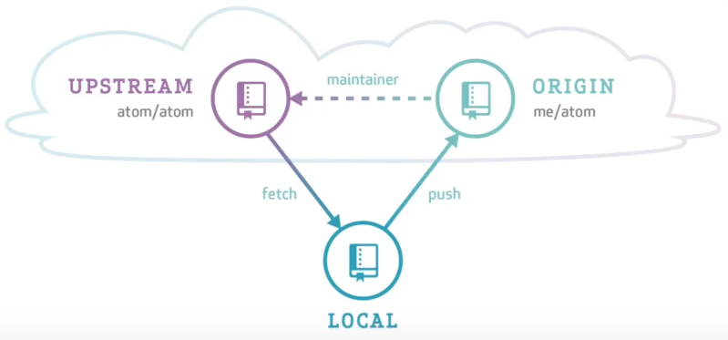

# GIT 

**Git** - система версионирования кода  

**Коммит (англ. commit)** – слепок всех отлеживаемых гитом (индексированных) файлов. Каждый коммит имеет родительский 
коммит – предыдущее состояние файла, а совокупность всех коммитов формирует дерево коммитов. Название каждого коммита 
уникально и представляет собой _хэш-сумму коммита_.

Если файл не изменился при переходе от одного коммита к другому, то гит укажет на ссылку файла в предыдущем состоянии. 
Т.е. физически файл храниться один раз, а гит хранит слепки/срезы.

### Стадии работы с git:

1. Редактирование файла – изменение файла в любом текстовом редакторе.
2. Добавление файла в staging area – область с изменениями, которые будут включены в следующий коммит.
3. _Сохранение коммита_ – перманентное сохранение всех собранных в staging area изменений.

### Основные команды

Для инициализации git в директории, за содержимым которой нужно следить, используется команда `git init`. В результате 
работы команды создается скрытая папка `.git `, в которой и будут храниться данные о всех коммитах.  

`git init` - создать в текущем каталоге новый подкаталог с именем `.git`, содержащий все необходимые файлы репозитория  
`git add` - добавить изменения в файле в staging area  
`git status` - проверкa статуса файлов  
`git commit` - сделать коммит  
`git log` - показать все коммиты, с флагом `-graph` - дерево коммитов  
`git diff --staged` - выводит изменения, добавленные в staging area  
`git checkout -b feature` - создание ветки и переход на новую ветку  
`git branch <new-branch>` - создание ветки
`git branch` - вывод веток  
`git checkout <hash-commit>` - переключение на другой коммит  
`git diff <from-branch> <to-branch>` - разница между ветками  
`git tag v1` - add tag  
`git merge <branch>` - мердж веток

`git clone <ссылка на репозиторий>` - сохранение репозитория  
`git pull` - добавление изменений из удаленного репозитория  
`pit push` - добавление изменений из локального репозитория  
`git push --tags` - добавление тэгов из локального репозитория  
`git remote add <origin> <URL>` - добавление URL репозитория в remote.  
`git remote -v` - получить remote адреса репозитория   

### Ветки и тэги

**Ветка (англ. branch)** – это указатель на коммит с определенным именем; по веткам можно переключаться между коммитами, 
когда ведется активная разработка программы.  

**Тэг (англ. tag)** – это тоже указатель на коммит, но, в отличие от ветки, он не изменяется; тэги используются для 
указания коммита, который находится в релизе.  

**HEAD** – это указатель на текущий коммит.  

### Стратегии ветвления

1. Git Flow
    - В ветке master всегда находится стабильный и работающий код и только он. 
    - В ветке dev находится слияние всех наработок, которые войдут в следующую стабильную версию. В этой ветке 
   тестируется новый функционал.
    - В тематических ветках находятся решения конкретных задач, например, реализация определенной функции.
2. Trunk based development
    - Ветка master представляет собой единый костяк (англ. trunk). 
    - От ветки master ответвляются быстроживущие ветки, в которых реализуется небольшой функционал. Они быстро вливаются 
   обратно в ветку master.  
   

### Удаленные репозитории

commit
branch
checkout
cherry-pick
reset
revert
rebase
merge