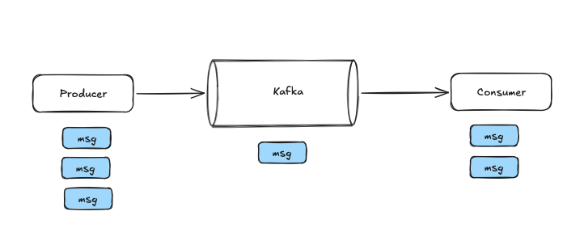
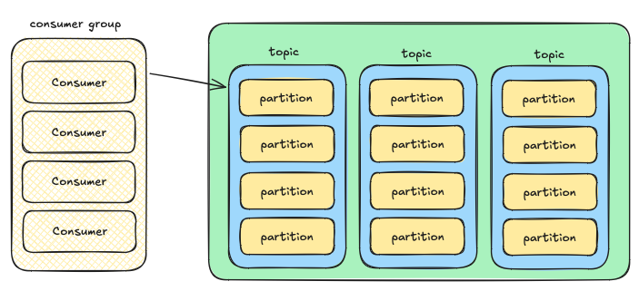

# Kafka

**Kafka** - Очередь сообщений, необходимая для асинхронной передачи данных. 

## Почему kafka?

Промышленная стримминговая платформа для высоких нагрузок:
- миллиарды сообщений в секунду
- хорошо масштабируется горизонтально из коробки
- идемпотентность

Pub/Sub - тупой брокер, умный консьюмер - kafka не знает кто и что читает. Всю логику реализует приложение, а Kafka просто хранит данные.

По сути это **распределенная БД**. Сообщения там храняться на диске. 

## Топики и партиции

Топики разбиты по партициям. Для каждой партиции может быть свой консьюмер. 

## Консьюмер группа

**Консьюмер группа** - это объединение нескольких консьюмеров, работающих совместно для чтения данных из топика. Консьюмер группа легко расширяется и автоматически мапится на партиции. Нужно правильно выбирать ключ партиционирования для локальной упорядоченности (в рамках одной партиции). 

Преимущества:
- масштабирование - добавление новых консьюмеров с одинаковым *group.id* позволяет обрабатывать данные параллельно
- отказоустойчивость - если один потребитель выходит из строя, его партиции автоматически перераспределяются между оставшимися участниками.
- идентификация - группа индентифицируется уникальной строкой *group.id*

## Гарантирован ли порядок сообщений в кафке?

Гарантирован в рамках одной партиции. необходимо выбирать ключ так, чтобы распределение по партициям было равномерно.