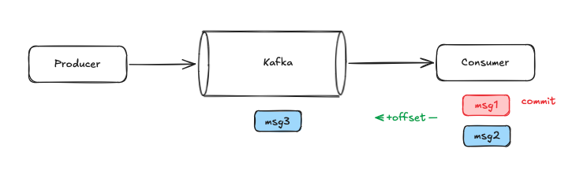
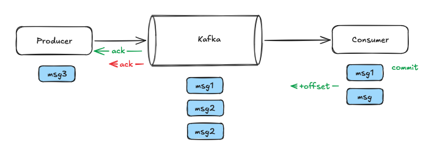
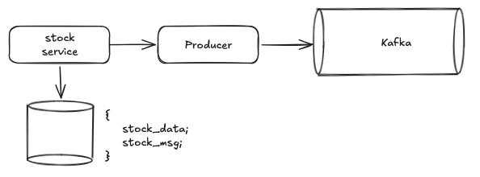
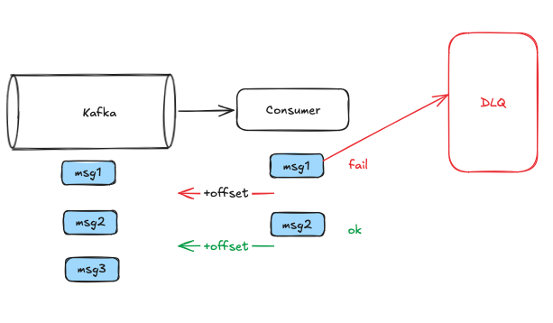

## Гарантии доставки

1. **At most once**

Настройка по умолчанию.

Сообщение доставим **максимум один** раз. Сообщения могут быть потеряны из-за того, что консьюмер коммитит сообщения, полученные от kafka. Если сообщение получено, но потеряно, всё равно оно будет закомиченно.

2. **At least once**

Сообщение доставим **по крайней мере** один раз. Могут быть дубли из-за того, что producer не смог обработать ack от kafka. 

Как из at most once сделать at least once:
- у продссера включить **ретраи** и **ack'и**
- у консьюмера фиксировать офсет только после успещной обработки сообщения. если упали, то перечитываем сообщение

3. **Exactly once**

Тот же at least once, но с избавлением от дублей. 

На уровне продюсера:
- добавить ack'и
- добавить ретраи
- добавить **ключ идемпотентности**

На уровне косьюмера:
- управление offset'ом на косьюмере (за пределами кафки)
- фиксировать результаты обработки сообщения и в offset в одной транзакции (transactional inbox)
- использовать offset из своего хранилища при повторном подключении к кафке

## Transactional outbox

## Dead letter queue

