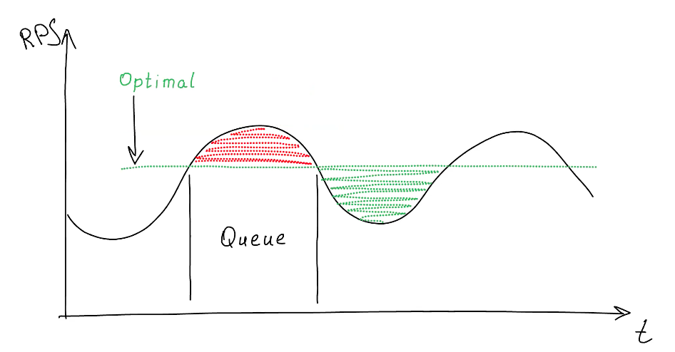
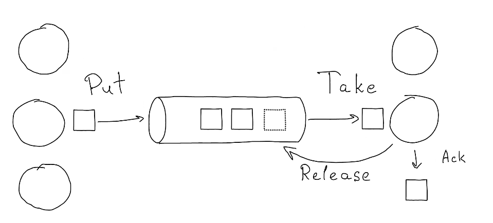
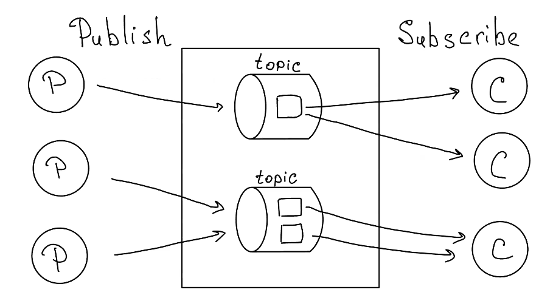
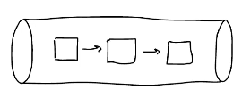
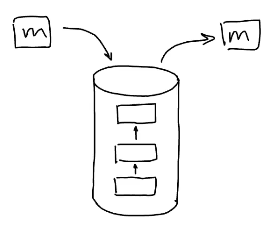
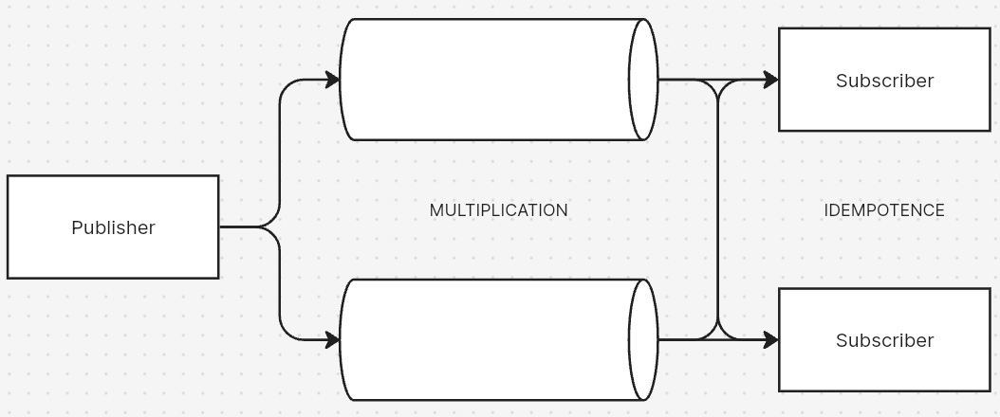

# Очереди

## Для чего нужны очереди?

1. Помогают устранить дисбаланс в потоке входящих задач
2. Планирование исполнения

3. Основа для репликации сообщений
4. Создание отказоустойчивых систем
5. Коммуникация микросервисов
6. Event sourcing
7. Стримы

## Что такое очередь?

1. Среда коммуникации посредством сообщений.
2. Put/take

3. Pub/Sub

4. Request/Responce  
5. Протоколы: AMPQ, MQTT, STOMP, NATS, ZeroMQ

## Какие бывают?
1. Managed / Cloud Services
    - Amazon SQS, EventBridge
    - Google Cloud Tasks
    - CloudAMQP
2. Message brokers
    - RabbitMQ
    - Apache Kafka
    - NATS JetStream
    - ActiveMQ
    - NSQ
3. Database-backed queues
    - PgQueue
    - Tarantool
    - Redis
4. Socket on steroids (lightweight or embedded)
    - ZeroMQ
    - NATS (core)
    - nanomsg

## Алгоритмы

1. Алгоритмы
    - FIFO  
        

    - LIFO  
        
    
    - Best Effort  
        

    - Qulity of Service  

2. Структуры данных внутри: Heap vs List
3. Зависимости: nested queues, hierarchy
4. retry, dekay, retry with delay
5. DLQ
6. Task dependecy
7. TTL, TTR, putback, Vilibility

## Проблемы

1. Availability (Доступность очереди):
 - возможность принимать сообщения (producer может отправить сообщение)
 - возможность сохранять сообщение
 
2. Durability:
	- возможность не терять сообщение (consumer может получить все сообщения)
	
3. Delivery guarantee 
	Обещание доставить сообщение.

- At most once - доставим или не доставим, но повторять не будем
- At least once - сообщение приняли, доставим еще раз, если не уверены, что доставили
- Exactly once - доставим точно один раз. 
   Обычно это не возможно. Промышленные системы обычно понимают под этим термином At least once, но повтор сообщения будет скрыт от пользователя.
	Большая часть систем доставляет сообщения "как-то" - что-то задублировали, что-то потеряли.

4. Scalability
   Возможность увеличивать пропускную способность путем добавления дополнительных нод

## Топологии

1. Single Instance
Availability: low
Durability: low
Scalability: -
Guarantee: X ≠ 1 | X ≤ 1 

2. Multi Instance - много очередей, но кладется в доступную
Availability: high.  
Durability: medium - может быть утеряно.  
Scalability: yes.  
Guarantee: X ≠ 1 | X ≤ 1   

3. Multiple queues, put K/N - multiplication.  
Availability: high.  
Durability: high.  
Scalability: yes.  
Guarantee: X ≠ K | X ≤ K -> X ≥ 1.  

4. Replicated queues, 1/N
Availability: high.  
Durability: high.  
Scalability: yes.  
Guarantee: X ~ 1 (X ≥ 1).  
 

