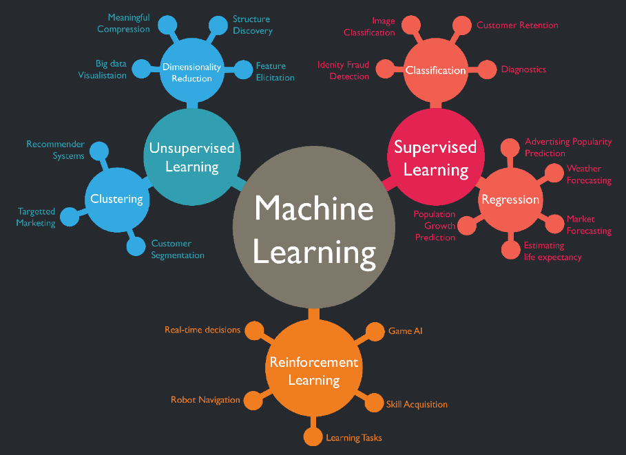
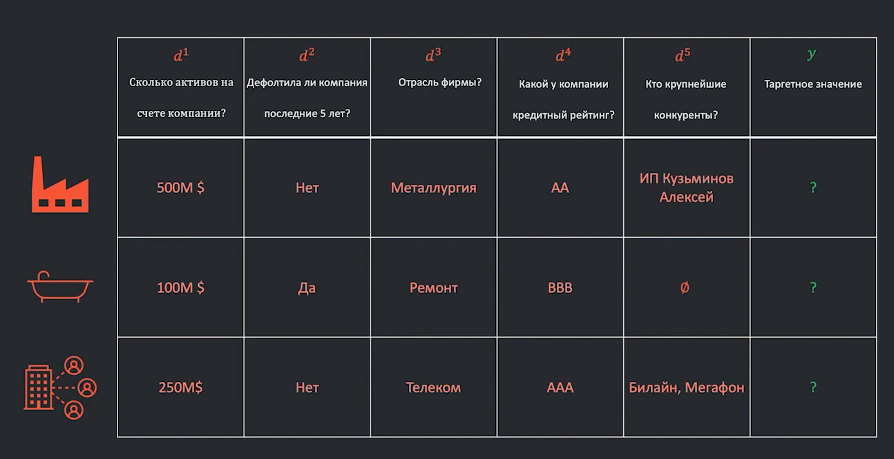
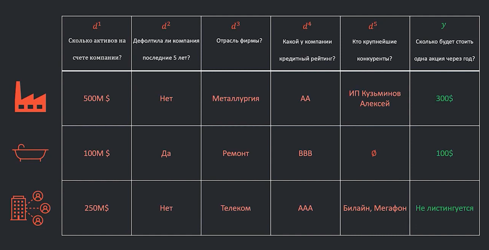

# Что такое машинное обучение?

Комплекс методов и инструментов, которые позволяют компьютеру строить модели с сильной экспертизой на основе входящих
данных из реально мира и накопленных человеком научных знаний.

Недостатки экспертизы человека, которые хорошо заменить человеком:

- нужна скорость ответа.
- экспертов может быть мало
- сложные задачи
- большое количество данных

Два основных блока, рассматриваемых в машинном обучении — **классическое машинное обучение** и **глубокое обучение** (
Deep
learning).

## Основные понятия ML

**Датасет (Dataset)** — структурированный набор данных, как правило, представленный в виде одной или нескольких таблиц,
где строкам соответствуют некие объекты (objects), а столбцам - их признаки (features).

**Алгоритм (Algorithm)** — набор однозначных пошаговых инструкций, которые компьютер может выполнять для достижения
определенной цели.

**Модель (Model)** — некая абстракция, с помощью данных обученная распознавать определенные типы закономерностей.

**Признаки или фичи (Features)** — некоторые характеристики, на основе которых проводится обучение модели.

## Типы задач машинного обучения

1. **Supervised Learning** (_Обучение с учителем_ - обучение по прецедентам, попытка по истории для объектов
   восстановить историю):
    - **регрессия:** предсказание некого числового значения (например, цена квартиры по ее площади и расположению или
      капитализация компании по ее характеристикам). Число это не ограничено.
      ```
      прецедент - это те наблюдения, которые уже произошли, мы смотрим на них и пытаемся восстановить на новых данных
      ```
      _пример,_ какая капитализация компании?
    - **классификация** (бинарная/многоклассовая): — определение объекта в ту или иную заранее определенную группу, т.е.
      множество ответов ограничено и известно.

   _пример,_ какой фрукт на картинке?

2. **Unsupervised Learning** (_Обучение без учителя_ - есть объекты, в которых мы пытаемся уловить связь):
    - **кластеризация:** объединение объектов в группы, сходных по неким признакам (сегментация пользователей, группы
      генов с похожей экспрессией). При этом заренее не известно, какие это будут группы.

    - **рекомендательные системы:** подбор контента на основе предыдущего поведения пользователя (например подбор фильма
      на основе предыдущих оценок).

    - **поиск аномалий** — поиск объекта, сильно отличающегося от других.

3. **Reinforcement Learning** (Обучение с подкреплением - Ответ заранее неизвестен. Система обучается самостоятельно,
   взаимодействуя с некоторой средой, получая от нее негативные и позитивные сигналы, тем самым как бы сама выступая в
   роли учителя.)



## Компоненты классической ML-задачи

- Выборка: объекты и признаки
- Ответ (target)
- Функция потерь и функционал качества
- Метрики качества
- Алгоритм / семейство моделей
- Оценка модели

### Выборка

**Выборка** - это на чем мы обучаем модели - те объекты для которых мы хотим установить связи.
Каждый объект состоит из признаков описания.

$x_i = (d^1, d^2,..., d^k)$ - объекты, где  
$d^1, d^2,..., d^k$ - признаки.  
$X = \{(x_i,y_i)\}$ - весь набор признаков и ответов

Признаки:

- вещественные: если он лежит на прямой бесконечных значений. Например, сколько активов есть у компании
  $$d^j \in R$$
- бинарные
  $$d^j \in [0,1]$$
- категориальные. Например отрасль компании
  $$d^j \in D$$
- порядковые
  $$d^j \in D \subset Z$$
- множественные
  $$d^j \in 2^D$$



### Ответы / таргет / цель

**Цель** - это переменная, которую мы хотим предсказать или оптимизировать на основе входных данных.

$y$ - ответ.  
$Y$ - множество всех ответов.

- вещественные. Например, какая будет цена акции через год?
  $$y_i \in R$$
- бинарный. Например, вырастет цена акции или нет
  $$y_i \in [0,1]$$
- множественный
  $$y_i \in \{1, 2, 3, ...\}$$
- задачи без явного таргета
  $$y_i \in \emptyset$$

- 

### Функционал потерь и функции качества

Функция - правило, по которому одно множество связано с другим

**Функция потерь (loss function)** — это математическая функция, используемая в статистике и машинном обучении для
оценки
качества модели, отражающая "стоимость" ошибок, возникающих при прогнозировании или принятии решений.

Квадратичная функция:
$$L(a(x_i), y_i) = (a(x_i)- y_i)^2$$

### Функция качества

**Функция качества** - усредненная функция потерь по всем объектам, т.е. некая средняя потеря модели $a(x)$ на
выборке $X$ из $m$ объектов:

$$Q(a(x), X) = \frac 1 m \sum_{i=1}^{m}L(a(x_i), y_i)$$

**Функционал качества в машинном обучении** — это математическая функция, которая используется для оценки
производительности модели. Он позволяет количественно оценить, насколько _хорошо модель выполняет свою задачу_, и
служит основой для оптимизации алгоритма обучения.

**Метрика качества в машинном обучении** — это количественный показатель, который используется для оценки
_производительности и качества модели_. Она позволяет понять, насколько хорошо модель выполняет свою задачу и где
могут быть области для улучшения.  
Метрики качества помогают сравнивать различные модели и выбирать наиболее подходящую для конкретной задачи.

Пояснение: зачастую в задачах МО разделяют метрику и функционал качества. Поэтому под первой скорее подразумевают
некоторую меру, близкую к бизнесу и легкую в интерпретации, а под второй – такую, которую во время обучения моделей
необходимо оптимизировать (минимизировать/максимизировать). Но, конечно, как уже и было сказано, совпадать они могут.

#### Симметричные метрики

**MSE (min square error)** - функция квадратичного отклонения  
$$MSE = \frac 1 n \sum_{}^{n} (a(x_i) - y_i)^2$$

**MAE (min absolute error)** - средняя абсолютная ошибка
$$MAE = \frac 1 n \sum_{}^{n} |a(x_i) - y_i|$$


#### Несимметричные метрики
RMSLE (Root Mean Squared Logarithmic Error)  - cреднеквадратичная логарифмическая ошибка 
$$
\text{RMSLE}(X, y, a) = \sqrt{\frac{1}{\ell}\sum_{i=1}^{\ell} \big(\log{(y_i + 1)} - \log{(a(x_i) + 1)}\big)^2}
$$

Больше метрик качества [тут](https://loginom.ru/blog/quality-metrics)