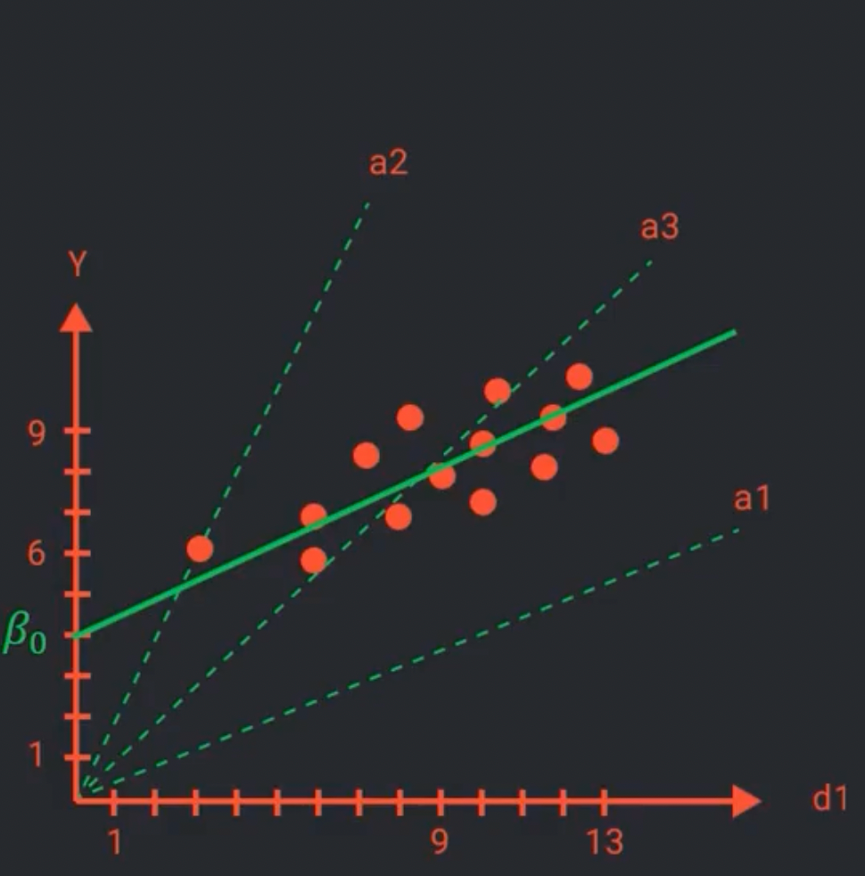
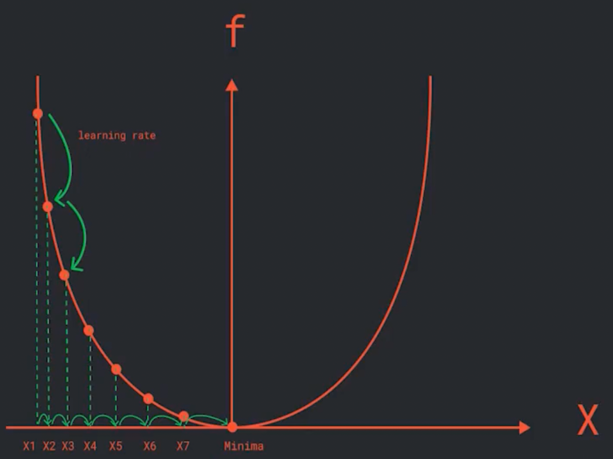
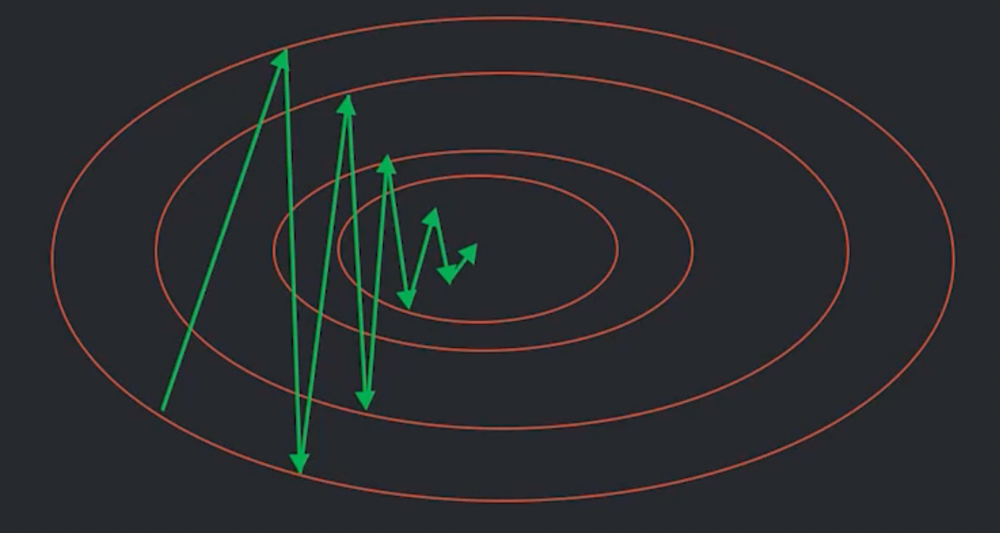

## Линейная регрессия

Линейная регрессия (Linear regression) — это математическая модель, которая описывает связь нескольких переменных.

$$
a(x) = \beta_0 + \beta_i d_i
$$

### Матричная форма

$X$ - матрица выборки (объекты и выборки). Строчка - это объект, а столбик - признак, где $n$ - количество объектов в
выборке, а $k$ - количество признаков (включая константу).  
$B$ - это коэффициенты (веса).

Квадратичная функция качества:
$$
Q = \frac{1} {n} (X \cdot B - Y)^T(X \cdot B - Y)
$$

Минимум находится путем взятия матричного дифференциала:

$$
dQ(\beta^*) = 0
$$
или формула оптимальных коэффициентов для MSE:
$$
(X^T \cdot X)^{-1} \cdot X^T \cdot Y
$$

## Градиентный спуск (Gradient descent)

$$
X_n = X_{n-1} - \eta \cdot f'(X_{n-1})
$$

$\eta$ - нормировачный коэффициент или темп обучения (learning rate)   
$\xi$ - критерий останова (threshold)

Алгоритм градиентного спуска (для функции одной переменной):

1. Инициализируемся в точке $X_{start}$
2. До сходимости:  
   $step = f'(X_{start})$  
   $X_{next} = X_{start} -\eta_i \cdot step$  
   $X_{start} = X_{next}$
3. Пока не сработает один из threshold:
    - Маленькое значение производной: $|f'(X_{n-1})| < \xi $
    - Маленький шаг: $|X_{n+1} - X_{n}| < \xi$
    - Маленькое изменение $f(X)$: $|f(X_{n+1}) - f(X_{n})| < \xi $

_Линии уровня_ - множество точек, которые при подстановке в функцию дают единое значение

_Градиент_ - это вектор из производных первого порядка или направление скорейшего возрастания.  
Тогда антиградиент напротив, показывает наискорейшее убывание.

Алгоритм градиентного спуска (для функции нескольких переменных):

1. Инициализируемся в случайной точке $X_{start}$
2. До сходимости  
   $ step = \nabla z' (S_{start}) $  
   $ X_{next} = X_{start} -\eta_i \cdot step $  
   $ X_{start} = X_{next} $
3. Три варианта порога:
    - Маленькое значение производной: $|\nabla z(X_{n-1})| \leq \xi $
    - Маленький шаг: $|X_{n+1} - X_{n}| < \xi$
    - Маленькое изменение $f(X)$: $|f(X_{n+1}) - f(X_{n})| \leq \xi $

Пусть имеем n объектов и m признаков:  
$$
\begin{aligned} &
Q = \frac {1} n \sum_{}^{n} (a(x_i) - y_i)^2 = \frac {1} n \sum_{i}^{n} (\beta_1 \cdot d_1^i +... +\beta_m \cdot d_m^i - y_i)^2 \\ &
Q'_{\beta_1} = \frac {2} n \sum_{i}^{n} d_1^i (\beta_1 \cdot d_1^i +... +\beta_m \cdot d_m^i - y_i) \\ &
... \\ &
Q'_{\beta_m} = \frac {2} n \sum_{i}^{n} d_m^i (\beta_1 \cdot d_1^i +... +\beta_m \cdot d_m^i - y_i) \\ &
\nabla Q = (Q'_{\beta_1} ... Q'_{\beta_m}) \\ &
X_{next} = X_{start} - \eta \cdot \nabla Q \\ &
\end{aligned}
$$

Проблемы выбора нормировачного коэффициента:
1. Если большой, то градиент может взорваться - т.е. мы никогда не приблизимся к нему
2. Если слишком маленький, тогда критерий останова $\xi$ сработает раньше, чем мы окажемся в минимуме

