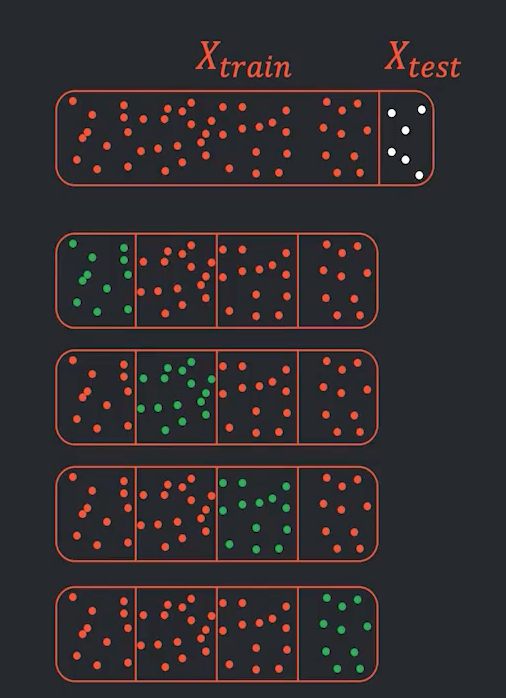

## Обобщающая способность

**Обобщающая способность(generalization ability)** - это способность модели выдавать правильные результаты не только для
тренировочных примеров, участвовавших в процессе обучения, а на всем множестве исходных данных (во всех сценариях, не
только на тренировочных данных).

**Недообучения** (underfitting) модель делает поспешные выводы.

**Переобучения** (overfitting) строит функцию слишком близко к исходным данным.

Если ни для одной модели не получилось хорошее качество. Почему?
Плохая модель:

- Либо модель чрезмерно сложная, либо чрезмерно простая
- Мы не правильно специфицировали задачу

Плохие данные:

- В какой-то части много выбросов
- Данные засплитились сегментированно

## Кросс-валидация (K-Fold)

1. Отложим $X_{test}$ для финальных замеров
2. $X_{train}$ случайно поделим на $K$ частей
3. Получим $K$ наборов $(X_{train}, X_{val})$
4. Строим $K$ моделей, минимизируя соответственно
   $$Q(a, X_{train_1}), Q(a, X_{train_2}), Q(a, X_{train_3})...$$
5. Получаем $K$ оценок $a_1, a_2, a_3..$
6. Замеряем $K$ средних ошибок на валидации
   $$Q(a, X_{val_1}), Q(a, X_{val_2}), Q(a, X_{val_3})...$$
7. Если их среднее/их распределение нас устраивает, то строим финальную модель
8. Финальная модель
    - либо обучаем последний раз на всё train'е
    - либо усредняем прогнозы / веса $a_1, a_2, a_3..$
    - либо берем лучшую на валидации

