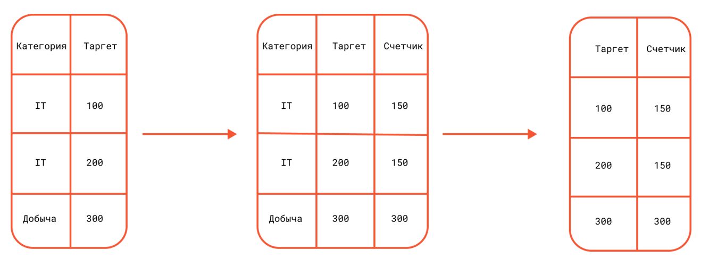

# Методы

## Mean-target encoding (Счетчики)

Mean-target encoding, или кодирование по среднему значению целевой переменной, является методом преобразования
категориальных признаков в числовые значения, что позволяет улучшить производительность моделей машинного обучения.



```python
data['Категория'] = data['Категория'].map(data.groupby(['Категория'])['таргет'].mean())
```

## One-hot encoding

One-hot encoding — это метод преобразования категориальных переменных в числовой формат. One-hot encoding создает новые
бинарные столбцы для каждой уникальной категории в исходном категориальном признаке. Каждый столбец представляет одну
категорию, и значение 1 указывает на присутствие этой категории, а 0 — на её отсутствие. Например, если у нас есть
признак "Цвет" с тремя категориями: "Красный", "Зеленый" и "Синий", то после one-hot encoding мы получим три новых
столбца:

    Цвет_Красный
    Цвет_Зеленый
    Цвет_Синий

Для записи с цветом "Красный" будет установлено значение [1, 0, 0], для "Зеленого" — [0, 1, 0], и для "
Синего" — [0, 0, 1]

```python
data = pd.concat((data, pd.get_dummies(data['Валюта'])), axis=1)
```

