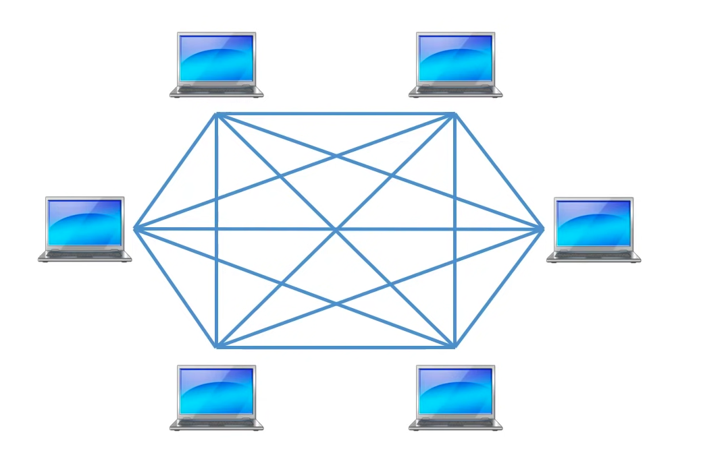
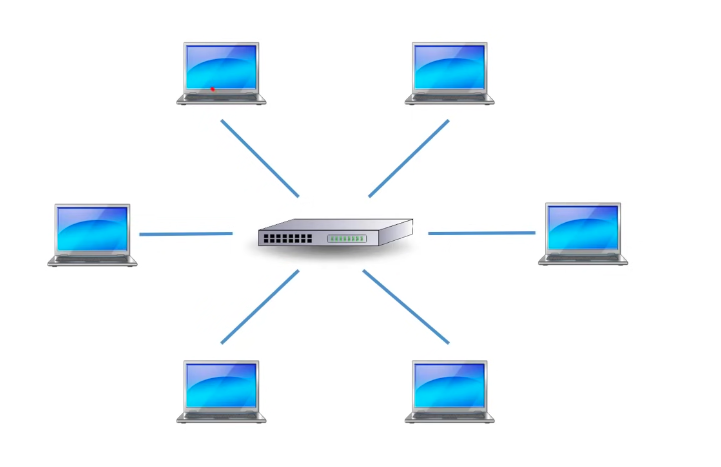
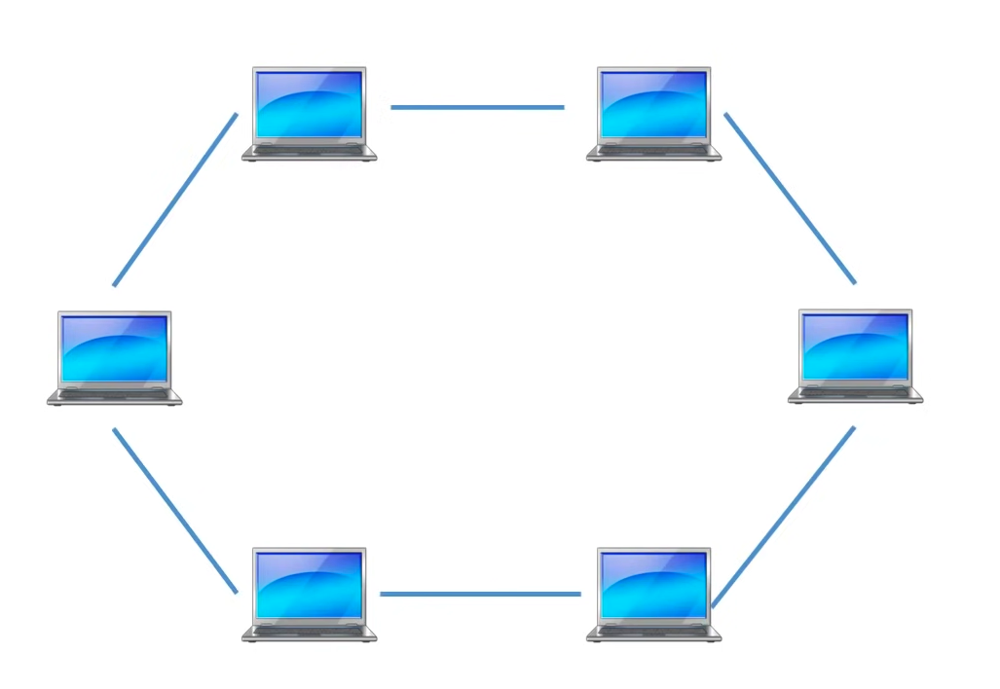
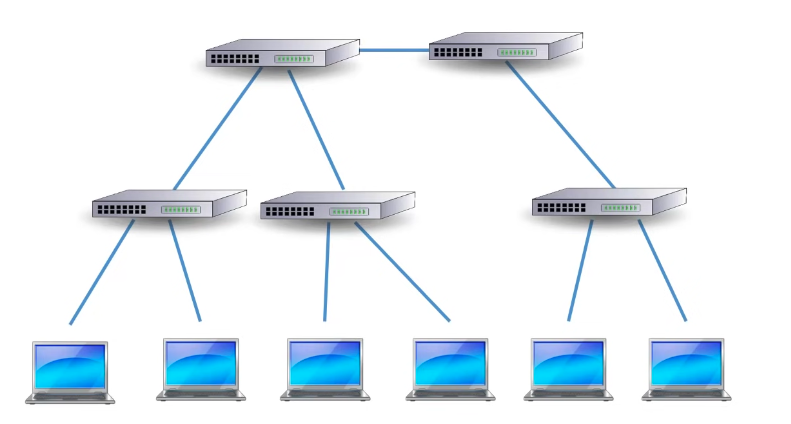
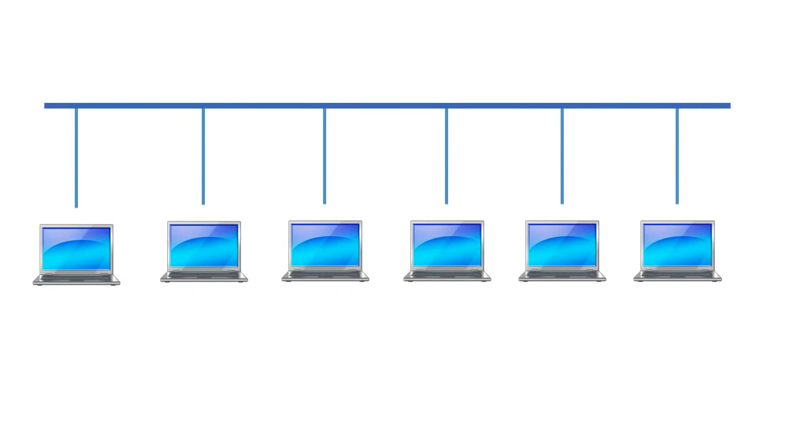
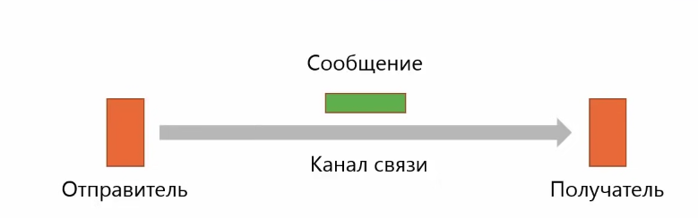
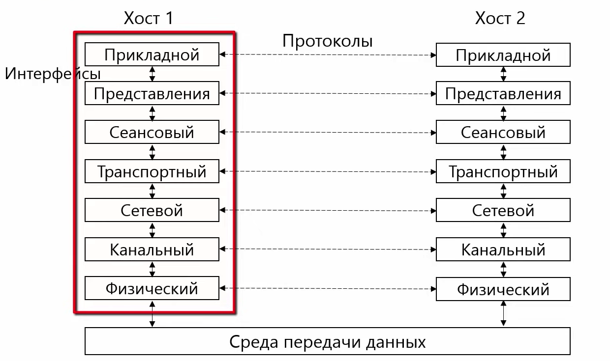
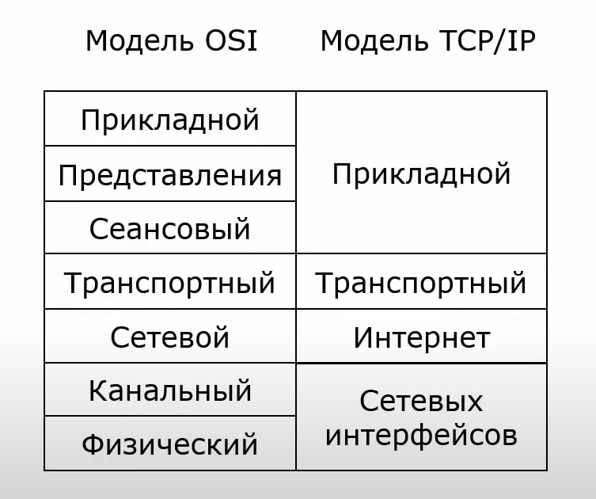
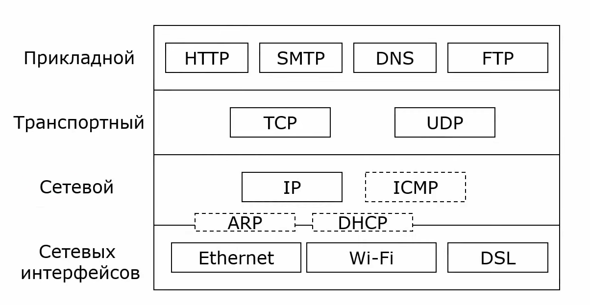

## Классификация сетей

1. По типу коммутации
    - коммутация каналов (необходимо установить соединение между отправителем и получателем) - телефонная сеть
    - коммутация пакетов (данные деляться на части и передаются независимо) - компьютерная сеть
2. По технологии передачи
    - широковещательные сети (доступны всем)
    - точка-точка (комп - комп)
3. По протяженности
    - персональная (1м)
    - локальная (10м - 1км)
    - муниципальная (10 км)
    - глобальная (100 - 1000км)
    - объединение сетей (интернет)

## Топология компьютерных сетей
Состоит из вершин (компьютеры и сетевое оборудование) и ребер (связей между узлами)
- Полносвязая топология - каждое устройство имеет связь с другим
- звезда - в качестве центральной точки выступает сетевое оборудование (маршрутизатор)
- кольцо - данные передаются по кольцу через все или несколько устройств
- дерево
- общая шина - данные доступны сразу всем участникам подключенных к общей шине

  
  
  
  
  

**Физическая топология** - соединение устройств в сети  
**Логическая топология** - правила распространения сигналов в сети

Ethernet:

  

## Основные стандарты
* IEEE - сетевое оборудование
* RFC - протоколы интернет
* W3C - рекомендации Web

## Основы организации компьютерных сетей
**Сервис** - описывает какие функции реализует уровень  
**Интерфейс** - набор примитивных операций, который нижний уровень предоставляет верхнему  
**Протокол** - правила и соглашения, используемые для связи уровня N одного компьютера с уровнем N другого уомпьютера

Модели организации сетей:
- ISO OSI - юридический стандарт, включающий 7 уровней взаимодействия и хорошую теоретическую проработку. На практике не используется
- TCP/IP - фактический стандарт на основе популярного стека протоколов TCP/IP, включающий 4 уровня. На практике используется

**Инкапсуляция** - включение сообщения вышестоящего уровня в сообщение нижестоящего уровня  
Сообщение: заголовок + данные + концевик

## Модель OSI (Open System Interconnection)

  

_Физический_ - передача битов по каналам связи. Задача уровня представить биты информации в виде сигналов, передаваемых по среде.     
_Канальный_ - передача сообщений. Должен уметь выделять сообщения. На этом уровне происходит управление доступом к среде передачи данных и физическая адресация.  
_Сетевой_ - построение сетей на основе разных технологий. Задачи уровня: согласование различий в сетях разного типа, адресация(сетевые или глобальные адреса), маршрутизация  
_Транспортный_ - передача данных между процессами на хостами    
_Сеансовый_ - создает сеансы связи. Задачи: очередность передачи сообщений, предотвращения выполнения критичной операции   
_Уровень представления_ - обеспечивает согласование синтаксиса и семантики передаваемых данных (форматы символов, форматы чисел), шифрование/дешифрование  
_Прикладной_ - набор приложений, полезных пользователям

| Уровень    | Оборудование                     |
|------------|----------------------------------|
| Физический | Концентратор                     |
| Канальный  | Коммутатор, точка доступа (WiFi) |
| Сетевой    | Маршрутизатор                    |  

Транспортный, сеансовый, уровень представления, прикладной - работают на хостах

## Модель TCP/IP

  

Стек протоколов:

  

