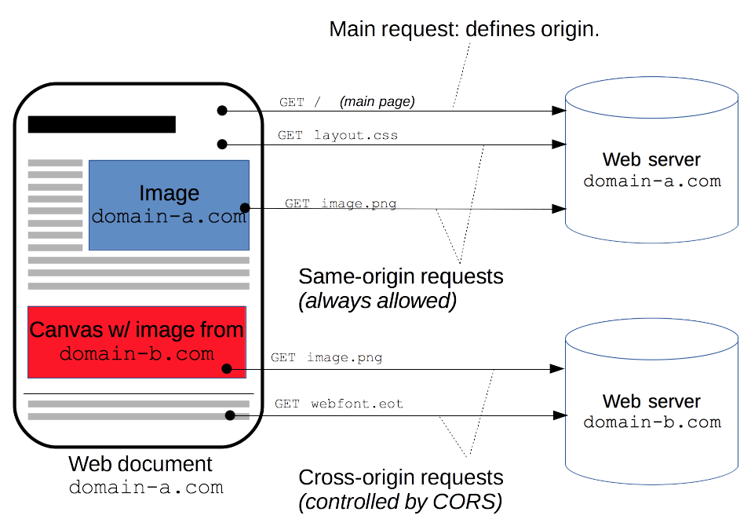

## REST

### Что такое REST?
**REST** (REpresentational State Transfer) - принцип взаимодействия клиента и сервера, основанные на понятиях "ресурса" 
и "глагола". В случае HTTP, ресура - это _uri_, глагол - это метод.

### REST API [Best practices](https://habr.com/ru/articles/351890/)
1. Конечные точки в URL - имя существительное (_frames_ вместо _getFrames_, _updateFrames_, ...)
2. Множественное число (_frames_, _frames/{id}_ вместо _frame_, _frame/{id}_)
3. Документация :)
4. Версионирование (_host/v1/frames/_)
5. Пагинация
6. Использование SSL
7. Разные HTTP-методы
8. Разные коды

-----------------

## Что такое CORs?

_**CORS** (Cross-origin request sharing)_ - механизм, который разрешает серверу указывать источники, с которых браузеру 
разрешено будет выполнить загрузку, отличные от его собственных.

Категории доступа тэгов:
1. Запись из из разных источников (ссылки, переадресации, отправка форм). С активным CORS эти операции будут разрешены.
2. Вставка из разных источников (script, link, img, video, ...)
3. Считывание из разных источников (тэги загружаемые через выховы AJAX/fetch). По умолчанию заблокированы браузером

Источник идентифицируется тройкой параметров: схема, имя хоста, порт. Если хотя бы из трех элементов у двух источников 
отличается, то ресурсы считаются разными и такие запросы будут блокироваться. Другими словами, если пользователь 
находится на сайте, на котором в тэге <script> будет выполняться код, который будет запрашивать ресурсы другого сайта, 
то такой код будет блокироваться ошибкой _Cross-Origin Request Blocked_.

Заметки:
- На сайт, не ограниченный платным доступом, не требующий аутентификацию и авторизацию можно установить: `Access-Control-Allow-Origin: *`
- На сторонний (например) аналитический API хорошо устанавливать набор заголовков `Access-Control-Allow-Origin`, чтобы 
API не пропустила лишние вредоносные запросы
- Полезно пропускать куки в запросах между разными источниками (`Access-Control-Allow-Credentials: true`) когда вы 
точно знаете какие клиенты будут иметь доступ к вашему серверу.

-----------------

## Что такое SSL и TLS, есть ли между ними отличия?

SSL или слой защищенных сокетов было оригинальным названием протокола, который разработала компания Netscape в середине 
90-х. SSL 1.0 никогда не был публично доступным, а в версии 2.0 были серьезные недостатки. 
Протокол SSL 3.0, выпущенный в 1996, был полностью переделан и задал тон следующей стадии развития.

Когда следующую версию протокола выпустили в 1999, ее стандартизировала специальная рабочая группа проектирования сети 
Интернет и дала ей новое название: защита транспортного уровня, или TLS. Как говорится в TLS-документации, «разница 
между этим протоколом и SSL 3.0 не критичная». TLS и SSL формируют постоянно обновляемую серию протоколов, и их часто 
объединяют под названием SSL/TLS.

Протокол TLS шифрует интернет-трафик любого вида. Самый распространенный вид — веб-трафик. Вы знаете, когда ваш браузер 
устанавливает соединение по TLS — если ссылка в адресной строке начинается с «https».

TLS также используется другими приложениями — например, в почте и системах телеконференций.

Самый безопасный метод шифрования — это асимметричное шифрование. Для этого требуется 2 ключа, 1 публичный и 1 приватный. 
Это файлы с информацией, чаще всего очень большие числа. Механизм сложный, но если попросту, вы можете использовать 
публичный ключ, чтобы шифровать данные, но вам нужен приватный ключ, чтобы расшифровывать их. Два ключа связаны с 
помощью сложной математической формулы, которую сложно хакнуть.

Так как в асимметричном шифровании применяются сложные математические расчеты, нужно много вычислительных ресурсов. 
TLS решает эту проблему, используя асимметричное шифрование только в начале сессии, чтобы зашифровать общение между 
сервером и клиентом. Сервер и клиент должны договориться об одном ключе сессии, который они будут вдвоем использовать, 
чтобы зашифровать пакеты данных.