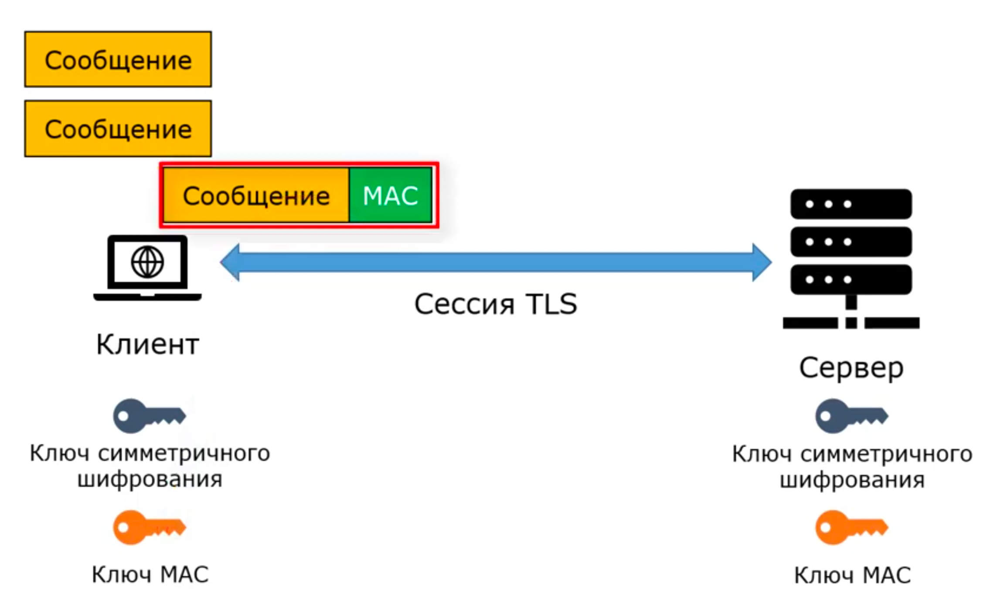

# SSL/TLS

_**TLS** (Transport Layer Security)_ - протокол защиты транспортного уровня
_**SSL** (Secure Sockets Layer)_ - уровень защиты сокетов (устарел)

  

Семейство протоколов для безопасной передачи данных. Используются протоколами прикладного уровня: HTTPs, SMTPs, POP3s,
IMAPs. Соответствует тремя уровням модели OSI:
* Транспортный - передача данных между процессами
* Сеансовый - восстановление сеанса шифрования, который был установлен ранее для повышения производительности
* Представление - представление данных в зашифрованном виде

Безопасность передачи данных включает:
1. Приватность (privacy)
2. Целостность (integrity) - для соблюдения целостности используются **хэш-функции**
3. Аутентификация (authentication) - используется цифровая подпись, инфраструктура открытых ключей

## Шифрование

Существует двух видов: _симметричное_ и _ассиметричное_.

В симметричном шифровании присутствует ключ, с помощью которого можно зашифровать и расшифровать данные. Ключ известен и
клиенту и серверу. Примеры: AES (Advanced Encryption Standard), 3DES (Triple Data Encryption Algorithm), RC4, RC5, RC6
(Rivest cipher)

  

В ассиметричном шифровании используется открытый и закрытый ключ. Открытый ключ используется для шифрования данных, а
закрытый для расшифровки. Примеры: RSA (Rivest-Shamir-Adleman), DSA (Digital Signature Algorithm), Diffie-Hellman.

В основном используют гибридный подход.

### RSA

  
  

Недостатки:
1. Алгоритм не обеспечивает прямую секретность - если злоумышленник получает доступ к секретному ключу, то данные 
расшифровать у него все равно не получится
2. Атака миллиона сообщений

Запрещено использовать с TLS 1.3

### Diffie-Hellman

Основа алгоритма коммутативные операции (можно выполнять в случайно порядке) - см. скрин внизу
p - простое число (1024, 2048 бита)
g - первообразный корень по модулю p, небольшое целое число

  

Алгоритм обеспечивает прямую секретность.

## Целостность

Для поддержания целостности используются криптографические хэш-функции.
Часто используемые хэш-функции: MD5, SHA-1 SHA-224, SHA-256, SHA-384, SHA-512

## Аутентификация

Важно! Во время отправки клиентом открытого ключа, злоумышленник может перехватить открытый ключ и использовать его,
чтобы читать сообщения от сервера. Для этого используется удостоверяющий центр, который выдает **сертификат**, содержащий
открытый ключ сервера. Если клиент доверяет удостоверяющему центру, то ключ, содержащийся в сертификате подлинный.

  

Электронная подпись - механизм, при котором сообщения шифруются закрытым ключом, а расшифровать можно с помощью
открытого ключа. Таким образом, при расшифровке сообщения открытым ключом, мы можем быть уверены, что это именно
сообщение из нужного нам источника.

**Принцип работы.**  
Сервер, с помощью закрытого ключа, шифрует хэш, полученный из данных. Это называется **электронной подписью**. Далее
сервер отправляет данные, присоединяя к ним электронную подпись. Клиент, из полученных данных извлекает хэш
и расшифровывает его с помощью открытого ключа. Расшифрованный хэш клиент сравнивает с хэшом данных. Если хэши совпадают,
то это сообщение от сервера.

  

## Протокол TLS

Протокол необходимый для безопасной передачи данных.
Версии протоколов TLS 1.1, 1.0, SSLv3, SSLv2 - устарели и использовать нельзя.

  

Протокол TSL состоит из двух уровней:
* нижний - протокол записей (record protocol) - задает формат, в котором данные будут передаваться по сети

* верхний - определяет, какое содержание будет передаваться
    - протокол установки соединений (handshake protocol) - используется для установки соединения между клиентом и сервером
    - протокол оповещения (alert protocol) - для отправки сообщений об ошибках
    - протокол смены шифра (change cipher protocol) - для перехода от одного вида шифрования к другому
    - протокол передачи данных (application data protocol) - передача данных

### Record Protocol (протокол записи)

В записи record protocol вкладываются сообщения вышестоящих протоколов. Здесь работают алгоритмы шифрования и проверки
целостности.

  

Тип сообщения - какой вышестоящий протокол используется (протокол оповещения, установки соединения...)

Для передачи данных необходима установка **сессии TLS**. Установка соединения и возобновление сессии осуществляется с
помощью протокола установки соединения. Также происходит обмен алгоритмами шифрования и MAC, ключами для симметричного
шифрования и MAC.

   -->>
   -->>

   -->>
   -->>

  

### Протокол оповещения

Содержит ошибки в работе TLS.
**Фатальные ошибки** должны приводить к немедленному разрыву сессии. Пример ошибок: ошибка MAC (bad_record_mac),
неизвестный удостоверяющий центр (unknown_ca), ошибка расшифровки (decrypt_error)

**Предупреждения** позволяют продолжать сессию. Примеры: срок действия сертификата истек (certificate_expired),
сертификат отозван (certificate_revoked), неизвестный формат сертификата (unsupported certificate).

## Установка соединения

Необходимо для определения набора шифров TLS, а также для проверки подлинности клиента и сервера 
Какой алгоритм используется:
- для шифрования - Diffie-Hellman
- для цифровой подписи - RSA
- для симметричного шифрования - AES
- для создания записей MAC кодов - SHA256

**TLS 1.2**

  

1. Client hello
Client random - простое число, которое будет использоваться для симметричного шифрования

2. Server hello  
Выбранный шифр TLS из предложенного перечня  
Server random - простое число, которое будет использоваться для симметричного шифрования  
Идентификатор сессии по которому сессию можно будет восстановить  

3. Сертификат  
Клиент проверяет валидность сертификата:
    - проверка подлинности удостоверяющих центров
    - проверка доверия корневому удостоверяющему центру
    - проверка домена сертификата
    - проверка срока действия
    - проверка, не отозван ли сертификат

4. Server Key Exchange - передача значений параметров алгоритма Diffie-Hellman
5. Server Hello Done - сервер передал все сообщения, для установки соединения
6. Client Key Exchange - передача информации для получения разделяемого ключа
7. Change Cipher Spec - изменения спецификации шифра
8. Finished - первое сообщение, которое зашифровано ключом симметричного шифрования и для которого сгенерирован код 
идентификации сообщения MAC
9. Сервер проверяет сообщение и если оно дошло без изменений, то выдает сообщение Change Cipher Spec, которое 
подтверждает, что сервер готов сменить спецификацию шифров TLS - перейти на зашифрованную передачу данных
10. Finished. После этого соединение считается защищенным.

  

При восстановлении сессии используется _идентификатор сессии_. Для этого клиент в сообщение Client Hello передает его. 
После этого сервер отдает сообщение Server Hello, Change Ciper Spec, Finished. Получая сообщение Finished, клиент 
расшифровывает его ключом симметричного шифрования, проверяет целостность и если всё прошло успешно пересылает Change 
Ciper Spec и Finished. Соединение считается установленным.

## Протокол TLS 1.3

Современная версия TLS. Появилась в 2018 году. 
Проблемы версии 1.2:
- низкая производительность
- атаки на TLS (RFC 7457): POODLE, BEAST, CRIME, BREACH...
- при настройке легко ошибиться
- поддерживает большое количество устаревших криптографических шифрований

Усиление безопасности:
- совершенная прямая секретность
- запрет устаревших шифров
- шифры **AEAD** - которые за одну операцию используют как шифрование, так и MAC для подтверждения целостности

  

1. В client_hello сразу включается информация для обмена ключами симметричного шифрования.
2. В server_hello генерируется своя информация для обмена ключами, на основе которой и клиент, и сервер могут 
сгенерировать pre-master key
3. Finished

Возможна аутентификация клиента:

  

_**0-RTT** - zero round trip time_  
Если клиент недавно устанавливал связь с сервером (есть идентификатор сети) и хочет использовать те же ключи, то можно
часть данных (early_data) включить в первое сообщение client_hello.

  

