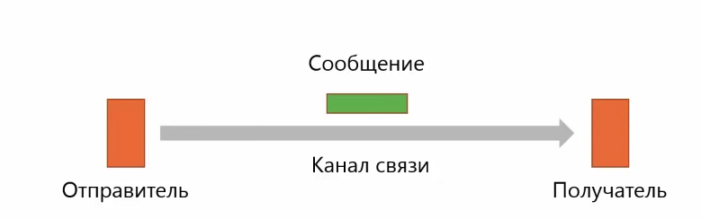

## Физический уровень

Задача - передача потока бит по среде. Не вникает в смысл передаваемой информации  
Единица передачи данных - bit

  

Характеристики:
- пропускная способность
- задержка
- количество ошибок

Способы передачи:
* кабель (телефонный кабель, коаксиальный кабель, витая пара, оптический кабель)
* беспроводные технологии (радиоволны, инфракрасное излучение)
* спутниковые каналы
* беспроводная оптика (лазеры)

## Канальный уровень

Задача - передача сообщений по каналам связи: **адресация** и **согласованный доступ к каналу**  
Единица передачи данных - кадров

### Формирование кадра

  

Методы выделения кадров:
- указатель количества байт в начале кадра - на практике не применяется
- вставка байтов
- вставка битов
- средства физического уровня - ethernet

Повторная отправка:

  

### Подуровни канального уровня
1. Управление логических каналов - отвечает за передачу данных (создаение кадров, обработка ошибок и тд)
2. Управление доступом к среде - совместное использование разделяемой среды, адресация
