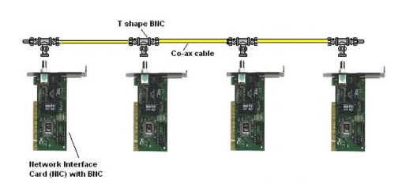
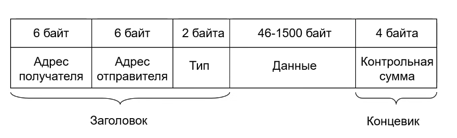

## Ethernet

**Ethernet** - технология для создания проводных сетей, находящаяся на физическом и канальном уровне.   

Различают виды:  
- ethernet (10Мб/с). Сигнал передается через коксиальный кабель, витая пара, оптика.
- fast-ethernet (100Мб/с) - витая пара, оптика
- gigabit-ethernet (1Гб/с) - витая пара, оптика
- 5G ethernet(2,5, 5Гб/с) - промежуточная версия. ТОЛЬКО витая пара
- 10g ethernet (10Гб/с) - витая пара, оптика
- 100g ethernet (40, 100Гб/с) - оптика

или
1. Классический (ethernet ... gigabit-ethernet)
2. Коммутируемые (соединения точка-точка) (fast-ethernet ... 10g ethernet)

Соединение изначально было реализовано через общую шину, но так как азрыв приводил к нерабочей сети, ввели новое устройство - 
концентратор (hub). Логическая схема осталось такой же - общая шина, но физическая превратилась в звезду.    


На физическом уровне ethernet содержит описание передачи сигналов по разным типам кабелей.  
На канальном уровне содержится описание методов доступа и протоколов.

### Кадры

Существует 3 формата кадра:
1. Экспериментальная реализация в Xerox
2. Ethernet II (DIX)
3. IEEE 802.3

Ethernet II кадр:


Тип - код протокола откуда полученные данные (_**0800** - IPv4, **86DD** - IPv6, **0806** - ARP_).
Концевик используется для проверки корректности отправки кадра.


### Mac адреса

_**MAC** (media access control) адрес_ - служит, для понимания кому предназначены данные.  
Пример: 1С:75:08:D2:49:45 - 6 шестнадцатеричных чисел. В сети все mac адреса **уникальны**.

Типы:
1. индивидуальный (unicast)
2. групповой (multicast, 1 бит старшего байта адреса равен 1)
3. broadcast (все 1 - FF-FF-FF-FF-FF-FF)  

_MAC адреса_ назначается либо централизовано, компанией производителем, или локально, администратором.

Структура:
* Первые три байта - уникальный идентификатор компании, производителя сетевой карты карты
* Последние три байта - по усмотрению производителя
```
Команды происмотра адреса в linux: 
ifconfig
ip link 
```


