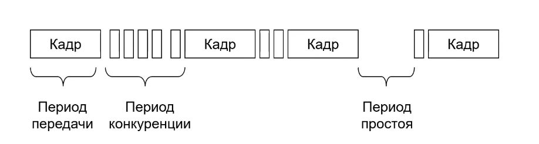
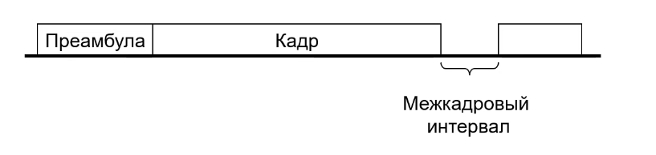
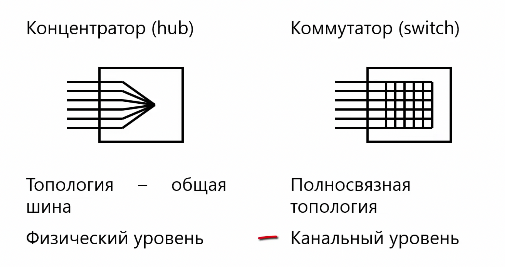
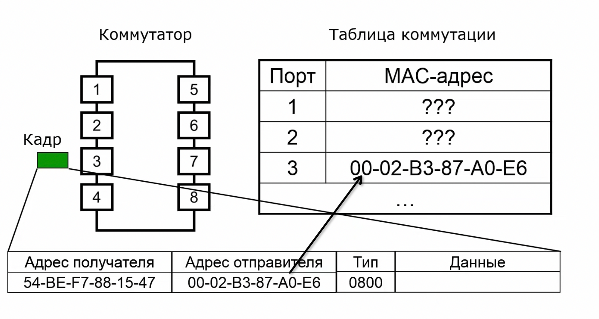
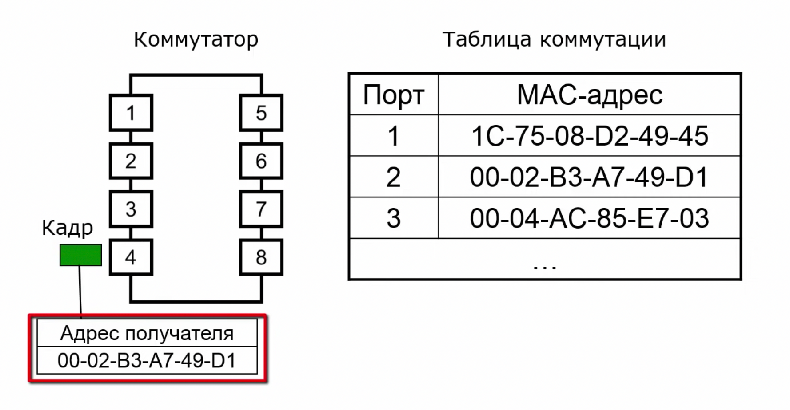
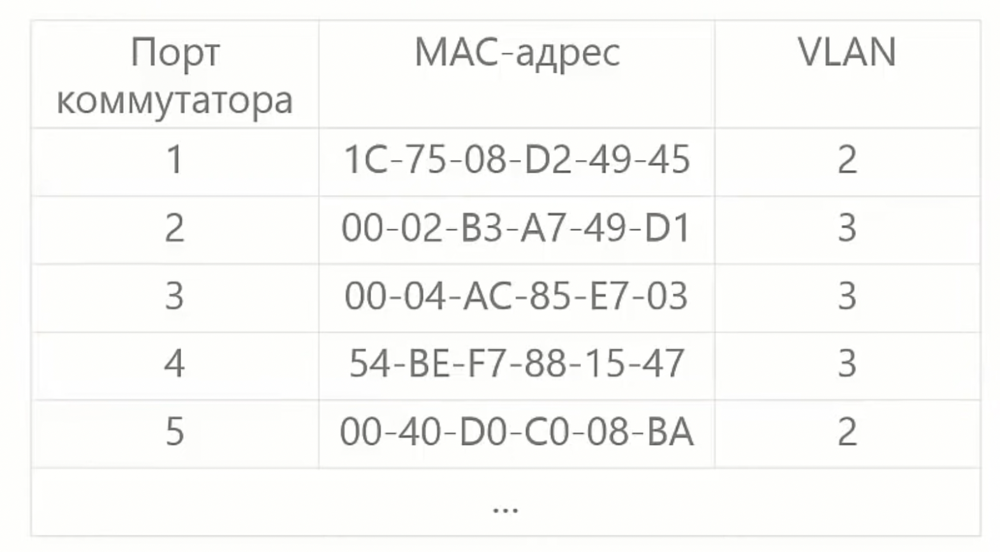
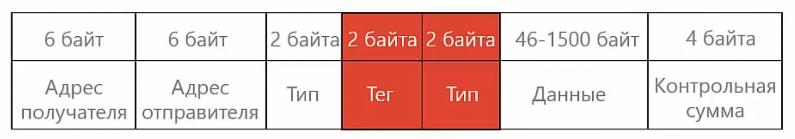
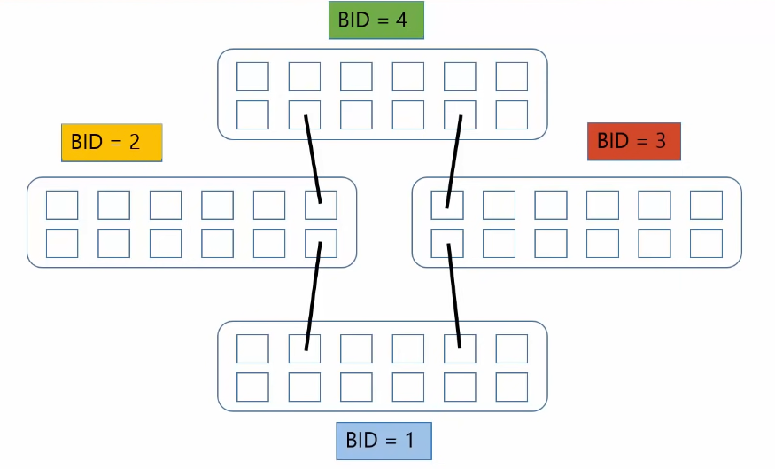
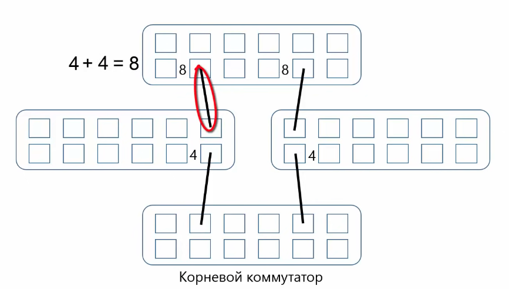

## Ethernet

**Ethernet** - технология для создания проводных сетей, находящаяся на физическом и канальном уровне.   

Различают виды:  
- ethernet (10Мб/с). Сигнал передается через коксиальный кабель, витая пара, оптика.
- fast-ethernet (100Мб/с) - витая пара, оптика
- gigabit-ethernet (1Гб/с) - витая пара, оптика
- 5G ethernet(2,5, 5Гб/с) - промежуточная версия. ТОЛЬКО витая пара
- 10g ethernet (10Гб/с) - витая пара, оптика
- 100g ethernet (40, 100Гб/с) - оптика

или
1. Классический (ethernet ... gigabit-ethernet)
2. Коммутируемые (соединения точка-точка) (fast-ethernet ... 10g ethernet)

## Классический Ethernet
Соединение изначально было реализовано через общую шину, но так как азрыв приводил к нерабочей сети, ввели новое устройство - 
концентратор (**hub**). Логическая схема осталось такой же - общая шина, но физическая превратилась в звезду.    


На физическом уровне ethernet содержит описание передачи сигналов по разным типам кабелей.  
На канальном уровне содержится описание методов доступа и протоколов.

### Кадры

Существует 3 формата кадра:
1. Экспериментальная реализация в Xerox
2. Ethernet II (DIX)
3. IEEE 802.3

Ethernet II кадр:


Тип - код протокола откуда полученные данные (_**0800** - IPv4, **86DD** - IPv6, **0806** - ARP_).
Концевик используется для проверки корректности отправки кадра.


### Mac адреса

_**MAC** (media access control) адрес_ - служит, для понимания кому предназначены данные.  
Пример: 1С:75:08:D2:49:45 - 6 шестнадцатеричных чисел. В сети все mac адреса **уникальны**.

Типы:
1. индивидуальный (unicast)
2. групповой (multicast, 1 бит старшего байта адреса равен 1)
3. broadcast (все 1 - FF-FF-FF-FF-FF-FF)  

_MAC адреса_ назначается либо централизовано, компанией производителем, или локально, администратором.

Структура:
* Первые три байта - уникальный идентификатор компании, производителя сетевой карты карты
* Последние три байта - по усмотрению производителя
```
Команды происмотра адреса в linux: 
ifconfig
ip link 
```

### Метод доступа CSMA/CD

_**Метод CSMA/CD** (carrier sense multiple access with collision detection)_ - метод управления доступом, чтобы в один момент времени данных мог передовать только один источник. Метод позволяет избежать коллизий.   
Способ определить доступна ли среда - прослушивание основной гармоники сигнала.  



Компьютер проверяет, есть ли в сети несущая частота, если нет, то он начинает передачу кадра. Сначала передается преамбула, которая позволяет отправителю и получателю синхронизироваться и выделить кадр.    

Преамбула:  
    - Длина 8 байт  
    - За счет первых 7 байт обеспечивается синхронизация отправителя и получателя  
    - На последнем байте 101010**11**. Две 1 говорят, о том, что преамбула закончилась.



### Передача кадра
Компьютер в начале передает преамбулу, а потом начинает передавать кадр. Все компьютеры сети начинают читать кадр и записывать 
кадр в буфер. Первые 6 байта содержат адрес. Компьютер получателя сравнивает адрес со своими и если он отличается, то останавливает 
чтение информации. После передачи кадра компьютер-отправитель выдерживает межкадровый интервал.  

Выделяют _неразборчивой режим_ работы сетевого адаптера, т.е. читается вся информация передаваемая на компьютер. Полезно использовать 
для диагностики сети. 

### Недостатки
1. Когда в сети много компьютеров, сеть работает медленно или становится не работоспособной, т.к. много времени уходит на борьбу за передачу данных
2. Низкая безопасность. Любой компьютер может принять информацию
3. Разное время доставки кадра


## Коммутируемый Ethernet

Появилась в 1995г и используется для того, чтобы побороть недостатки классического Ethernet.



На коммутаторе заполняется таблица коммутации:

| Порт коммутатора |    MAC-адрес    |
|------------------|-----------------|
|       1          |1С:75:08:D2:49:45|
|       2          |72:01:В7:А1:F1:10|
|       3          |00:04:AC:85:E7:03|

С помощью _**алгоритма обратного обучения**_ коммутатор узнает MAC-адреса подключенных к нему компьютеров.   


Алгоритм прозрачного моста:


## VLAN
_**VLAN** (virtual local area network)_ - виртуальная локальная сеть - технология позволяющая разделить одну сеть на 
несколько логических виртуальных сетей, независимых друг от друга.

Преимущества:
- безопасность
- распределение нагрузки
- ограничение широковещательного трафика



_Стандарт IEEE 802.1Q_ предусматривает изменение кадра, для того, чтобы передавать адрес VLAN. В поле тип вставляется 
специальное значение _0x8100_ - указатель на то, что кадр с VLAN.   



## Протокол STP

_**STP** (spanning tree protocol)_ - протокол, позволяющий отключать на программногом уровне некоторые уровни, чтобы не 
образовывалось кольцо. Находится на канальном уровне. Определен в _Стандарте IEEE 802.1D  

### Принцип работы

**I.** Выбор **корневого коммутатора** с самым маленьким адресом. 
В данном случае коммутатор с BID = 1. Сейчас в качестве идентификатора используется Mac адрес, но можно и задавать их в ручную.

Каждый коммутатор сети рассылает остальным участникам сети свои bid. Принимая значения, он сравнивает свой bid и те значения, которые к нему пришли. Выбирает меньшее и отправляет остальным коммутаторам значения _**меньшего**_ bid. Т.о. через некоторое время в сети установится единогласное понимание, какой коммутатор обладает наименьшим идентификатором.

 

**II.** После выбора корневого коммутатора все остальные рассчитывают кратчайшие пути до него:
* количество промежуточных коммутаторов
* скорость соединения

Коммутаторы рассылают на все порты управляющие сигналы BPDU с минимальным расстояние до корневого коммутатора. Расстояние берется из стандарта.


**III.** На следующем шаге разрывается кольцевое соединение. Отключается тот путь, у которого значение расстояния до корневого коммутатора выше. Если пути имеют одинаковые расстояния, тогда отключается тот, у кого значение порта больше.

Состояние портов:
- listening - порт обрабатывает управляющие сообщения, но не передает данные
- learning - принимает данные, но не передает данные, т.к. составляет таблицу коммутации
- forwarding - принимает и передает кадры данных // blocking - образовалось кольцо и порт заблокирован
- disable - выключен администратором

listening -> forwarding (30 сек), поэтому придумали новую версию протокола RSTP (Rapid Spanning Tree Protocol) (IEEE 802.1w)  
Multiple Spanning Tree Protocol (MSTP) - для использования STP и VLAN (IEEE 802.1s)  