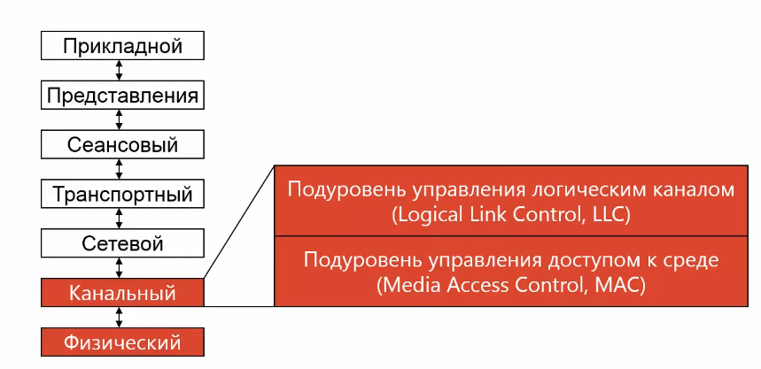
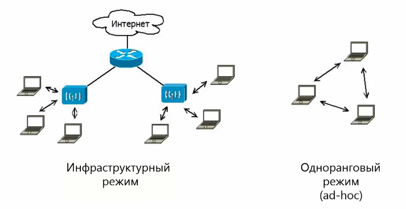
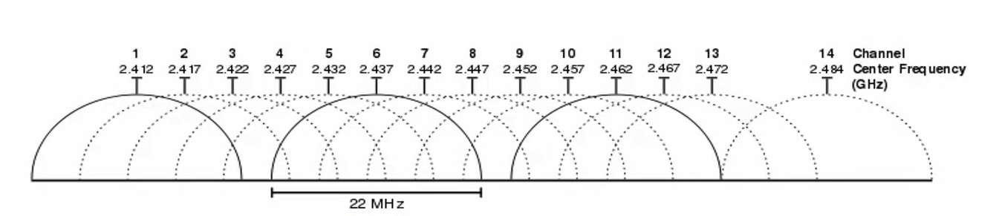
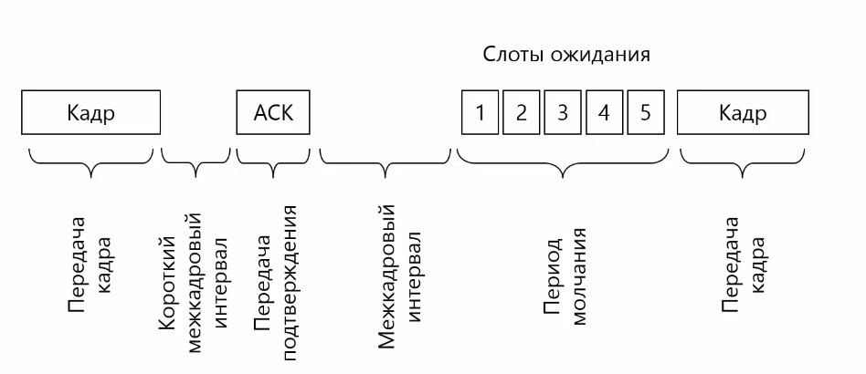
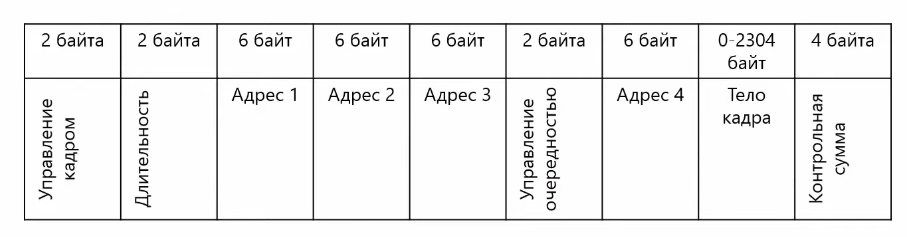
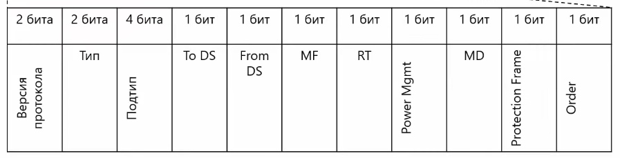
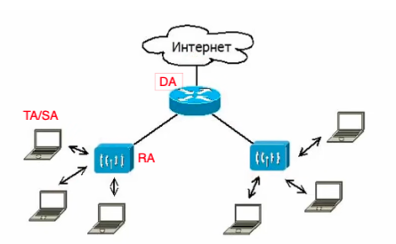
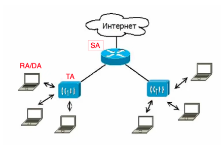
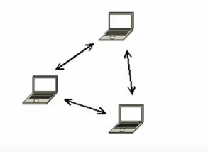
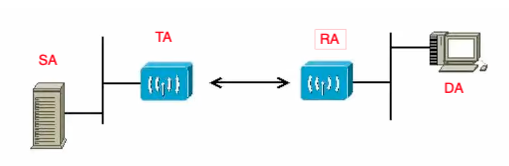

## Wi-Fi
_**Wi-Fi**_ - это технология беспроводных локальных сетей, находящаяся на физическом и канальном уровне. Описана в _Cтандарте IEEE 802.11_

**Режимы доступа:**

Для адресации используются MAC адреса, только сигнал передает не по физической среде (кабели), а через электромагнитное излучение. Используются диапозоны 2,4 и 5 ГГц. На диапазоне 2,4 ГГц есть 14 каналов. Если в одной области будут работать больше, чем 14 сетей, то им не хватит каналов - **WiFi джунгли**.

**Проблема "скрытой" станции.** - ситуация, когда возникает коллизия передачи из-за того, что данные на один и тот же компьютер передают разные источники. Т.к. источник 1 не видит источник 3, находящийся вне сети 1-2, то он считает, что данные можно передавать на компьютер 2. Аналогичная история происходит и с источниом 3. В итоге оба компьютера начинают передавать информацию на один компьютер 2.

**Проблема "засвеченной" станции.** - ситуация, при которой происходит невозможность отправки данных из-за того, что "свободный" компьютер, который хочет передать информацию вне сети считает, что не может это сделать, т.к. другие компьютеры в сети заняты передачей данных между собой. Он сможет отправить пакеты только когда передача данных внутри сети прекратиться.

### Метод CSMA/CA

Перед тем, как начать передавать данные, компьютеры прослушивают несущую частоту. Если кто-то передает данные. Все остальные компьютеры ждут. В WiFi после передачи кадра идет **передача подтверждения ACK**. После этого все компьютеры должны выдержать паузу: короткий межкадровый интервал (компьютер, которому надо отправить подтверждение) и обычный межкадровый интервал (для компьютера, который хочет отправить данные)

Далее идет период молчания. Т.к. в WiFi коллизия дорогая, то компьютеры пытаются пропустить друг друга. Каждый компьютер выбирает разное время для периода молчания. Случайным образом генерируются слоты ожидания. Тот комьютер, который сгенерировал наименьшее количество начинает отправку первым.

### Протокол MACA

Используется редко. Основан на сообщениях RTS (request to send) и CTS (clear to send). 
Перед началом отправки данных компьютер отправляет сообщение RTS и количество данных. Если другой компьютер готов принять данные, тогда он отвечает всем компьютерам сети сообщением CTS. Все остальные компьютеры ждут время на передачу ранных + время на передачу подтверждения.

### Формат кадра

#### Формат уровня LLC
Такой же как и у Ethernet

#### Формат уровня MAC

**Управление кадром:**

1. Версия протокола. Сейчас используется 0. Остальные зарезервированы
2. Тип и подтип кадра. 
    - кадры данных
    - служебные кадры контроля (ack, rts, cts)
    - кадры управления (используются для сервисов)
3. to ds/from ds - to/from destribution system
4. mf - more fragments - флаг, который говорит о том, что будет продолжение фрагмента
5. rt - флаг повторной отправки. Когда отправитель не получил подтверждения передачи кадра.
6. PowerMgmt - станция использует управление питанием и работает в спящем режиме
7. MD - more data - устанавливается точки доступа при передаче кадра станции, которая работает в режиме сохранения питания. 
8. Protection frame - показывает установлено ли у кадра шифрование данных или нет
9. Order - сохраняется ли порядок передачи или нет
 
**Длительность:**

Используется с управляющими кадрами. Указывается на какое время зарезервирован WiFi.

**Адреса:**

Существуют типы адресов:
- _**DA** (destination address)_ - адрес получателя (назначение такое же как и в ethernet)
- _**SA** (sender address)_ - адрес отправителя (назначение такое же как и в ethernet)
- _**RA** (receiver address)_ - адрес получателя (принимают из беспроводной среды)
- _**TA** (transmitter address)_ - адрес передатчика (передает в беспроводную среду)

**I.** Передаче кадра от компьютера в интернет _(схема: через откуда куда)_
| Адрес 1 | Адрес 2 | Адрес 3 |
|---------|---------|---------|
|   RA    |  TA/SA  |    DA   |

**II.** Передача кадра из интернета к компьютеру _(схема: куда через кого)_
| Адрес 1 | Адрес 2 | Адрес 3 |
|---------|---------|---------|
|  RA/DA  |    TA   |    SA   |

**III.** Одноранговая сеть
| Адрес 1 | Адрес 2 |     Адрес 3      |
|---------|---------|------------------|
|  RA/DA  |  TA/SA  |идентификатор сети|

**IV.** Беспроводной мост

| Адрес 1 | Адрес 2 | Адрес 3 | Адрес 4 |
|---------|---------|---------|---------|
|   RA    |    TA   |    DA   |    SA   |

### Сервисы Wi-Fi

#### Базовый набор сервисов

В своем радиусе действия точка доуступа рассылает идентификатор набора сервисов BSSID 
(MAC-адрес) и понятный для людей текстовый идентификатор (SSID).

**1 шаг.** Аутентификация. Клиент отправляет точке доступа специальный кадр. Если точка 
доступа удовлетворяет этот кадр, она в ответ отправляет подтверждение.

Режимы:
- открытая. подключиться к сети может кто угодно. шифрование не используется
- персональная. используется единый пароль
- enterprise. каждый пользователь сети имеет свой логин/пароль, которые храняться на 
определенном сервере аутентификации (протоколы RADIUS, LDAP)

**2 шаг.** Ассоциация. Клиент передает параметры Wifi c которыми он может работать и если они 
подходят точке доступа, то она высылает кадр с успешной ассоциацией. 

**3 шаг.** Передача данных

**4 шаг.** Деасоциациация/деавторизация. Клиент посылает запрос на отключение от точки доступа. 
Если такого не происходит, то по истечению таймаута этот клиент отключается автоматически.

Выделают 2 вида сканирования:
- **Пассивное сканирование**. Все точки доступа рассылают широковещательный кадр с информацией о себе (_Beacon frame_) - SSID и BSSID.
- **Активное сканирование**. Клиент **сам** рассылает широковещательный запрос ко всем точкам доступа (_Probe_). Получив такое запрос точки доступа отправлют информацию о сетях, которые они обслуживают.

Шифрования:
- WEP (wired equivalent privacy) - не используется, т.к. просто взломать
- WPA
- WPA2