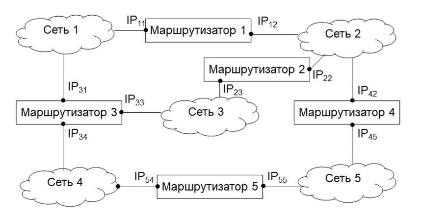
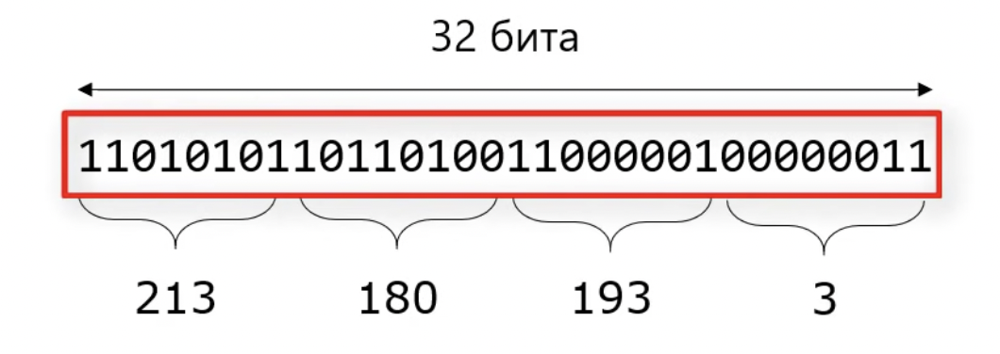
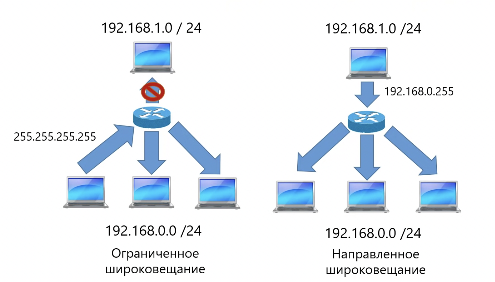

## Сетевой уровень

Объединяет сети, построенные на основе разных технологий (ethernet, Wi-Fi, 5G/4G/3G, MPLS и другие). Является основой интернет.

Задачи:
- Объединение сетей (internetworking). Создаение составной сети на базе технологий канального уровня
- Маршрутизация - поиск маршрута в составной сети, где может быть много активных соединение
- Обеспечение качества обслуживания

Решает проблемы:
- различия технологий канального уровня
- ограничения по масштабируемости

### Различия сетей

1. **Сервис:**
* без гарантии доставки (ethernet)
* с гарантией доставки (Wi-Fi)
* c гарантией доставки и порядка следования сообщения (пока не существует)
> **Решение:**
> Кадры из WiFi принимаются сотправкой подтверждения, а в Ethernet отправляются без подтверждений

2. **Адресация:**
* Разный размер, плоская, иерархическая
* MAC - Ethernet/WiFi, IMEI - сети сотовой связи
> **Решение:**
> Вводятся глобальные адреса, не зависимые от конкретных технологий.
> Методы преобразования глобального адреса в локальный (ARP для TCP/IP).

3. **Широковещание:**
* Поддерживается или нет
> **Решение:**
> Пакеты отправляются всем хостам в сети по индивидуальным адресам

4. **Максимальный размер кадра:** (MTU)
* Ethernet - 1500
* WiFi - 2304

5. **Формат кадра**
> **Решение:**
> Согласование размера кадра - фрагментация

### Ограничения по масштабируемости

1. Коммутаторы используют таблицы коммутации. Невозможно использовать коммутатор с таблицей всех устройств

2. Отправка пакетов на все порты. Если нет конкретного получателя, то отправка происходит всем, т.о. образом мы "засорим" сеть мусорными пакетами

3. Отсутствие дублирующих путей приводит к тому, что отправка в соседние точки сети может занимать продолжительное время

> **Решения:**
> 1. Агрегация. Работа не с отдельными адреса, а с блоками адресов. Каждый блок - это сеть.
> 2. Запрет отправки "муссорных" пакетов у которых путь доствки не известен
> 3. Возможность наличия нескольких путей в сети. Наличие маршрутизации.



### IP адреса
В сетях используются два типа адресов **локальные** (адреса канального уровня: MAC, IMEI) и **глобальные** (не привязаны к технологии канального уровня: IP).

IP адреса применяются для идентификации компьютера в составной сети. Есть две версии протокола: IPv4 (4 байта) и IPv6 (16 байт)

#### IPv4
Состоит из 4 октэтов.
Старшие биты - номер подсети
Младшие биты - номер хоста



Маска сети - показывает, где в IP-адресе находится номер сети, а где номер хоста. Адрес подсети вычисляется на основе маски по формуле:
`AdrNew = IP && Adr-Mask`

Существует два вариант записи маски:
1. В виде адреса: 255.255.255.0 (если IP машины: 128.192.10.1, то при логическом И получится адрес сети: 128.192.10.0)
2. В виде префикса: 128.192.10.30 /24. Префикс показывает сколько первых бит адреса относятся к сети, а все остальное к адресу хоста. В данном случае /24 - это первые 3 октета.

#### Типы IP адресов

- Индивидуальный (unicast) - адрес конкретного компьютера в сети
- Групповой (multicast) - адрес который исползуется несколькими компьютерами
- Широковещательный (broadcast) - для получения всеми компьютерами сети
    - ограниченное широковещание (один хост хочет отправить пакеты всем участникам сети, для этого используется отправка на адрес 255.255.255.255)
    - направленное широковещание (отправка с внешнего хоста всем участникам сети, для этого используется широкий адрес 192.168.0.255)


#### Специальные IP адреса
`0.0.0.0` - адрес текущего хоста
`255.255.255.255` - все хосты текущей подсети (ограниченный широковещательный адрес)
`127.0.0.0/8` - loopback (обратная петля) - для отладки приложений. В этом случае данные не отправляются в сеть, а приходят обратно на компьютер
`169.254.0.0/16` - link local - назначаются автоматически, если недоступна другая конфигурация IP. Используются только в рамках одной сети и не проходят через маршрутизатор.

Зарезервированные частные адреса могут использоваться внутри частной сети, без регистрации в IANA
```
10.0.0.0/8
172.16.0.0/12
192.168.0.0/16
```
Для подключения частных адресов к интернет используется технология NAT (Network Adress Trancslation)

Проблема нехватки IP-адресов решена двумя способами:
1. IPv6
2. NAT