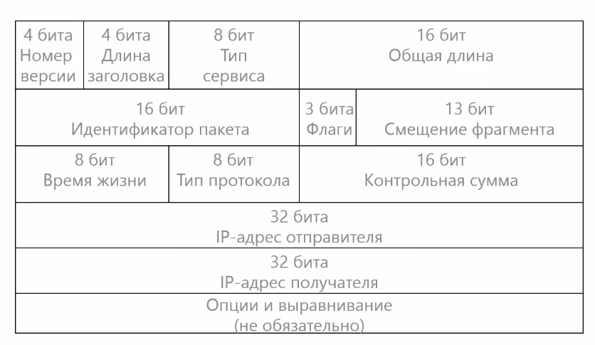
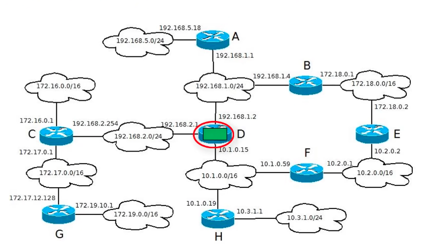
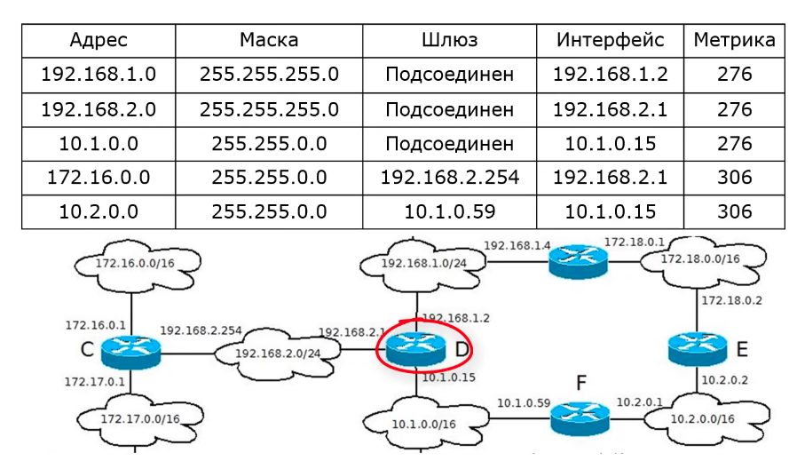
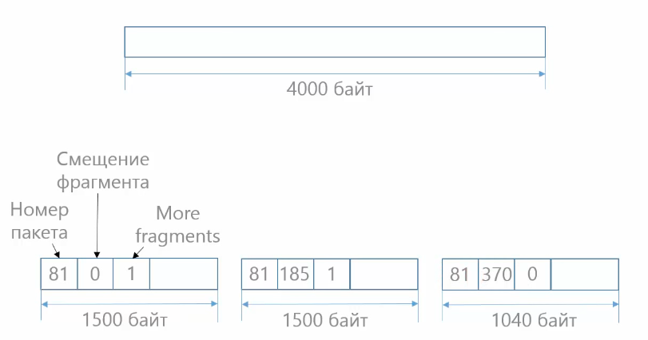
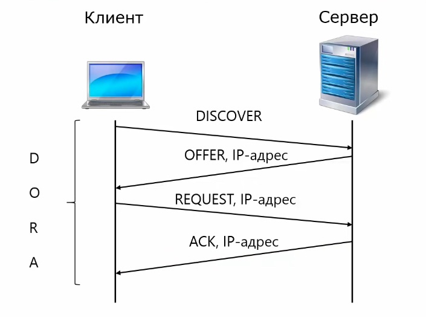
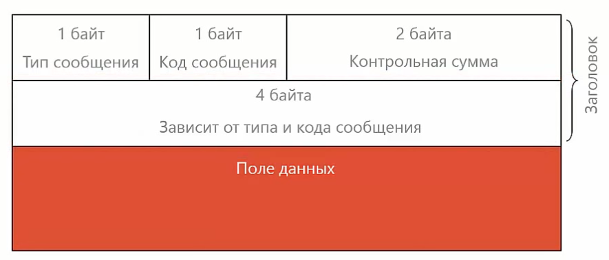

### Протокол IP
_**IP** (Internet Protocol)_ - межсетевой протокол, обеспечивающий передачу данных без гарантии доставки и порядка следования сообщений/пакетов. Испульзуется передача данных без установки соединения.

Задачи:
- объединение сетей
- маршрутизация
- качество обслуживания

* Номер версии - IPv4 или IPv6
* Длина заголовка - указывается полная длина обязательной части и опций  
* Тип сервиса - для обеспечения качества обслуживания (используется редко)  
* Общая длина всего пакета (65535 байт), но на практике обычно выбирается с учетом размера кадра канального уровня. Для ethernet - это 1500 байт.  
* Идентификатор пакета / флаги / смещение фрагмента - используются для фрагментации
* Время жизни - нужно для того, чтобы пакеты по сети не ходили вечно
* Тип протокола следующего уровня: 
    - TCP - 6
    - UDP - 17
    - ICMP - 1
* Контрольная сумма - проверка правильности доставки пакета
* Адреса отправителя и получателя
* Опции (сейчас практически не используются):
    - записать маршрут
    - временные метки

#### Маршрутизация
Маршрутизация - поиск маршрута доставки пакета между сетями через транзитные узлы - маршрутизаторы.

Этапы:
1. Изучение сети
2. Продвижение пакетов на маршрутизаторе

Пакет пришел пришел на маршрутизатор D. 
A. Сеть, которой предназначен пакет подключена к маршрутизатору
Маршрутизатор передает пакет непосредственно в сеть

B. Сеть, которой предназначен пакет подключена к другому маршрутизатору и мы ЗНАЕМ этот маршрутизатор (**шлюз** - маршрутизатор A)
Маршрутизатор D передает пакет маршрутизатору A, который передает его в сеть

С. Пришел пакет, маршрута которого мы не знаем
Маршрутизатор отбрасывает пакет

У маршрутизатор составлена таблица маршрутизации, которая показывает, как устроена сеть. Обязательные столбцы:
- адрес
- маска
- интерфейс
- шлюз
- метрика

Таблица для линукс:

Записи в таблице маршрутизации:
1. Статические - настраивается вручную, конфигурируются интерфейсы, вручную прописываются маршруты к сетям
2. Динамические  - настраиваются автоматически, через протоколы маршрутизации RIP, OSPF, BGP, ...

Маршрутизатор по умолчанию - маршрутизатор, на который отправляются пакеты для неизвестных сетей. Обозначается 0.0.0.0 с маской 0.0.0.0 или default

Запись с более длинной маской приоритетнее для маршрутизатора при выборе направления отправки пакета.

#### Фрагментация

_**Фрагментация**_ - разделение пакета на несколько частей (фрагментов) для передачи по сети с маленьким MTU _(Maximum Transmition Unit, MTU)_. Используются 3 заголовка пакета: идентификатор пакета, флаг, смещение фрагмента.

Идентификатор фрагмента всегда уникален для одинаковых фрагментов
Флаги (DF - не фрагментирован, MF - будут еще фрагменты)

### Протокол DHCP
_**DHCP** (Dynamic Host Configuration Protocol)_ - протокол динамической конфигурации хостов. Позволяет назначить IP-адреса кмопьютерам в сети автоматически. При этом требует создания инфраструктуры (DHCP сервер).

Работает по модели _клиент-сервер_:
Клиент отправляет запрос на DHCP сервер, который в свою очередь отвечает IP-адресом. Хост запрашивает у сервера возможность подключиться к IP-адресу, сервер отвечает положительным ответом ACK. 
DHCP выделяет клиенту IP-адрес на время аренды. После этого необходимо продлить время аренды. 

Существуют дополнительные сообщения:
NACK - сервер отказывает в предоставлении адреса
RELEASE - сообщение об освобождении IP адреса
INFORM - запрос и передача дополнительной конфигурационной информации

Для работы в сети нужен не только IP-адрес. Конфигурационные параметры передаются DHCP в качестве опций. 
DHCP предоставляет дополнительно:
- маску подсети
- маршрутизатор по умолчанию (шлюз)
- адреса DNS-серверов
- адреса серверов времени
- маршруты

### Протокол ARP

_**ARP** (Address Resolution Protocol)_ - протокол автоматического разрешения адресов или определения MAC-адреса по IP
В реальности данные передаются через технологии канального уровня (например Ethernet). Коммутаторы ничего не знают об IP-адресах, а значит нужна технология, которая будет связывать **MAC-адрес** и IP

С помощью ARP-протокола можно узнать адреса только компьютера в подсети.

Самое простое - это таблица соответствия (в linux - _/etc/ethers_)

Компьютер, который хочет узнать MAC-адрес отправляет IP на широковещательный адрес _FF:FF:FF:FF:FF:FF_. Тот компьютер, который узнал свой IP-адрес отправляет в ответ MAC и IP адреса. Далее он кэшируется и отправляется в ARP-таблицу (команда _arp -a_)

### Протокол ICMP

_**ICMP** (Internet Control Message Protocol)_ - протокол межсетевых управляющих сообщений. Требуется для оповещения об ошибках на сетевом уровне, а также для тестирования работоспособности 

Типы сообщений: 0 - эхо-ответ, 8 - эхо запрос, 3 - узел назначения недопустим, 5 - перенаправление маршрута, ...

Коды сообщений для типа 3: 0 - сеть недостижима, 1 - узел недостижим, 2 - протокол недостижим, 3 - порт недостижим, ...

Утилиты:
- ping (доступность компьютера в сети)
- tracerout (маршрут от отправителя к получателю `sudo tcptraceroute 224.0.0.251`)