## Транспортный уровень

**Задача:** передача данных между процессами на разных хостах. Тут необходимо обеспечить **адресацию**, а также **надежность** передачи данных.

**Схема взаимодействия хостов:**

  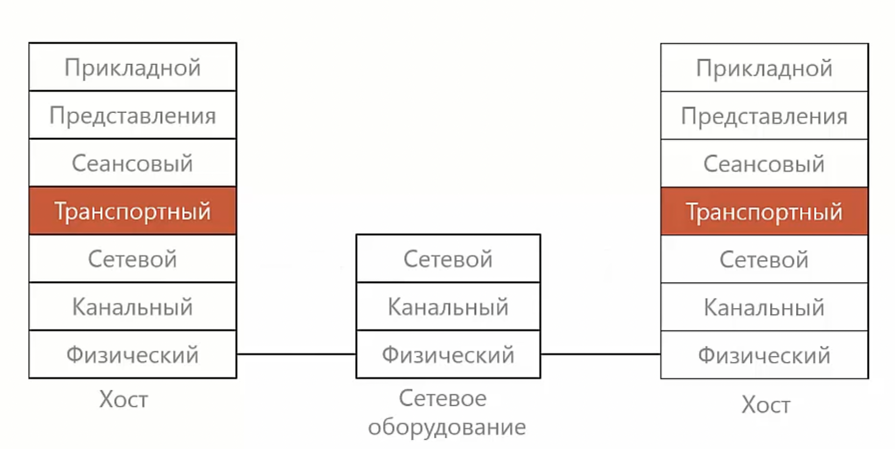

Для адресации данных используются **порты** - 1...65535
Три вида:
- хорошоизвестные (well-known ports): _0...1023_
- зарезервированные: _1024...49151_
- динамические: _49152...65535_

[Список портов](https://www.iana.org/assignments/service-names-port-numbers/service-names-port-numbers.xhtml)  

### Протокол UDP

_**UDP** (User Datagram Protocol)_ - протокол транспортного уровня

Сообщение протокола UDP называется дэйтаграммой. 

Протокол UDP обладает преимуществом - он достаточно быстрый, т.к. нет накладных расходов на установку соединения. Но не продоставляет дополнительного уровня надежности, поэтому ошибки должно обрабатывать приложение. 

Пример: Используется для указания порта отправителя и порта получателя.

**Формат протокола:**

  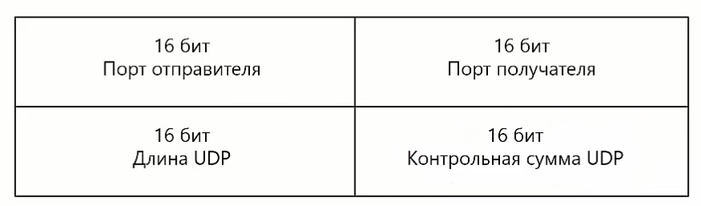

### Протокол TCP

_**TCP** (Transmission Control Protocol)_ - протокол управления передачей. Обеспечивает надежную передачу данных. 

**Механика работы.** Поток байт от приложения разбивается на отдельные части -  сегменты, которые передаются поочередно от отправителя к получателю. Получатель собирает сегменты и передает принимающему приложению

  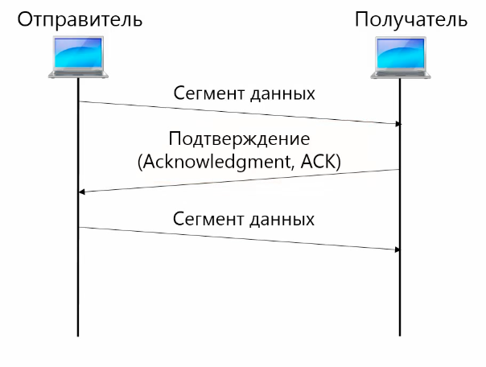

**Нумерация байтов:**

  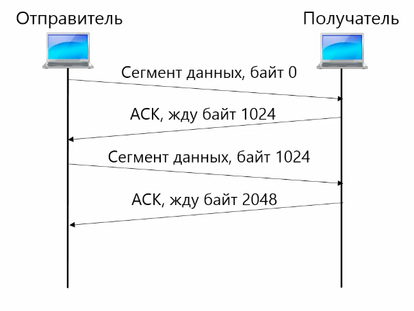

**Дублирование байтов:**

  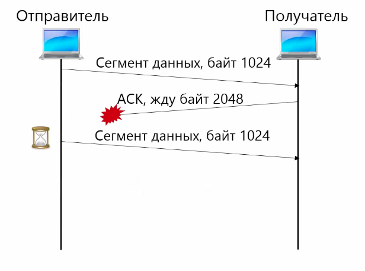

#### Варианты подтверждения доставки

**Остановка и ожидание**
На каждую порцию данных отправляется подтверждение. Используется на канальном уровне

  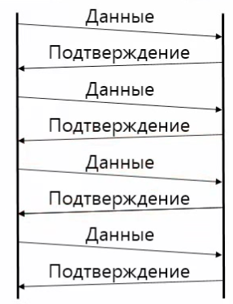

**Скользящее окно**
На несколько порций данных отправляется коммулятивное подтверждение. Обычно используется, когда между источником и приемником большое расстояние.

  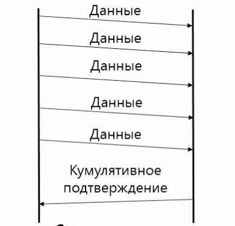

Размер окна - это количество байт данных, которые могут быть переданны без подтверждения

  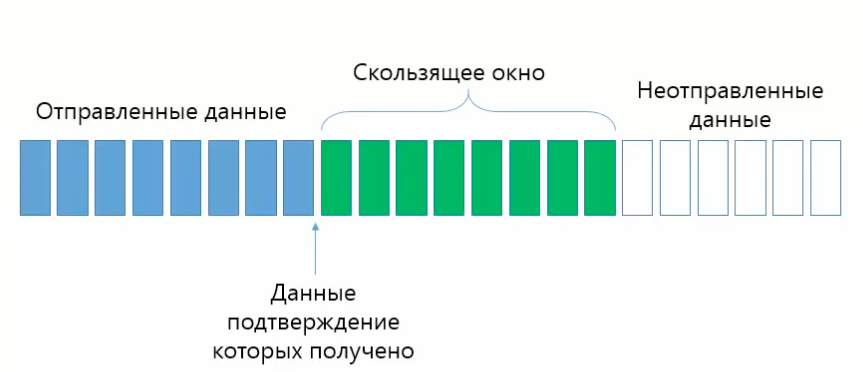

Есть два вида подтверждения:
- коммулятивное - подтверждение приема указанного байта данных и **всех предыдущих**. (используется по умолчанию)
- выборочное _(selective acknowledgment, SACK)_ - подтверждение диапозонов принятых байт

#### Соединение

В протоколе TCP для передачи данных необходимо установить соединение, а после разорвать. 

Задачи соединения:
- убедиться, что отправитель и получатель хотят передавать данные друг другу
- договориться о нумерации потока байт
- договориться о параметрах соединения (максимальный размер сегмента и тп)

Трехкратное рукопожатие:
1. SYN
2. SYN + ACK
3. ACK

  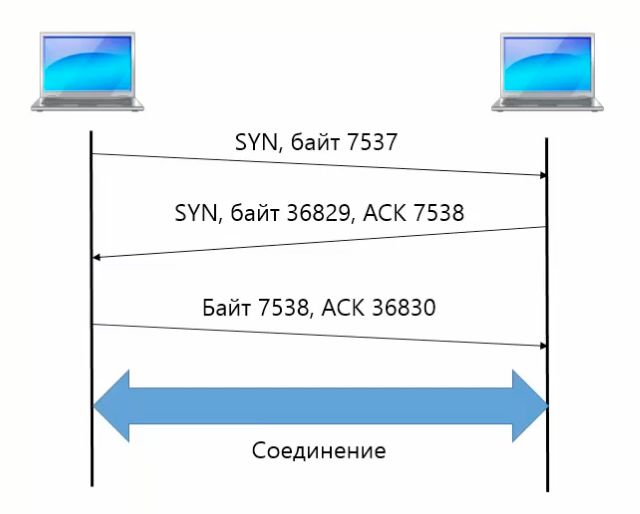

**Корректный разрыв соединения**

  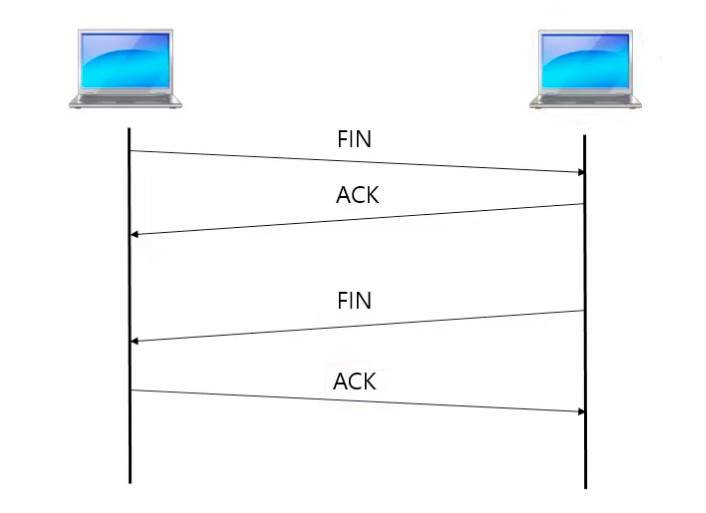

При некорректном разрыве соединения посылается сообщение **RST**. 

#### Формат заголовка

  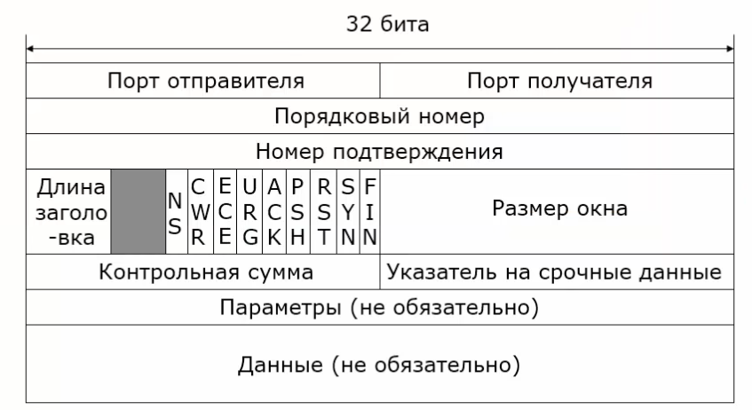

_Порядковый номер_ - это порядковый первого байта сегмента
Для ethernet: 1460 (сегмент) + 20 (заголовок TCP) + 20 (заголовок IP) = 1500 байт
_Номер подтверждения_ - байт, который ожидается
_Параметры:_ MSS, масштаб окна, выборочное подтверждение, метки времени

#### Управление потоком

Т.к. в сети могут быть устройства разной производительности, то необходимо управлять потоком, чтобы избежать ситуации, когда быстрый отправитель отправляет много данных медленному получателю - _затопление_

Для решения проблемы используется поле **Размер окна**, в котором указывается сколько байт данных получатель может принять. Размер окна задается получателем и зависит от количества свободного места в буфере.

  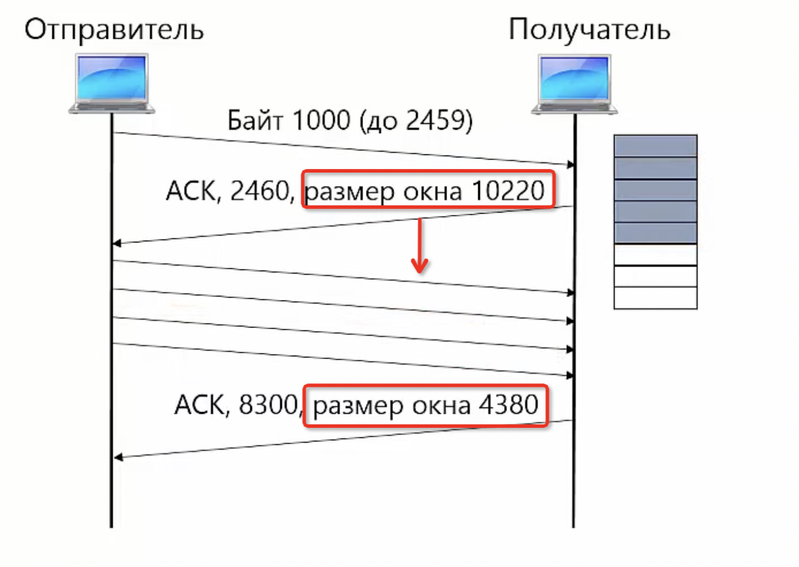

#### Управление перегрузкой

Т.к. в сеть может поступать большое количество пакетов, которое маршрутизаторы не способны обработать, то часть пакетов будет отбрасываться.

Окно перегрузки формируется отправителем и рассчитывается в зависимости от того, какая нагрузка на сеть. **Важно** определить оптимальный размер скользящего окна. Для этой цели используется метод аддитивного увеличения, мультипликативного уменьшения (_AIMD_). Суть метода заключается в том, что при получении каждого подтверждения мы прибавляем к размеру окна некоторое значение (обычно это размер одного сегмента), а если перегрузка произошла, тогда умножаем размер окна на некоторое значение (обычно 1/2 сегмента). Для быстрых сетей (современных) используется _медленный старт_ - размер окна увеличивается на 2..4 сегмента. 

В TCP обычно используется комбинированный метод - медленный старт + AIMD.

#### TCP global synchronization

Когда на маршрутизаторе заканчивается место в буфере, начинают отбрасываться пакеты всех отправителей. Отправители получают сигнал о перегрузке и уменьшают размер окна. В TCP нет встроенной задержки, поэтому сразу же отправители начинают отправку данных. Для того, чтобы решить эту проблему используются несколько методов:
1. Задержка сегмента - замеряется round trip time - время от отправителя и обратно. 
2. Сигнал от маршрутизатора - random early detection или explicit congestion notification

### Интерфейс сокетов

**Сокет** - стандарт интерфейсов взаимодействия программ с транспортным уровнем стека протоколов TCP/IP.

  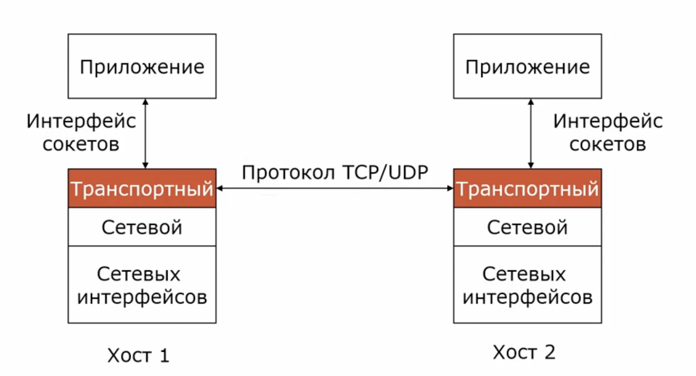

|Операция|Назначение                             |
|--------|---------------------------------------|
|Socket  |Создать новый сокет                    |
|Bind    |Связать сокет с IP-адресом             |
|Listen  |Объявить о желании принимать соединения|
|Accept  |Принять запрос на установку соединения |
|Connect |Установить соединение                  |
|Send    |Отправить данные по сет                |
|Receive |Получить данные по сети                |
|Close   |Закрыть соединение                     |

Взаимодействуют стороны по принципу _клиент - сервер_
Создается сокет (указывается протокол сетевого и транспортного уровня) -> Биндится на IP и порт **BIND** -> Выполняется операция **LISTEN** - готовы принимать соединение (создается очередь) -> **ACCEPT** (ждем соединения. возврат произойдет, когда какой-то из клиентов установит соединение)
На стороне клиента также создается сокет -> вызов метода **CONNECT** (соединение с сервером) -> Отправка данных порциями байт **SEND** (на стороне сервера прием данных **RECEIVE**) -> разрываем соединение **CLOSE**.

  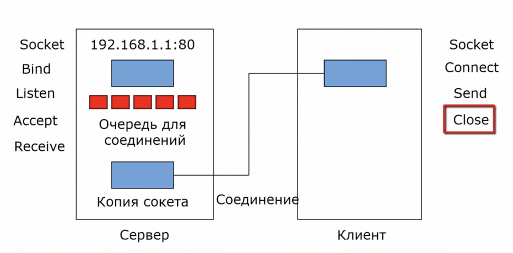

### Трансляция сетевых адресов (NAT)

_**NAT** (Network Adress Translation)_ - технология преобразования IP-адресов внутренней сети в IP-адреса внешней (интернет). Цель создания - преодоление проблемы нехватки IPv4.

**Типы NAT:**
1. Статический NAT - отображение 1 к 1
2. Динамическое преобразование - набор внутренних IP отображается на группу внешних
3. Один ко многим - все адреса из внутренней сети отожражаются на один внешний 

Преобразование происходит с помощью NAT таблицы, которая находится внутри устройства. Пакет внутренней сети преобразуется следующим образом - в качестве IP отправителя записывается IP сети, а порт генерируется случайно. Эти данные записываются в таблицу, где указываются также и внутренний IP хоста.

  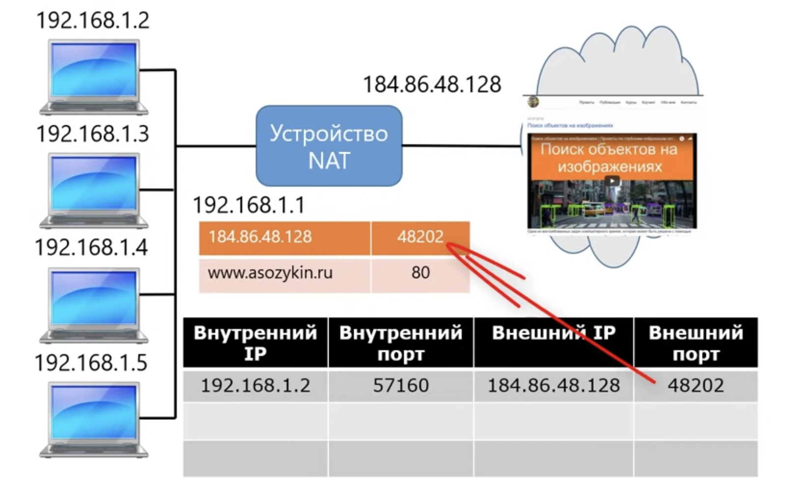

Недостатки:
- нарушение принципа IP-сетей: каждый компьютер может соединиться с любым другим
- нет возможности подключиться к компьютерам во внутренней сети из внешнего мира
- плохо работают протоколы не устанавливающие соединение
- некоторые прикладные протоколы работают неправильно (FTP)
- нет единого стандарта NAT 

### Межсетевые экраны

**Межсетевой экран** - устройство или программа, которая предназначена для разделения сетей друг от друга (брэндмауер, firewall)

Работают на сетевом и транспортном уровнях.