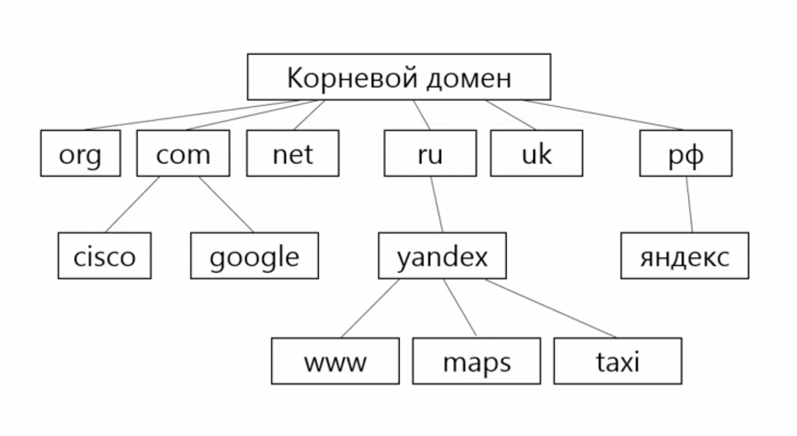
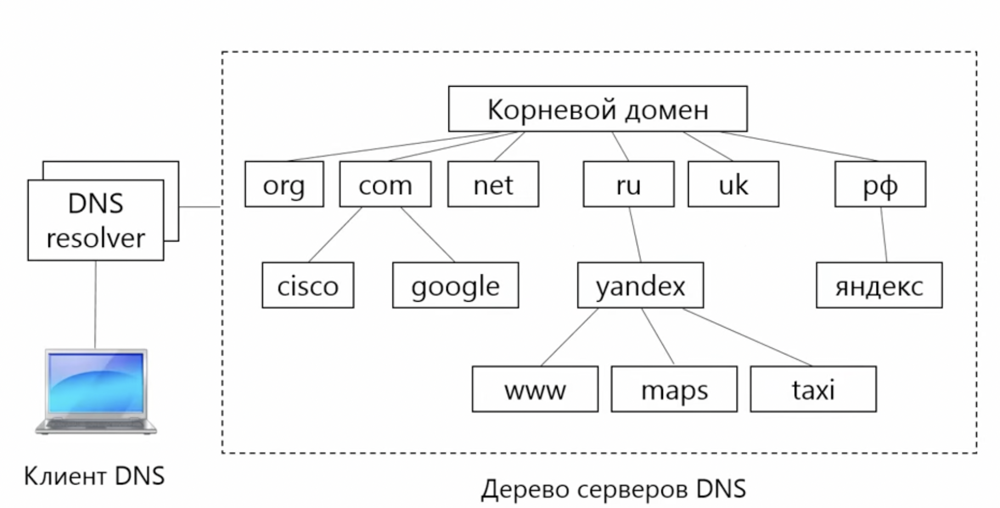
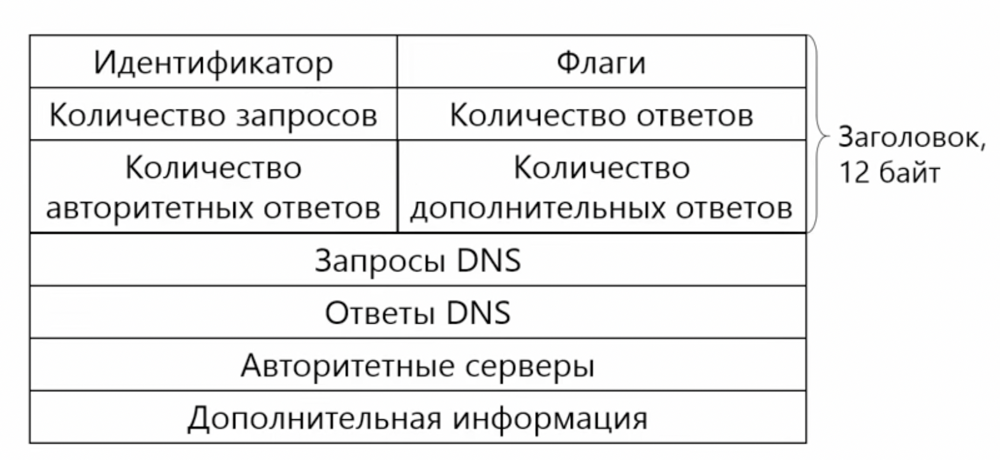
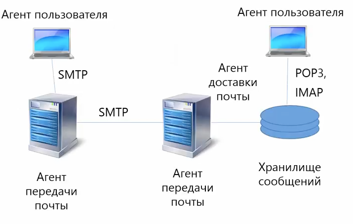

## Прикладной уровень

Необходим для взаимодействия между собой сетевых приложений. Сетевое приложение использует протокол для того, чтобы получить какую-то полезную информацию по сети. Часто приложения используют несколько протоколов.

**Сеансовый уровень.**
*Сеанс* - набор связанных между собой сетевых взаимодействий, направленных на решение одной задачи, например загрузка Web-страницы.

**Уровень представления.**
Для понимания, что это за уровень. Можно представить онлайн звонок, который будет трансформировать китайский язык источника в русский язык потребителя. Преобразованием языка как раз и будет заниматься уровень представления. Еще один пример - защита данных (шифрование TLS/SSL).

### DNS 
_**DNS** (domain name system)_ - позволяет преобразовать имена компьютеров в IP адреса и наоборот. 

Плюсы:
- возможность менять инфраструктуру скрытую за именем
- возможность обслуживать один адрес несколькими хостами, в т.ч. и IPv6

До того, как придумали DNS имена компьютеров хранили в текстовом файле _/etc/hosts_

Особенности:
1. Децентрализована - нет одного компьютера на котором храняться все имена хостов
2. Названия компьютеров деляться на отдельные части - домены. За отдельные домены отвечают отдельные организации.
3. Дублирование серверов DNS позволяет системе быть надежной.

Каждая доменная зона содержит записи всех поддоменых зон. Например, зона ru - яндекс, com - cisco, google. Доменная зона является некоторым аналогом файла /etc/hosts.

Также возможно делигирование доменом верхнего уровня управление сервером доменом нижнего уровня. Например уровень yandex делигирует управление taxi другому нижележащему домену.

### Инфраструктура DNS

Распределением доменных имен занимаются регистраторы. Корневой регистратор - ICANN

### Протокол DNS

**Схема работы:**
Отправляется запрос на корневой домен для определения IP адреса maps.yandex.ru. Корневой сервер говорит, что не знает адреса и делегирует определение адреса низлежащему домену _ru_, который в свою очередь делегирует задачу домену _yandex.ru_.

Существуют 2 режима работы:
- итеративный - если сервер отвечает за одну доменную зону, то он возвращает ответ, если нет, то возвращает адрес другого домена, у которого есть более точная информация.

- рекурсивный - DNS сервер сам отправляет запросы всем DNS-серверам, потом результирующий ответ отправляет сам

В DNS есть два типа ответов:
1. Авторитетный (authoritative) - ответ получен от сервера, ответственного за доменную зону
2. Не авторитетный (non authoritative) - ответ от сервера, который не обслуживает доменную зону. Обычно берется из кэша

Протокол DNS работает по модели _клиент-сервер_. DNS использует протокол UDP. Работает с 53м портом.

Пакет DNS:

_Идентификатор_ - любое целое число (одинаковое в запросе и ответе)
_Флаги:_
    - QR - запрос/ответ
    - OPCODE - тип запроса
    - AA - авторитетный ответ или нет
    - TC - пакет обрезан или нет
    - RD - запрос на рекурсивный режим
    - RA - рекурсивный режим доступен
    - Z - зарезервирован
    - RCODE (0 - успешно, другие - произошла ошибка)
Кол-во запоросов, ответов, от авторитетных серверов, дополнительных ответов
_Запрос DNS_ - доменное имя компьютера, для которого хотим узнать адрес
_Ответы DNS_ - IP адреса искомого компьютера
_Авторитетные серверы_ - IP адреса доменных зон

**Запрос DNS:**
Имя + Тип записи + Класс записи (сейчас 1 IN, интернет)

**Ответ DNS:**
Имя + Тип записи + Класс записи + TTL(сколько храниться в кэш) + Длина данных + Данные
|                |
|----------------|
|www.yandex.ru   |
|1 (A запись)    |
|1 (IN, Интернет)|
|90 сек          |
|4               |
|77.88.55.66     |

#### Типы записей DNS

_Тип записи_ - для чего запись предназначена
_Класс записи_ - в каких сетях используется (сейчас только интернет)

A - IPv4  
AAAA - IPv6  
CNAME - Canonical Name Record - определяет псевдоним (alias) для доменного имени  
MX - Mail eXchange - адреса почтового сервера  
SRV - для указания порта  
NS - Name Server - указывает адреса DNS-серверов, отвечающих за зону.   

Записи NS задаются на домене более высокого уровня. например ru. 
PTR - доменное имя для адреса

### Протокол SMTP

Simple Mail Transfer Protocol - простой протокол передачи почты. Создан в 1982 году. Расширенная версия
(ESMTP) вышла в 2008 г. Работает в _текстовом_ режиме.  

Протокол транспортного уровня:
TCP, UDP

Порты:  
_25_ - передача почты между почтовыми серверами  
_585_ - прием почты от клиентов

Электронное письмо состоит из 3-х составляющих:
- конверт - тут находятся команды SMTP. конверт используется для передачи письма между серверами и клиентами  
- заголовки (From, To, CC, BCC...)
- тело письма

Команды SMTP:
HELO - установка соединения
MAIL - адрес отправителя (MAIL FROM: bla@exmple.com)
RCPT - адрес получателя (RCPT TO: rec@example.com)
DATA - передача письма
QUIT - разрыв соединения с сервером.

В качестве ответа клиент получает код (220 - подключение к серверу успешно, 221 - закрытие соединения...)

### Протокол POP3
_**POP3** (Post Office Protocol version 3)_ - протокол почтового отделения. Используется для чтения почты. Использует подход 
"загрузить и удалить" - почта храниться только на клиенте и после прочтения удаляется с сервера.

Недостатки: 
- Только один клиент. После прочтения письма удаляются с сервера. 
- Единое хранилище писем. Нет ни папок, ни фильтров.

Протокол транспортного уровня: TCP. Порт _110_.

Команды:  
----- Авторзация -----  
USER - пользователь  
PASS - пароль  

----- Транзакция -----  
STAT - общее количество писем  
LIST - передачи информации о сообщениях  
RETR - передать сообщение на клиент  
TOP - передать заголовок на клиент
DELE - пометить сообщение на удаление

----- Обновление -----  
QUIT - закрытие транзакции, удаление сообщения, закрытие соединения  

В качетсве ответа: _+ОК_ или _-ERR_  

### Протокол IMAP
_**IMAP** (Internet Message Access Protocol)_ - протокол доступа к электронной почте.  

Отличия от POP3:
1. Почта храниться на сервере. Клиент загружает только те письма, которые запросил.  
2. Можно выполнять поиск по шаблону и тд
3. Могут работать несколько клиентов. Все клиенты видят одно и то же состояние почтового ящика
4. Наличие флагов. Например, о прочтении письма - \Seen.

Протокол транспортного уровня: TCP. Порт _143_.

При работе по протоколу, клиент проходит 4 состояния:
- Клиент не аутентифицирован (not authenticated) - нужно подключиться к серверу и пройти аутентификацию
- Клиент аутентифицирован - нужно выбрать папку, с которой будет работать
- Папка выбрана
- Выход

Ответы:
OK - успешное выполнение
NO - ошибка выполнения
BAD - неправильная команда или аргумент

В протоколе есть команды:
* работы с папками (CREATE/DELETE/RENAME/STATUS)
* перемещение писем (COPE/MOVE)
* поиск писем (SEARCH)
* закрытие папки (CLOSE)

### Протокол FTP

_**FTP** (File Transfer Protocol)_ - протокол передачи файлов

**Принцип работы.** Клиент FTP подключается к серверу по протоколу и может работать с файловой системой сервера.
Протокол использует URL: <protocol>://<имя_сервера>/<путь_к_файлу>.

Протокол транспортного уровня: TCP. Порты: _20_ (активный режим) и _>1024_ (пассивный режим).  
Использует два соединения: управляющее и передача данных.  

**Активный режим**
Инициатор соединения - сервер.

**Пассивный режим**
Инициатор соединения - клиент.

Команды:  
_USER_ - пользователь  
_PASS_ - пароль  
_LIST_ - просмотре содержимого каталога  
_RETR_ - передать файл с сервера на клиент    
_STOR_ - передать файл с клиента на сервер  
_DELE_ - удалить файл  
_MKD_ - создание каталога  
_RMD_ - удаление каталога  
...
