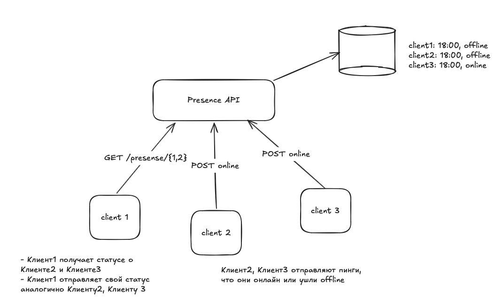
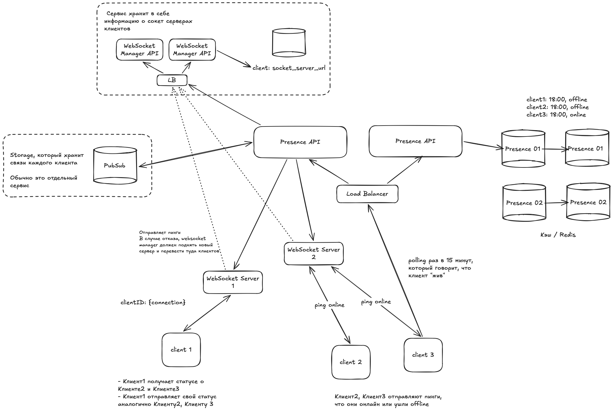

# Presence service

Near реалтайм система, показывающая текущий статус пользователя - online/offline. Обязательно должно быть "last seen time"

Функциональные требования:
- около реалтайм система
- когда последний раз был в системе

Нефункциональные требования:
- 300M DAU
- минимальная задержка
- доступность важнее, чем всё остальное (по CAP теореме)

## MVP 

## Design

