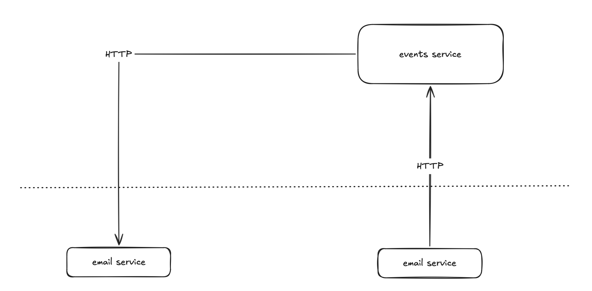
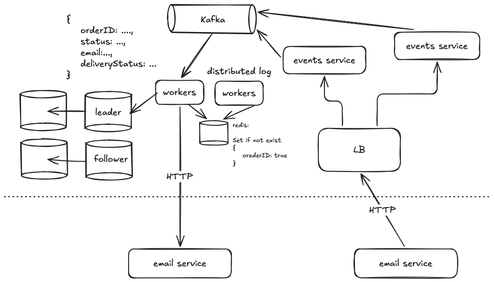

# Система нотификаций

Система нотификаций Amazon, который сообщает о движение товара к покупателю. Есть сервис логистики, который отправляет ивенты о статусе покупки. Ивенты отправляем на email покупателя.

Функциональные требования:
- пользователи получают письма о статусе

Нефункциональные требования:
- сколько ивентов: от 20k/s до 80k/s, нет скачков, масштабируемая
- без потери данных, не страшно, если email придет два раза
- availability vs consistency: система должна быть отказоустойчивой.

## MVP 

## Design

