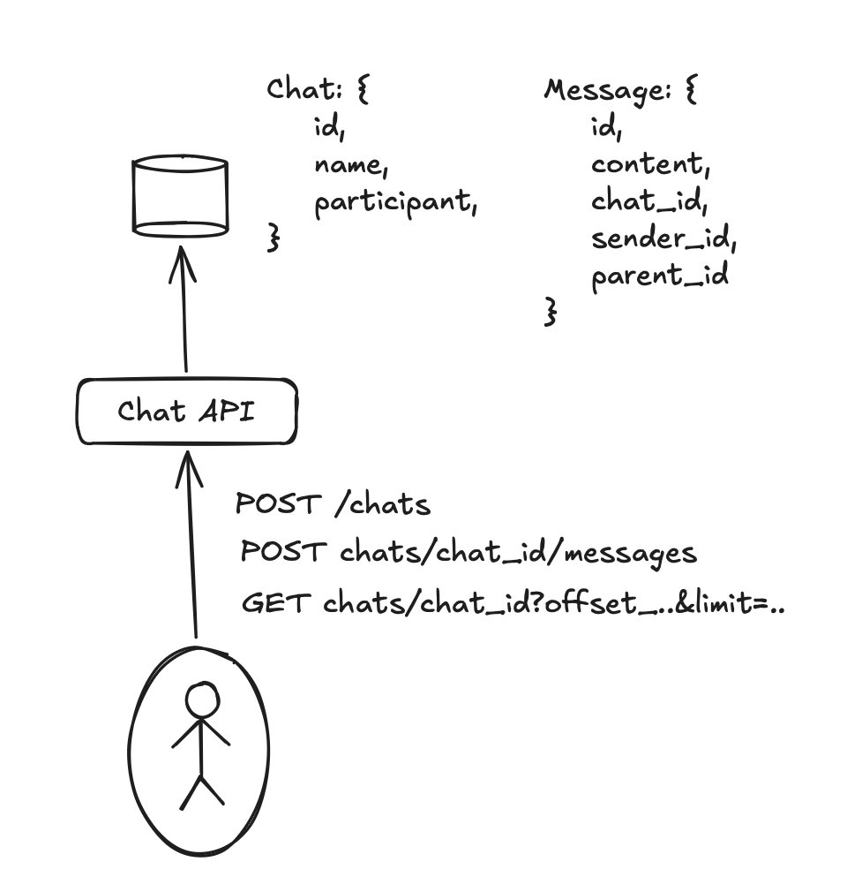
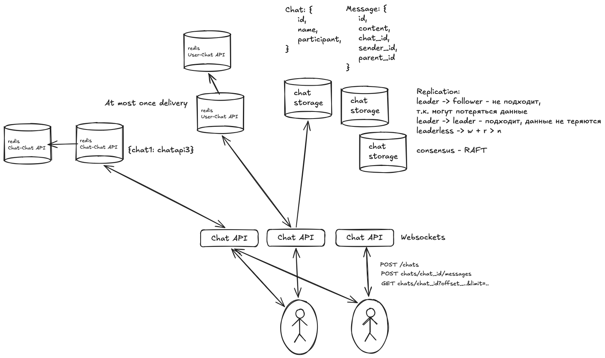

# Мэссенджер

Функциональные требования:
- создание чата
- отправка сообщения
- получать сообщения

Нефункциональные требования:
- 15B сообщений в день (174000 mess/sec) -> 0.5..1M/s
- 50-100M одновременных пользователей
- 200k пользователей в чате
- CAP:
    - available
    - no messages loss
    - causal order
- latency: near real time
- spikes per chat

## MVP

## Design
