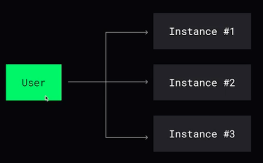
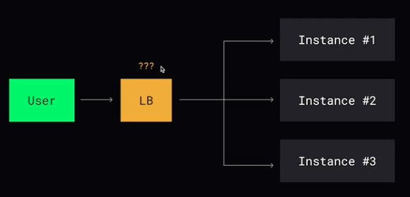
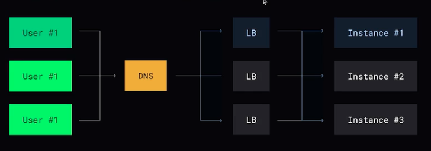
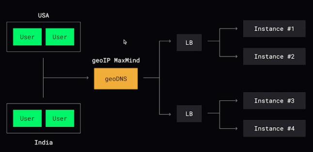
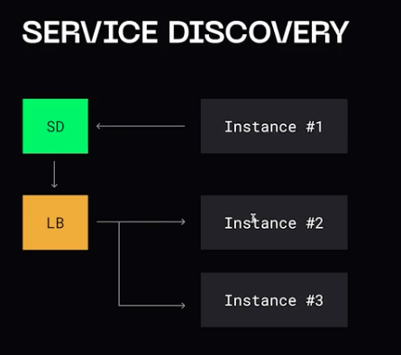

## Балансировка нагрузки

Главная задача распределения, чтобы все сервера получали одинаковое количество нагрузки.

**Клиентская балансировка** - логика балансировки реализована на стороне клиента. Клиентское приложение знает о том куда и когда отправлять запросы.  

_Плюсы:_
- нет посреднеков => нет latency

_Минусы:_
- клиент знает о всех компонентах
- усложнение клиента

**Серверная балансировка** - присутствует посредник между клиентом и системой

_Плюсы:_
- простая логика клиентов

_Минусы:_
- дополнительное latency

Алгоритмы:
1. Random - случайное распределение на случайный сервис
2. Round Robin - распределение по порядку
3. Взвешенный Round Robin - чем больше вес сервера, тем больше ему будет приходит нагрузки
4. Sticky Sessions - когда распределение происходит в зависимости от пользователя -> используется hash-функция для получения сервера
5. Least connections // response time // throughput - выбор сервера в зависимости от количества открытых соединений, времени ответа или пропускной способности. На сервере храниться табличка, к которой обращается клиент.

## Типы балансировки нагрузки

- L3/L4 - балансировщик, который работает на транспортном уровне модели OSI. Балансировщик оперирует либо сетевыми уровнем - IP-адреса (L3), либо транспортным уровнем - порты (L4)
Работают быстрее, т.к. работают на низком уровне

- L7 - балансировщик работает на прикладном уровне

- DNS балансировка - за отдельным IP адресом спрятан балансировщик

- geoDNS балансировка - в зависимости от положения пользователя

## Отказоустойчивость

Балансировщик обязан выполнять **healthcheck** - а жив ли тот или иной узел.   
2 модели: _polling_ (LB сам опрашивает сервера) и _pushing_ (сервис отправляет данные в LB)

Иногда используется модель **Service discovery**, который опрашивает сервера и отдает информацию о доступности:

## Проксирование

По своей сути балансировщик уже является прокси сервером, но иногда от него не требуется распределение нагрузки:
- взлом и защита (blacklist)
- кэширование данных 
- ограничение трафика
- анонимность данных
- шифрование данных

### Типы проксирования

- **Forward proxy** - сервис явно знает о том, что будет обращаться к прокси

Service -> FProxy ->| Service

- **Reverse Proxy** - посредник не известен

Service ->| RProxy -> Service

 
 
   

[>>> Назад <<<](../README.md)