# Кэширование

Проблемы, которые помогает решать кэширование:  
1. Снижение repsonse time
2. Снижение лишний нагрузки на сторонние сервисы
3. Переиспользование ранее полученных или вычесленных данных
4. Стабилизация работы при кратковременных отказах системы

Задача кэша - ускорить ответ, а не держать нагрузку.

### Какие данные кэшировать

1. Данные меняются редко (дни, недели, месяцы) - желательно кэшировать
2. Меняются нечасто (минуты, часы) - неоднозначно
3. Меняются часто (секунды) - кэшировать бессмысленно, т.к. часто придется инвалидировать

### Термины кэширования

**Cache miss** - промах кэша - запрошенный ключ не был найден в кэше  
**Cache hit** - попадание в кэш - запрошенный ключ найден в кэше  
**Hit ration** - процент эффективных попаданий кэша  
**Горячий ключ** - ключ, на который приходится большая часть запросов  
**Прогрев кэша** - процесс наполнения кэша данными  
**Инвалидация** - удаление закэшированных данных  

# Как посчитать эффективность кэша

**AvarageTime = DBAccessTime * CacheMissRate + CacheAccessTime**

Пусть:  
_DBAccessTime_ = 100ms  
_CacheAccessTime_ = 20ms  

Тогда при _CacheMissRate > 0.8_ - кэш вреден!

# Виды кэширования

1. **Внутреннее кэширование** - добавить внутри сервиса или рядом на диске

Плюсы:
* Высокая скорость
* Отсутствие сетевых запросов
* Нет расходов на Marshaling/Unmarshaling данных

Минусы:
* Горизонтальное масштабирование
* Прогрев кэша после падения сервиса

2. **Внешнее кэширование** - данные храняться в другой базе данных

Плюсы:
1. Хранение большого объема данных
2. Горизонтальное масштабирование
3. После падения сервиса данные не теряются
4. Простой програв кэша и простая логика инвалидации

Минусы: 
1. Скорость работы

# Способы взаимодействия с кэшом

### Cache aside // Кэширование на стороне

В этой стратегии приложение координирует запросы в кэш и БД и само решает, куда и в какой момент нужно обращаться

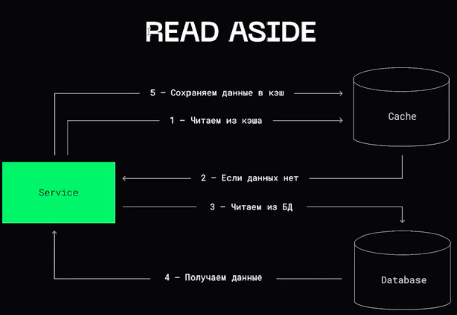

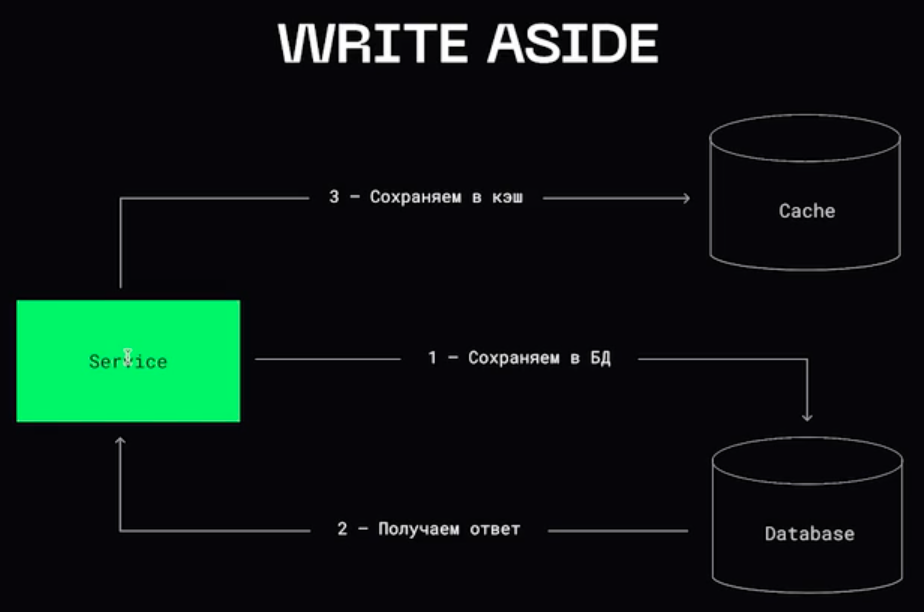

### Cache through // Сквозное кэширование

В рамках этой стратегии все запросы от приложения проходят через кэш  

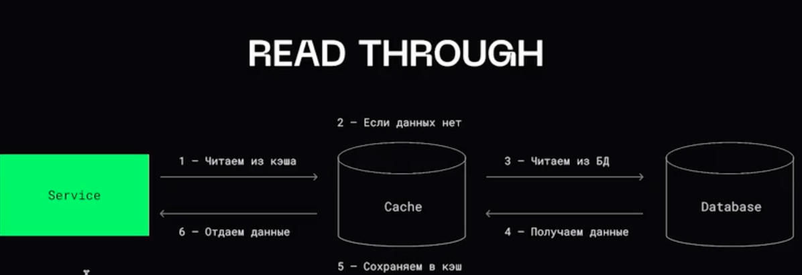

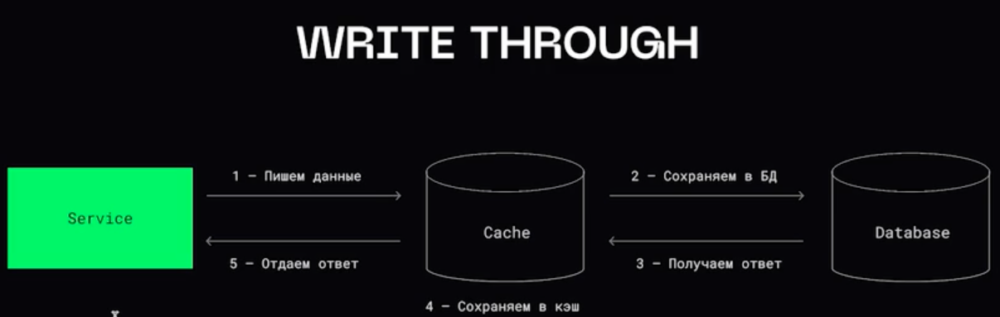

### Cache ahead // Опережающее кэширование

Запросы всегда идут в кэш, никогда не попадая в БД напрямую. Кэш периодически сам наполняется данными из БД. Тут у нас маленькая задержка, но данные могут быть неконсистентныим.  

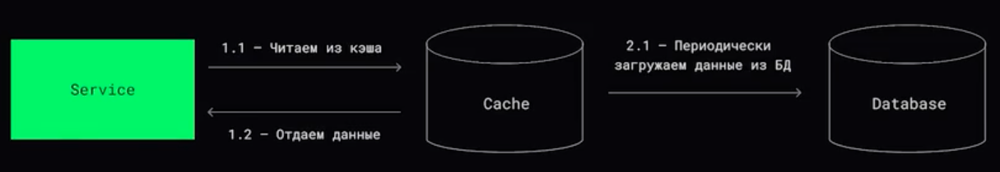

 
 
 

# Алгоритмы вытеснения данных

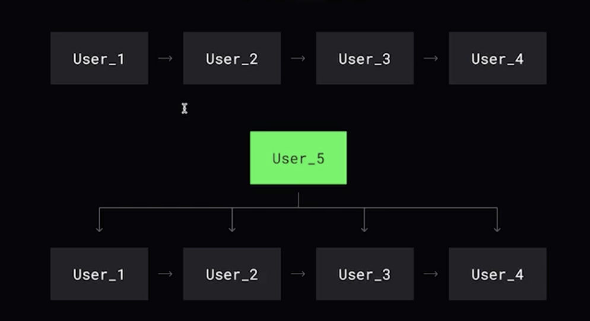
  
1. Random
2. FIFO
3. LIFO (стэк вызова функции)
4. LRU (least recently used) - 80% задача  
Вытесняется тот пользователь к которому дольше всего не было обращений. **Когда** было обращение.
5. MRU (most recently used)
Вытесняется элемент, который только что использовался.
6. LFU (least frequently used)
Вытесняется тот пользователь, к которому было меньше всего обращений. **Сколько** было обращений

 
 
 

# Алгоритмы кэширования

### Алгоритм Белади (OPT)

Теоретический алгоритм

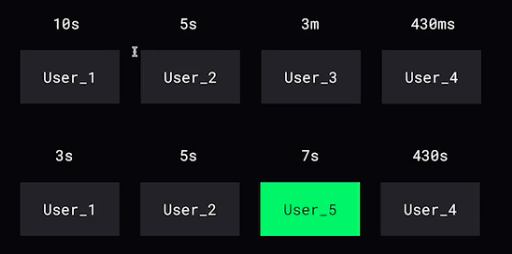

### Second Chance

При обращении выставляем бит присутствия, а при вытеснении удаляем из начала очереди, если бит = 0. Если бит = 1, то меняем бит на ноль, затем переносим элемент в конец очереди и идем к следующему.  

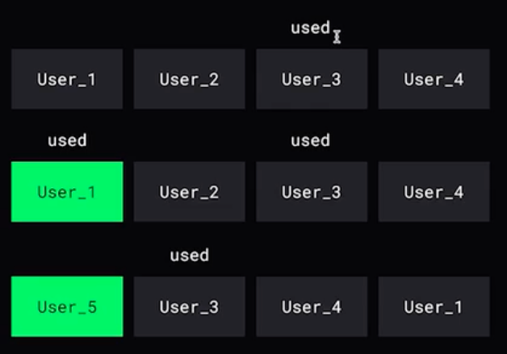

### Clock

Тот же самый second chance, только не нужно двигать элемент из начала очереди, если бит равен единице.

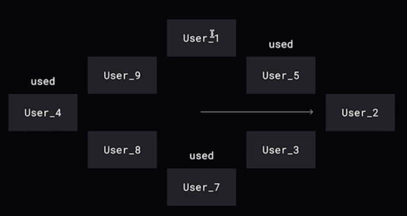

### 2Q (Отстойник)

Элементы, запрошенные из 1FIFO, никуда не двигаются. Вытеснение 1FIFO перемещаются в 2FIFO. Элементы, запрошенные из 2FIFO, уходят в LRU. Вытесненые из 2FIFO удаляются.

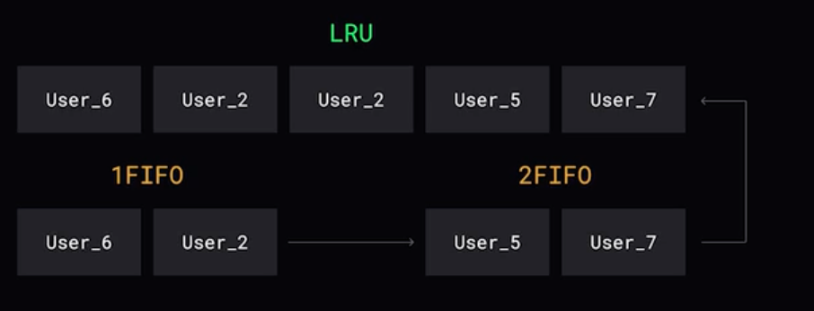

### SLRU (segmented LRU)

- Сперва кладем в первую коробочку
- При повторном запросе кладем во вторую коробочку
- При еще одном запросе - из второй в третью

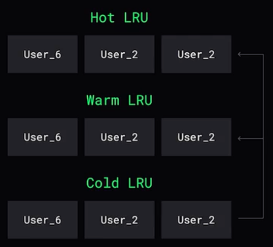

### TLRU (time aware LRU)

Абсолютно такой же алгоритм, только к данным добавляется их время жизни в кэше (TTL), по которому они автоматически удаляются из кэша

### LRU-K

Удаляем страницу, K-й последний доступ к которой находится дольше всего во времени в прошлом.

## Инвалидация данных в кэше

### Инвалидация по TTL

При сохранении данных в кэш для них устанавливается время жизни TTL и данные будут автоматически удалены через это время.

Проблемы:
1. Если TTL у большого количества данных одинаковый, тогда в одним момент кэш опустеет и все запросы пойдут в БД. Помогает **Jitter** - добавление случайной величины к TTL
2. Thundering Herd Problem // Проблема стаи быков. Резкий рост нагрузки на базу вызванный тем, что удалился "популярный" ключ из кэша.  

### Инвалидация по событию

Данные удаляются по какому-то событию. 

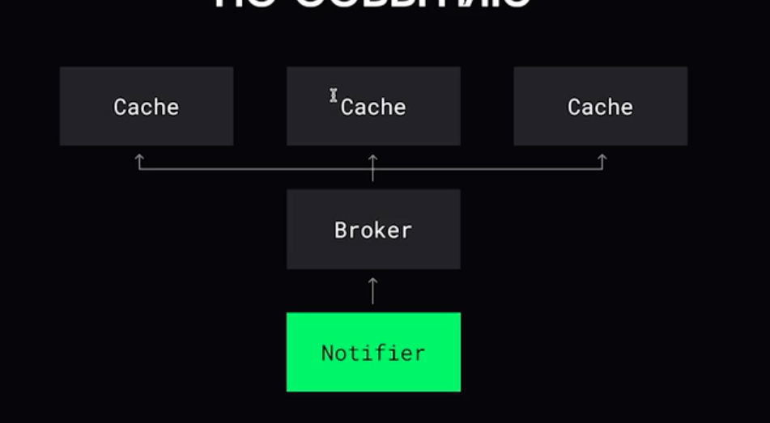

### Версионирование кэша

### Тэгирование кэша

В зависимости от тэга кэша инвалидируется связанные данные. 

# Многомерный кэш

Когда кэши складываются в цепочку или дерево:
1. Кэш браузера
2. Кэш прокси сервера
3. Внутренний кэш приложения
4. Внешний кэщ приложения
5. Кэш движка базы данных

 
 
   

[>>> Назад <<<](../README.md)