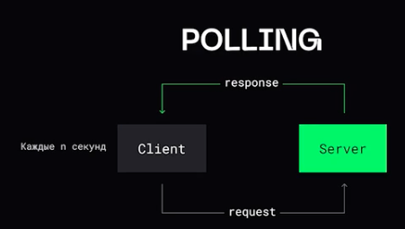
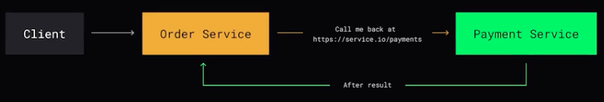

# API

### CRUD

Акроним, обозначающий Create Read Update Delete

## Подходы HTTP

### REST

_Глагол_ - метод запроса (GET, POST, DELETE, PUT) - что-то сказать серверу  
_Существительное_ - URI запроса - над чем оперировать  
_Дополнительная информация_ - хэдэры запроса  
_Содержимое_ - тело запроса и ответа. Обычно в JSON  
_Результат_ - код ответа  


### SOAP

Вся информация сохранятеся в XML - коды ответа, тело ответа и прочее. Устаревший подход.


### RPC

Класс технологий, позволяющих программам вызывать функции или процедуры в другом адресном пространстве. 


## Under / over fetching

Ситуация, когда API недодал данные или отдал сильно больше, чем требуется. Получается, что мы гоняем "лишние" байты по сети. Для решения этой проблемы используется инструмент кастомизации запросов - GraphQL


## Проблемы проектирования

### Как получать обновления от сервера?

#### Polling



#### WebHook

Метод, позволяющий приложению автоматически передавать данные или уведомления другому приложению по определенным событиям или действиям




#### Streaming


**SSE (server-side events)** - клиент подписывается на события сервера и как только происходит событие - клиент сразу же получает уведомление по HTTP и некоторые данные, связанные с этим событием. Клиент держит коннекшен и ничего не пишет, а сервер ждет, когда произошел коннекшен отправляет событие и информацию связанную с ним.

**WebSocket** - протокол для общения между клиентом и сервером, предоставлябщий возможность двухсторонней коммуникации поверх TCP.  


### Как отдавать большое количество сущностей?

```
GET /api/products?offset=200&limit=100
{"items": [... 100 products]}
```

```
GET /api/producrs?page=10
{"items": [... 100 products]}
```

```
GET /api/producrs?cursor=qWe
{"items": [... 100 products], "cursor": "qWr"}
```

### Как улучшить производительность?

1. Запросы и ответы можно сжимать. Экономлю трафик, но получаю дополнительную нагрузку на CPU
2. Можно сохранять часть данных в кэше


### Как предотвратить повторное выполнение операции?

Ключ идемпотентности - на стороне клиента генерируем ключ и отправляем сервису через API. Сервис проверит, выполнял ли он эту операцию по ключу или нет.


<br>
<br>
<br>  

[>>> Назад <<<](../README.md)