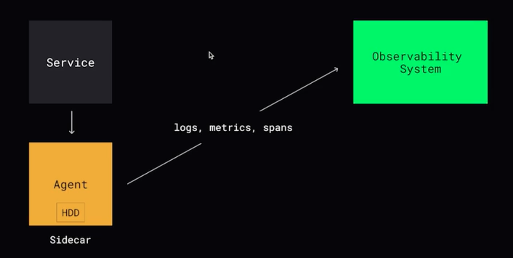

# Observability

## Мониторинг

Процесс сбора, анализа и визуализации данных о работе приложения с целью обеспечения его надежности, производительности и доступности.  

Системы: Prometheus, graphite, zabbix, victoria metrics

### LTES (Google SRE):
- Latency - время на обработку одного запроса
- Traffic - количество запросов
- Errors - количество ошибок
- Saturation - насколько компонент использует свои ресурсы 

### RED
- Rate - количество запросов
- Errors - количество ошибок
- Duration - время обработки одного запроса

### USE
- ulitization - время или процент использования ресурса
- saturation - количество отложенной работы
- errors - количество ошибок

## Алертинг

Алертинг отслеживает изменения определенных метрик с помощью алертов и отправляет уведомления через подходящий для вас канал уведомлений. 

## Логирование

Логирование - запись логов, позволяет понять что происходило, когда и при каких обстоятельствах.

Что логировать:
1. Ошибки и исключения
2. События и действия пользователей
3. Запросы к серверу и сторонним ресурсам
4. Информацию о состоянии приложения

Системы: graylog, ELK

## Трэйсинг

Инструмент для трассировки и анализа оаспределенных запросов, благодаря которому можно определить, где происходят сбои, что вызывает низкую производительность, а также как происходит процесс выполнения конкретных запросов. 

span - операция

Системы: Jaeger, Zipkin, LightStep

## Непрерывное профилирование

Метод анализа и измерения производительности программного обеспечения, который позволяет получать данные о работе программы в режиме реального времени

Системы: Parco, Pyroscope или ... Sentry. 

 
 
   

[>>> Назад <<<](../README.md)