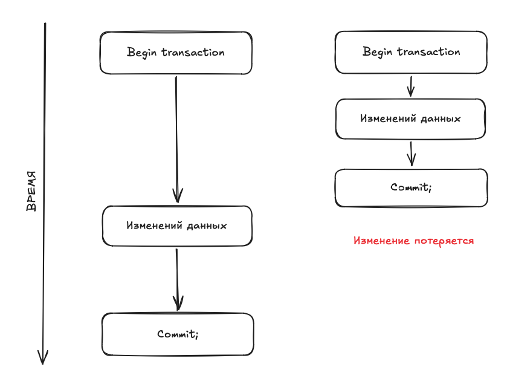
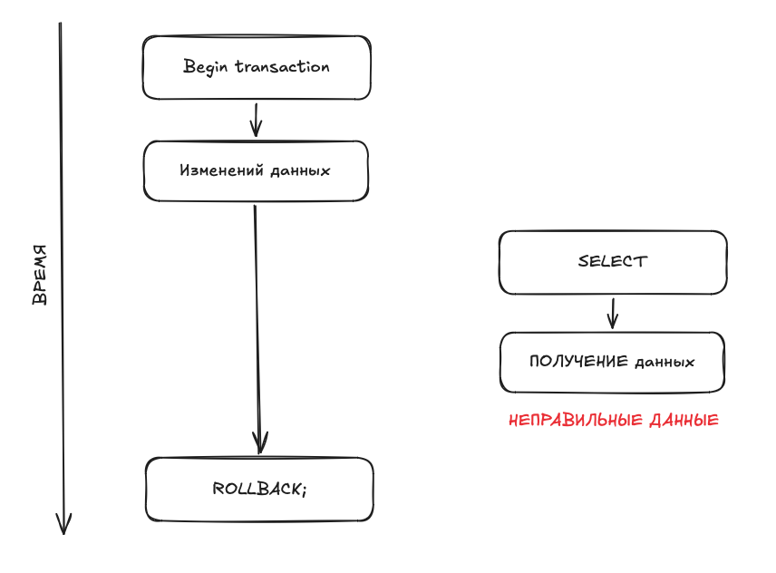
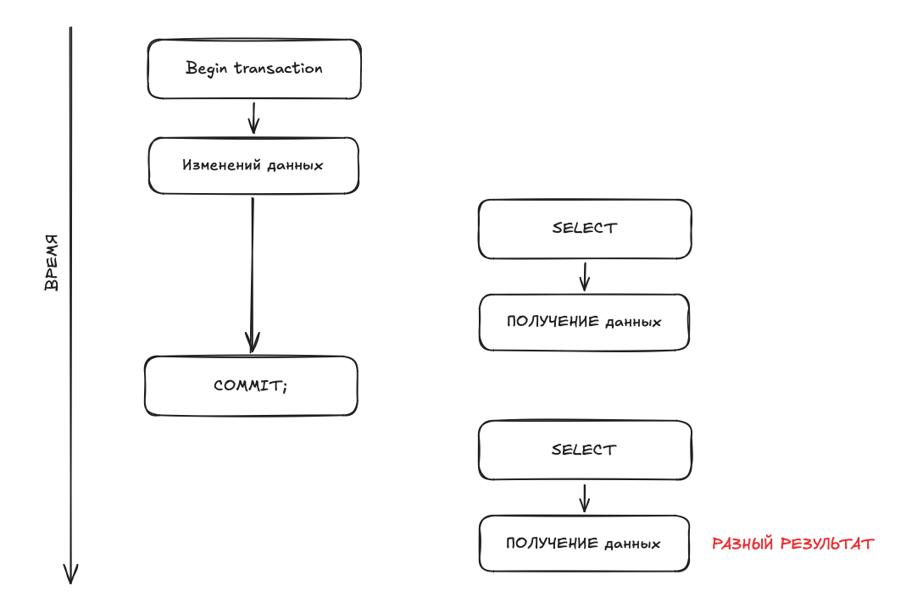
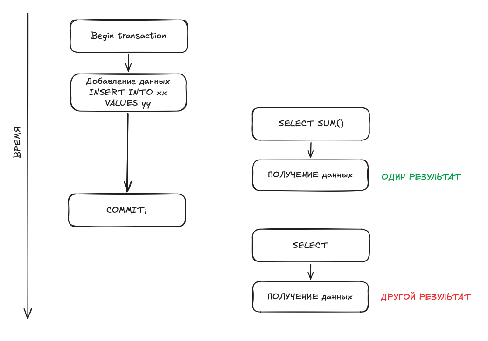
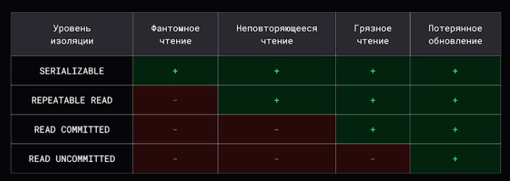
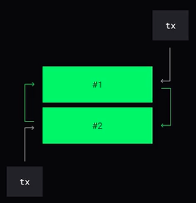

# Базы данных

## Виды баз данных

### Реляционные 

Примеры: _MySql, PostgreSql_

Подразумевает, что между таблицами существуют отношения. Данные хряняться на дисках в строковом формате. 

### Колоночные

Примеры: _Clickhouse, Vertica_

Каждая колонка хранится отдельным файлом. Удобно сжимать данные, т.к. в файле обычно храняться однородные данные.

### Документоориентированные

Примеры: CouchDB, mongoDB

Преимущество - нет строгой фиксированной модели данных.

#### Поисковые движки

Примеры: _Elasticsearch, Sphinx_

Такие же документоориентированные движки, но позволяющие делать быстрый текстовый поиск. Часто используются совместно с реляционными базами данных.

### Key-Value

Примеры: _Redis, Memcached, Tarantool_
Apache ZooKeeper, etcd - зарекомендовали себя, как хранилища информации о кластере и другая мета-информация.

БД, которые хранят свои состояния в памяти.

### Графовые

Пример: _Neo4j_

Вершины графа - это информация, а ребра - это отношения.

### Time series

Пример: _influxdb_

Данные привязаны к времени.

### Blob/Object storage

Примеры: Ceph, Amazon S3

Храняться object'ы - mp3, картинки, наборы байтов.

## Как выбирать базы данных

1. Транзакции
2. Формат данных 
3. Навык работы с технологией
4. Характер обращений к данным
5. Сообщество и зрелость технологий
6. Частота изменяемости формата данных

## OLAP vs OLTP

OLTP - Online Transaction Processing  
OLAP - Online Analytical Pricessing  

HTAP - hybrid transactional / analytical processing

## Где хранятся данные в БД

1. In Memory - данные храняться в оперативной памяти.

2. Persistent - данные записываются в хранилище (на диск)

3. Embedded - база данных, которая тесно интегрированна с прикладныим программами.

4. Single-file - один файл внутри себя содержит всю структуру и все данные БД

5. Append-only - ланные могут только добавляться, но не могут быть изменены или удалены

## Индексы

Индексы - позволяют данные искать быстро.

**Плюсы:**
1. Ускоряют чтение

**Минусы:**
1. Замедляют запись
2. Используюь дополнительную память
3. Усложняют работу планировщика запросов.

Когда можно обойтись без индекса?

1. Мало данных
2. Селективность индекса

### Основные индексы

#### BTREE

Самобалансирующее дерево поиска. Его особенность в том, что дерево растет в ширину. У дерева есть параметр _T_, который говорит о том, сколько данных содержится в блоке. Этот блок вычитывается в память из диска и по нему проходит поиск.

#### HASH

Hash-таблица. Берется функция и по результату понимается насколько данные смещены.

#### BITMAP

Это структура, состоящая из наборов дискретных данных. Т.к. это набор битов, то в памяти занимает немного данных. По набору этих параметров проще найти требуемые данные.

#### SPATIAL

Квадранты - например, геоданные. 

#### REVERSED

Это, например, текстовые данные. Для каждого слова указывается, где встречалось это слово и достаются данные - это называется _обратный индекс_. 

### Функциональный индекс

Индекс, ключи которых хрянят результат пользовательский функций.

### Разряженный индекс

Характеризуется тем, что каждый ключ ассоциируется с определенным указателем на блок в сортированном файле данных, а не с какой-то определенной записью. 

### Кластеризованный и некластеризованный индекс.

При налии кластеризованного индекса строки таблицы упорядочены по значению ключа этого индекса. Если данные упорядоченны, то они как правило храняться в одном файле. Чаще всего PRIMARY KEY.

Некластеризованный индекс, созданный для таблицы, содержит только указатели на записи таблицы, либо уникальные идентификаторы записи.

## Транзакции

### ACID

ACID - это стандарт того, какие гарантии должна давать база данных, чтобы поддерживать транзакции. 

**Атомарность**  
Каждая транзакция базы данных является единым блоком, который использует подход "всё или ничего" при выполнении. При успешном выполнении происходит _COMMIT_, при неуспешном _ROLLBACK_

**Согласованность**
Различные утверждения относительно данных должны всегда оставаться справедливыми.  
В реляционных базах данных это соблюдается благодаря констрэйнтам: NOT NULL, UNIQUE. PRIMARY KEY, FOREIGN KEY, CHECK, DEFAULT, CREATE INDEX.  

**Изоляции транзакций**
Каждая транзакция происходит до или после каждой другой транзакции, и представление базы данных, которое транзакция видит в своем начале, изменяется только самой транзакцией до ее завершения. Ни одна транзакция не должна видеть промежуточный результат другой транзакции. 

**Устойчивость**
Гарантирует, что после фиксации транзакций в базе данных она постоянно сохраняется с помощью резервных копий и журналов транзакций. Достигается при помощи WAL.

### BASE

BASE - альтернативная концепция, которая фокусируется на гибкости и доступности в ущерб строгой согласованности.

Basically Available, Soft state, Eventually consistent

Базы построенные на принципах BASE могут быть более гибкими и могут позволять временные несогласованности данных, которые в конечном итоге будут согласованными. 

### Аномалии транзакций

- Потерянное обновление (lost update) - два обновления одной и той же сущности

- Грязное чтение (dirty read) - чтение во время до коммита другой транзакции

- Неповторяющееся чтение (non-repeatable read)

- Чтение "фантомов" (phantom read)

### Решение проблем изоляции**

Чем выше уровень изоляции транзакций, тем ниже пропускная способность базы данных.  

#### 2PL

Фаза расширения - запрашиваются все необходимые для определенной транзакции блокировки и никакие блокировки не высвобождаются

Фаза сжатия - все полученные на фазе роста блокировки высвобождаются

#### MVCC

Оперирует снэпшотами и проверяет нет ли изменений

 
 
   

[>>> Назад <<<](../README.md)