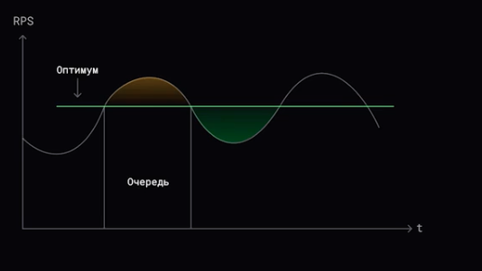

# Брокер сообщений

Примеры: _Kafka_ - pull модель; _RabbitMQ_ - push модель

Плюсы 
1. Асинхронная связь
2. Слабое связывание
3. Масштабируемость
4. Отказоустойчивость
5. Понимание потоков данных

## Задачи

1. Распределение задач

2. Планирование исполнения

  

 
 
   

[>>> Назад <<<](../README.md)