# Хранение данных распределенно

## Бэкап

Главное назначение резервного копирования - это восстановление даных после их потери или повреждения, а также для клонирования БД, например для тестирования

Рекомендуется создавать резервные копии регулярно  - ежеднемно, ежемесячно, зависит от важности данных. Рекомендуется хранить не менее трех последних версий резервных копий.  

## Репликация

Репликация - это процесс создания и поддержания копий (клонов) баз данных на нескольих серверах.  

**Репликация масштабирует только чтение!**

### Сценарии использования репликации

- Availability - увеличение отказоустойчивости
- Scalability - масштабирование чтения
- Geo - размещение данных ближе к пользователю

### Виды репликации

**I. Куда писать данные...**

#### 1. Follow - leader.  

У одной реплики есть ранг - лидер. Все апдейты, записи приходят в мастер. Чтение из реплик.

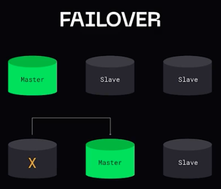

 

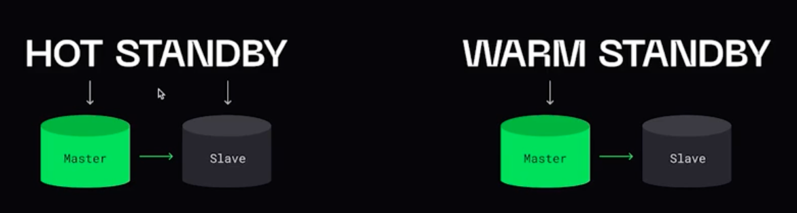

#### 2. Master-master

Обычно используется для различных дата центров в геораспределенных системах. В случае падения ДЦ, есть точная копия данных, и система не будет недоступна, но на восстановление данных уйдет какое-то время.  

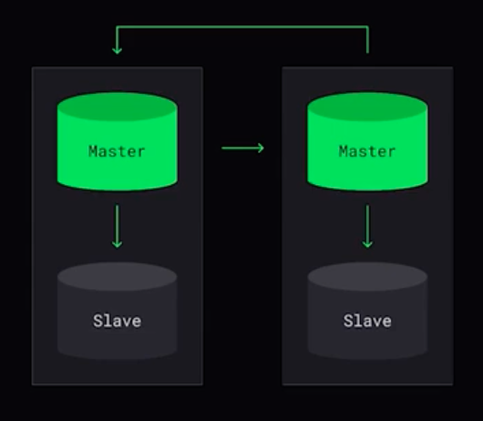

**Как резолвить конфликты?**

1. LWW (last write wins)
2. Ранг реплик
3. Решение конфликтов на клиенте (как в git)
4. Conflict-replicated data type (CRDT)

#### 3.Master-less

Обычно используется для децентрализованных систем

1. Пишем в определенные ноды
2. ЧИтаем из определеных нод

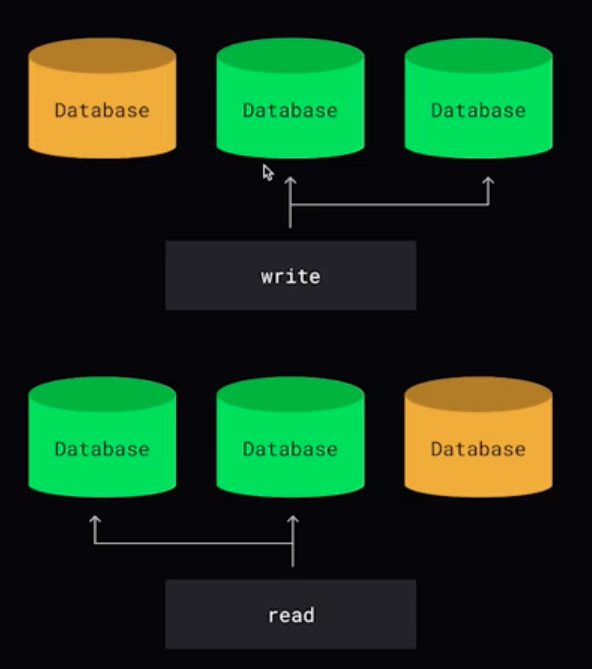

 

**Из какого количества нод читать и в какое количество нод писать?**

`N` - количество реплик

1. `W + R > N` - гарантируется строгая согласованность
2. `W + R <= N` - не гарантируется строгая согласованность
3. `R = 1; W = N` - система оптимизирована для быстрого чтения
4. `W = 1; R = N`- система оптимизирована для быстрой записи

**II. Когда синхронизировать данные...**

1. Синхронная репликация (sync)

- Локальная запись данных
- Отправка данных на реплику
- Получение подтверждения от реплики об удаленной записи данных
- Возвращение подтверждения клиенту

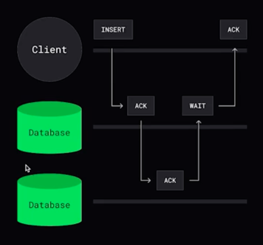

 

**Strong consistency** - любая операция чтения из любого узла БД вернет последнюю операцию записи.

2. Асинхронная репликация

- Локальная запись данных
- Возвращение подтверждения клиенту
- Отправка данных на реплику

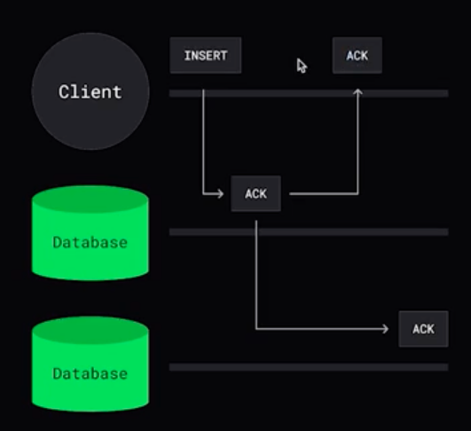

 

**Eventual consistency** - в отсутствие изменений данных, через какой-то промежуток времени после последнего обновления ("в конечном счет") все запросы будут возвращать последнее обновленное значение. 

3. Полусинхронная реализация

- Локальная запись данных
- Отправка данных на реплику
- Получение подтверждния от реплики о получении изменений
- Возвращение подтверждения клиенту

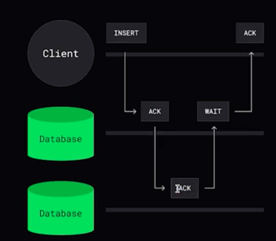

**III. Кто ответственный за синхронизацию...**

1. push - мастер рассылает данные репликам
2. pull - фоловеры сами опрашиют обновления

**IV. Как передавать данные...**

1. Физическая - копирую файлы

  **Плюсы:**  
  - работает быстро  
  - базы идентичны  
  - просто применить изменения в реплике  

  **Минусы:**
  - копирование зачастую избыточного количества данных
  - не можем гибко настраивать реплики. например, хранимые процедуры
  - на время передачи данных все транзакции должны быть остановлены

2. Логичкая - копируем данные

  **Плюсы:**
  - передаются только данные, не копируется всё
  - транзакции на реплике могут продолжаться без проблем
  - на реплике можно добавлять своим сущности

  **Минусы:**
  - более медленная
  - транзакции могут происходить с задержками
  - сложнее

**SBR** - statement based replication - передаю сами запросы. Проблемы могут возникнуть с UNIX_TIMESTAMT(), UUID(), RAND() и так далее.

**RBR** - row based replication - когда передаю измененные сущности.

## CAP теорема

_**CAP** - Consistency Availability Partition tolerance -_ САР система говорит о том, что нельзя совместить все 3 свойства в одной системе: целостность, доступность и устойчивость к разделению.  

**CP** - банковская система. Потеря данных важнее, чем недоступность (банковская система)

**CA** - доступность важнее, чем согласованность (комментарии в чате)

Разновидность CAP-теоремы - **PACELC** - в случае разделения сети (P) в распределенной системе необходимо выбирать между доступностью (А) и согласованностью (С), но в любом случае, даже если система работает нормально в отсутствии разделения (E), нужно выбирать между задержками (L) и согласованностью (C)

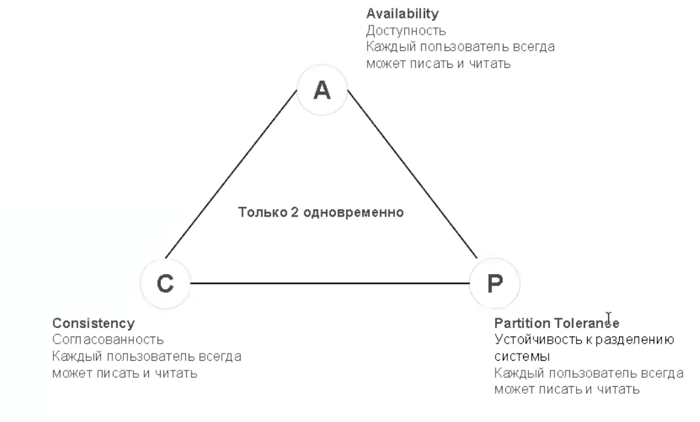

## Партиционирование

Метод разделения больших таблиц на много маленьких, и желательно, чтобы это происходило прозрачным для приложения способом

Сценарии использования:
1. Ограничение на размер таблицы, индекса, количества строк и тд
2. Распределение нагрузки (партиции на разных дисках)
3. Охлаждение данных (одни партиции на SSD, другие на HDD)
4. Удаление данных (партиционирование по дням)

Виды партиционирования:
1. Вертикальное - когда таблица нарезается вертикально. Например, данные о пользователе разбивается по табличкам
2. Горизонтальное

Способы: 

1. Range based подход - разбиение в зависимости от диапазонов. Например, 0..10, 11..20, 21..30.
2. Key based - распределение при помощи hash-функции ключа
3. Directory based - ds

## Шардирование

Подход предполагающий разделение таблиц на независимые сегменты, каждый из которых управляется отдельным инстансом БД. Синхронизации между данными нет. 

**Плюсы:**
1. Увеличили производительность масштабируемость
2. Увиличили производительность на запись
3. Увиличить доступность данных

**Минусы:**
1. Сложность чтения
2. Сложность координирования
3. Write Skew / Hot Spot - когда один шард "перегрет"

 

**Базовые принципы:**
1. Данные, которые в дальнейшем потребуются вмете, должны храниться вместе
2. Специально храню данные по разным местам, чтобы параллельно их обрабатывать - MPP (Massively Parallel Processing) подход

### Routing данных

1. На уровне БД

2. Клиентский - сам клиент определяет в какой шард идти

3. Proxy - отдельный сервис определяет

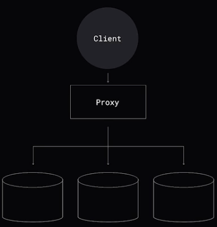

4. Coordinator - прокси с логикой. Часто в координаторе используют кэширование. 

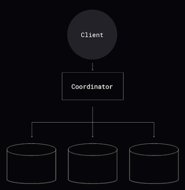

### Перебалансировка

Виртуальные шарды (VBuckets). Пользователь абстрагируется от физических шардов

Процесс переблансировки:
- только чтение
- все данные неизменяесые - пишем в target, читаем из src
- логическая репликация с src на target, после синхронизации переключаем target
- смешанный подход

### Resharding

Процесс используется, когда нужно добавить/удалить ноду или исправить ошибки при выборе шардирования.

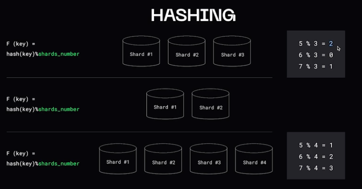

 

**Consistent hashing**

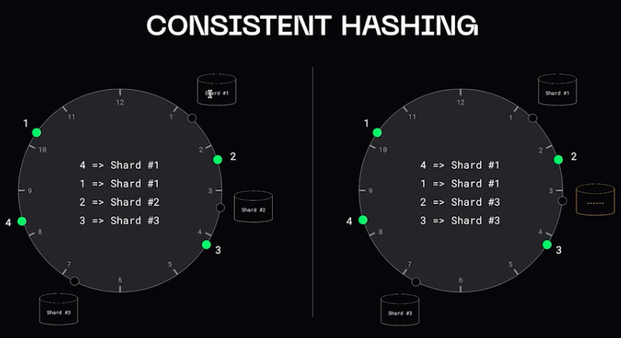

Могут быть проблемы с каскадным сбоем БД - когда один шард выходит из строя, тогда все данные переливаются в другой шард. Он не выдерживает нагрузку, выключается и все данные переливаются в следующий шард.  

Решение проблемы - виртуальные шарды

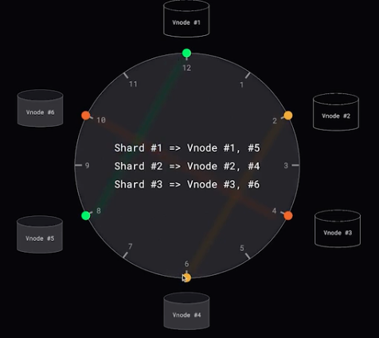

**Randezvous hashing**

Шард выбирается по хэшу ключа и индификатору ноды

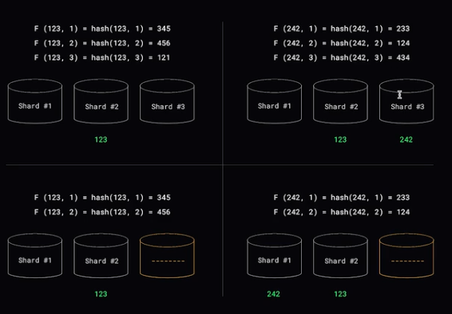

**Smart sharding**

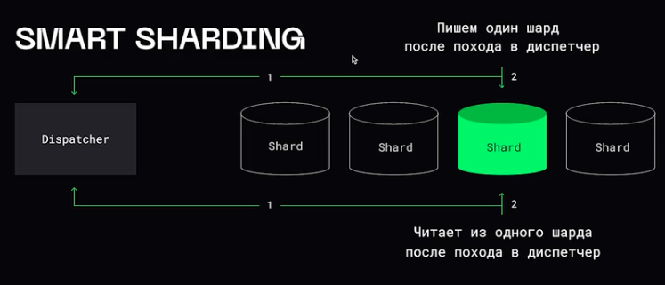

**Быстрая запись**

Этот MPP подход применяется в случае, когда важная быстрая запись, а чтение мы можем выполнить дольше.  

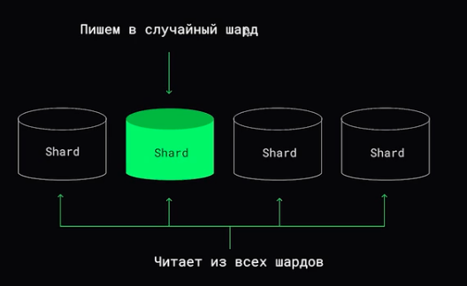

## Алетернативные способы хранения данных

1. Хранение на клиенте

2. CDN - content delivery network

 
 
   

[>>> Назад <<<](../README.md) 